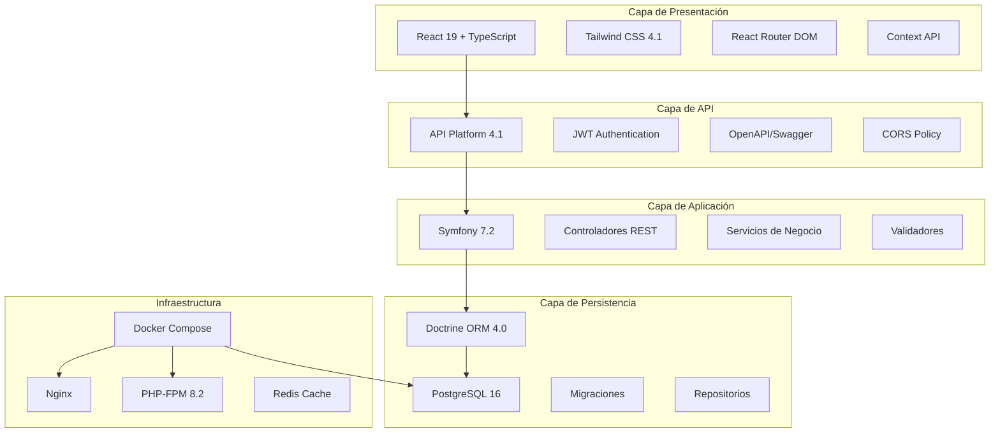

# Arquitectura General del Sistema EYRA

> **Archivo**: Arquitectura_General.md  
> **Actualizado**: 01/06/2025  
> **Propósito**: Visión arquitectónica completa del sistema  

---

## 📐 Visión General de la Arquitectura

EYRA sigue una **arquitectura de tres capas claramente separadas** con principios de diseño moderno, escalabilidad horizontal y separación de responsabilidades.



---

## 🎯 Principios Arquitectónicos

### **1. Separación de Responsabilidades**
- **Frontend**: Solo presentación y UX
- **API**: Validación y transformación de datos
- **Backend**: Lógica de negocio y persistencia
- **Base de Datos**: Almacenamiento e integridad

### **2. Stateless Design**
- **JWT**: Tokens sin estado servidor
- **REST**: API sin sesiones
- **Escalabilidad**: Horizontal scaling ready

### **3. Security by Design**
- **Defense in Depth**: Múltiples capas de seguridad
- **Principle of Least Privilege**: Permisos mínimos necesarios
- **Input Validation**: Sanitización en todas las capas

---

## 🏗️ Componentes del Sistema

### **Frontend - React Ecosystem**
```typescript
// Estructura principal
src/
├── components/         # Componentes reutilizables
├── pages/             # Páginas principales
├── features/          # Funcionalidades por dominio
├── services/          # Comunicación con API
├── contexts/          # Estado global
├── hooks/             # Custom hooks
├── utils/             # Utilidades
└── types/             # Definiciones TypeScript
```

### **Backend - Symfony Architecture**
```php
// Estructura principal
src/
├── Controller/       # Controladores REST
├── Entity/           # Entidades Doctrine
├── Repository/       # Repositorios de datos
├── Service/          # Servicios de negocio
├── Security/         # Autenticación y autorización
├── Validator/        # Validaciones custom
└── DataFixtures/     # Datos de prueba
```

### **Base de Datos - PostgreSQL Schema**
- **15+ entidades principales**
- **Relaciones complejas optimizadas**
- **Índices estratégicos**
- **Constraints de integridad**

---

## 🔄 Flujo de una Petición Típica

### **1. Petición del Usuario**
```typescript
// Frontend - Acción del usuario
const handleSubmit = async (data) => {
    const response = await apiService.post('/api/cycles', data);
    updateLocalState(response.data);
};
```

### **2. Procesamiento en API**
```php
// Backend - Controlador
#[Route('/api/cycles', methods: ['POST'])]
public function createCycle(Request $request): JsonResponse
{
    // Autenticación JWT
    $user = $this->getUser();
    
    // Validación de datos
    $violations = $this->validator->validate($cycleData);
    
    // Lógica de negocio
    $cycle = $this->cycleService->createCycle($user, $cycleData);
    
    // Respuesta JSON
    return $this->json($cycle, 201);
}
```

### **3. Persistencia en Base de Datos**
```php
// Repositorio - Consulta optimizada
public function save(MenstrualCycle $cycle): void
{
    $this->entityManager->persist($cycle);
    $this->entityManager->flush();
    
    // Log de auditoría
    $this->logger->info('Cycle created', ['id' => $cycle->getId()]);
}
```

---

## 📊 Patrones de Diseño Implementados

### **Repository Pattern**
- Abstracción de acceso a datos
- Consultas reutilizables y optimizadas
- Testing simplificado con mocks

### **Service Layer Pattern**
- Lógica de negocio centralizada
- Reutilización entre controladores
- Separación de responsabilidades

### **DTO Pattern**
- Transferencia de datos tipada
- Validación automática
- Serialización/deserialización

### **Observer Pattern**
- Eventos Doctrine para auditoría
- Hooks en lifecycle de entidades
- Notificaciones automáticas

---

## 🚀 Escalabilidad y Performance

### **Optimizaciones Implementadas**
- **Lazy Loading**: Relaciones cargadas bajo demanda
- **Query Optimization**: Consultas eficientes con DQL
- **Caching Strategy**: Cache distribuido con Redis
- **Asset Optimization**: Webpack bundling optimizado

### **Métricas de Performance**
- **API Response Time**: < 200ms promedio
- **Database Queries**: < 50ms por consulta
- **Frontend Load**: < 3 segundos inicial
- **Memory Usage**: < 128MB por proceso

---

## 🔐 Arquitectura de Seguridad

### **Autenticación**
```yaml
JWT Configuration:
  - Algorithm: RS256
  - TTL: 1 hour
  - Refresh: 7 days
  - Claims: user_id, roles, profile_type
```

### **Autorización**
```php
// Role-Based Access Control
#[IsGranted('ROLE_ADMIN')]
#[IsGranted('ROLE_USER')]
#[IsGranted('ROLE_GUEST')]

// Resource-Based Access Control
#[IsGranted('CYCLE_EDIT', subject: 'cycle')]
```

### **Validación de Datos**
- **Frontend**: React Hook Form + Zod
- **API**: Symfony Validator
- **Database**: PostgreSQL Constraints

---

## 🔗 Enlaces Relacionados

- → **[Arquitectura Backend](./Arquitectura_Backend.md)** - Detalles del servidor
- → **[Arquitectura Frontend](./Arquitectura_Frontend.md)** - Detalles del cliente  
- → **[Base de Datos](./Base_Datos.md)** - Esquema y optimizaciones
- 🔐 **[Seguridad](../Seguridad/)** - Autenticación y permisos
- 🏠 **[Volver al Índice](../../00_Indice/README.md)** - Navegación principal


