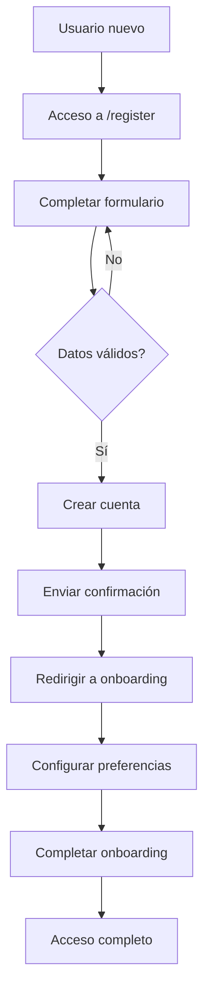
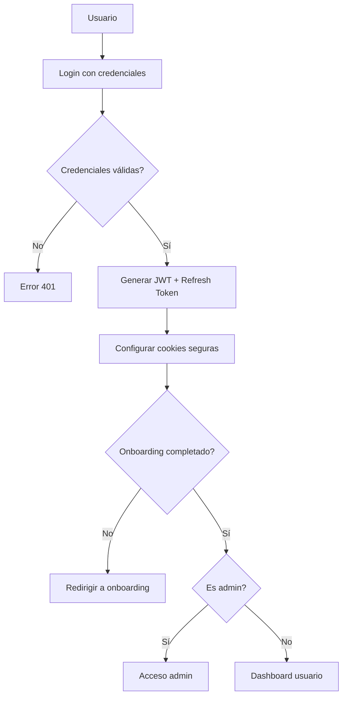

# Casos de Uso - EYRA

> **Archivo**: Casos_Uso.md  
> **Actualizado**: 01/06/2025  
> **Propósito**: Definición de casos de uso principales del sistema  

---

## 👥 Actores del Sistema

### **Primarios**
- **Usuario Principal**: Persona que usa EYRA para seguimiento de salud
- **Usuario Invitado**: Pareja, amigo, padre o cuidador con acceso limitado
- **Administrador**: Gestor del sistema con permisos completos

### **Secundarios**
- **Sistema de Notificaciones**: Envío automático de alertas
- **API Externa IA**: Futura integración para consultas científicas
- **Sistema de Backup**: Respaldo automático de datos

---

## 🎯 Casos de Uso Principales

### **CU-001: Gestión de Usuarios**

#### **CU-001.1: Registro de Usuario**
- **Actor**: Usuario nuevo
- **Precondición**: Usuario no registrado
- **Flujo Principal**:
  1. Usuario accede a `/register`
  2. Completa formulario con email, contraseña, datos básicos
  3. Selecciona tipo de perfil 
  4. Configura avatar personalizable
  5. Sistema valida datos únicos (email, username)
  6. Sistema crea cuenta y envía confirmación
  7. Usuario es redirigido a onboarding
- **Postcondición**: Cuenta creada, onboarding pendiente
- **Excepciones**: Email duplicado, datos inválidos

#### **CU-001.2: Autenticación**
- **Actor**: Usuario registrado
- **Precondición**: Cuenta activa existente
- **Flujo Principal**:
  1. Usuario accede a `/login`
  2. Introduce email y contraseña
  3. Sistema valida credenciales
  4. Sistema genera JWT token (30 min)
  5. Sistema genera refresh token (7 días)
  6. Usuario es redirigido según rol y estado onboarding
- **Postcondición**: Sesión activa con permisos
- **Excepciones**: Credenciales inválidas, cuenta desactivada

---

### **CU-002: Onboarding Personalizado**

#### **CU-002.1: Configuración Inicial**
- **Actor**: Usuario recién registrado
- **Precondición**: Cuenta creada, onboarding no completado
- **Flujo Principal**:
  1. Sistema muestra formulario personalizado según perfil
  2. Usuario configura preferencias de salud
  3. Si perfil menstrual: última fecha periodo, ciclo promedio
  4. Usuario selecciona condiciones médicas existentes
  5. Configura preferencias de notificaciones
  6. Si aplica: genera código para parejas/padres
  7. Sistema marca onboarding como completado
- **Postcondición**: Usuario puede acceder a funcionalidades completas
- **Casos Especiales**: Perfil de pareja usa código de invitación

---

### **CU-003: Gestión de Ciclos Menstruales**

#### **CU-003.1: Registro de Nuevo Ciclo**
- **Actor**: Usuario con perfil menstrual
- **Precondición**: Usuario autenticado, onboarding completado
- **Flujo Principal**:
  1. Usuario accede a registrar ciclo
  2. Selecciona fecha de inicio
  3. Sistema genera automáticamente 4 fases del ciclo
  4. Usuario puede ajustar duraciones según su historial
  5. Sistema calcula predicciones futuras
  6. Sistema actualiza estadísticas personales
- **Postcondición**: Ciclo registrado, predicciones actualizadas
- **Variantes**: Edición de ciclo existente, eliminación

#### **CU-003.2: Predicción Inteligente**
- **Actor**: Sistema automático
- **Precondición**: Al menos 3 ciclos registrados
- **Flujo Principal**:
  1. Sistema analiza historial de ciclos
  2. Calcula patrones y tendencias
  3. Aplica algoritmo de predicción (múltiples métodos)
  4. Genera predicción con nivel de confianza
  5. Sistema programa notificaciones futuras
- **Postcondición**: Predicciones disponibles con margen de error

---

### **CU-004: Sistema de Invitados**

#### **CU-004.1: Generar Código de Invitación**
- **Actor**: Usuario principal
- **Precondición**: Usuario autenticado
- **Flujo Principal**:
  1. Usuario accede a gestión de invitados
  2. Selecciona tipo de invitado (pareja, amigo, padre, profesional)
  3. Configura permisos específicos (qué puede ver)
  4. Establece tiempo de expiración (1-168 horas)
  5. Sistema genera código único de 8 caracteres
  6. Usuario comparte código con persona invitada
- **Postcondición**: Código activo disponible para canje
- **Excepciones**: Límite de códigos alcanzado

#### **CU-004.2: Canjear Código de Invitación**
- **Actor**: Usuario invitado
- **Precondición**: Usuario registrado, código válido
- **Flujo Principal**:
  1. Usuario introduce código en `/invitation/redeem`
  2. Sistema valida código (existente, no expirado, no usado)
  3. Sistema muestra información del usuario anfitrión
  4. Usuario confirma solicitud de acceso
  5. Sistema establece relación de acceso con permisos
  6. Sistema notifica al usuario principal
- **Postcondición**: Acceso establecido según permisos configurados

---

### **CU-005: Panel de Administración**

#### **CU-005.1: Gestión de Usuarios (Admin)**
- **Actor**: Administrador
- **Precondición**: Rol ROLE_ADMIN activo
- **Flujo Principal**:
  1. Admin accede a `/admin`
  2. Ve dashboard con estadísticas del sistema
  3. Navega a gestión de usuarios
  4. Aplica filtros de búsqueda (rol, perfil, estado)
  5. Puede crear, editar, desactivar usuarios
  6. Todas las acciones se registran en logs de auditoría
- **Postcondición**: Cambios aplicados, auditoría registrada
- **Restricciones**: No puede eliminar otros admins, ni eliminarse a sí mismo

#### **CU-005.2: Gestión de Condiciones Médicas**
- **Actor**: Administrador
- **Precondición**: Rol ROLE_ADMIN activo
- **Flujo Principal**:
  1. Admin navega a gestión de condiciones
  2. Ve lista de condiciones existentes
  3. Puede añadir nuevas condiciones con descripción
  4. Puede editar condiciones existentes
  5. Puede activar/desactivar condiciones
  6. Cambios afectan inmediatamente a usuarios
- **Postcondición**: Catálogo de condiciones actualizado

---

### **CU-006: Sistema de Notificaciones**

#### **CU-006.1: Notificaciones Automáticas**
- **Actor**: Sistema automático
- **Precondición**: Usuario con preferencias configuradas
- **Flujo Principal**:
  1. Sistema revisa diariamente predicciones de usuarios
  2. Identifica eventos próximos (periodo en 3 días)
  3. Genera notificaciones según preferencias
  4. Clasifica por contexto (cycle, health, admin)
  5. Envía notificaciones a usuarios correspondientes
  6. Registra estadísticas de entrega
- **Postcondición**: Usuarios informados proactivamente

#### **CU-006.2: Gestión de Notificaciones por Usuario**
- **Actor**: Usuario autenticado
- **Precondición**: Notificaciones recibidas
- **Flujo Principal**:
  1. Usuario ve listado de notificaciones
  2. Puede filtrar por tipo y contexto
  3. Puede marcar como leídas individualmente
  4. Puede marcar todas como leídas por categoría
  5. Puede descartar notificaciones no deseadas
  6. Ve contador de no leídas en tiempo real
- **Postcondición**: Notificaciones gestionadas según preferencias

---

### **CU-007: Acceso de Invitados**

#### **CU-007.1: Vista de Pareja**
- **Actor**: Usuario invitado (pareja)
- **Precondición**: Acceso configurado como 'partner'
- **Flujo Principal**:
  1. Usuario accede con sus credenciales
  2. Sistema identifica rol de invitado activo
  3. Muestra dashboard personalizado para parejas
  4. Ve estado actual del ciclo de su pareja
  5. Recibe recomendaciones de acompañamiento
  6. Ve calendario con fases (sin detalles íntimos)
  7. Puede ver alertas relevantes para él/ella
- **Postcondición**: Información de apoyo disponible
- **Restricciones**: Solo lectura, sin modificación de datos

#### **CU-007.2: Control Parental**
- **Actor**: Usuario invitado (padre/madre)
- **Precondición**: Acceso configurado como 'parent'
- **Flujo Principal**:
  1. Padre accede al sistema
  2. Ve dashboard de supervisión del menor
  3. Acceso a información de salud relevante
  4. Puede ver patrones preocupantes
  5. Recibe alertas de situaciones que requieren atención
  6. Acceso limitado según configuración del menor
- **Postcondición**: Supervisión responsable habilitada
- **Consideraciones**: Balance entre privacidad y cuidado parental

---

## 🔄 Diagramas de Flujo

### **Flujo de Registro Completo**

### **Flujo de Autenticación con JWT**

---

## 🔗 Enlaces Relacionados

- ← **[Flujo de Navegación](./Flujo_Web_EYRA.md)** - Rutas y vistas
- → **[Arquitectura del Sistema](../Arquitectura/)** - Diseño técnico
- 🔐 **[Seguridad y Permisos](../Seguridad/)** - Control de acceso
- 📊 **[MVP Implementado](../../01_Introducción/MVP.md)** - Estado actual
- 🏠 **[Volver al Índice](../../00_Indice/README.md)** - Navegación principal

