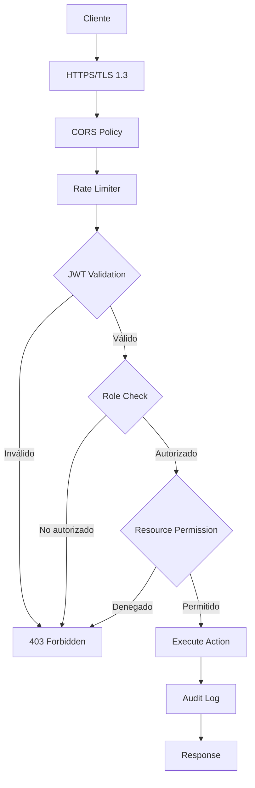

# Sistema de Seguridad y Permisos EYRA

> **Archivo**: Seguridad_Permisos.md  
> **Actualizado**: 01/06/2025  
> **Propósito**: Modelo de seguridad completo y permisos granulares  

---

## 🛡️ Modelo de Seguridad Multi-Capa

EYRA implementa un **sistema de seguridad en profundidad** con múltiples capas de protección que garantizan la integridad y confidencialidad de los datos sensibles de salud.



---

## 🔑 Autenticación JWT Avanzada

### **Configuración de Seguridad**
```yaml
# JWT Configuration
Algorithm: RS256              # Asimétrico, más seguro
Access Token TTL: 30 min      # Tiempo limitado
Refresh Token TTL: 7 days     # Renovación automática
Encryption: AES-256-GCM       # Encriptación adicional
Key Rotation: Monthly         # Rotación de claves
```

### **Implementación de Tokens**
```php
// JWT Token Service
class TokenService
{
    public function createJwtToken(User $user): string
    {
        $payload = [
            'user_id' => $user->getId(),
            'email' => $user->getEmail(),
            'roles' => $user->getRoles(),
            'profile_type' => $user->getProfileType()->value,
            'onboarding_completed' => $user->isOnboardingCompleted(),
            'iat' => time(),
            'exp' => time() + 1800, // 30 minutos
            'jti' => $this->generateJti(), // Token ID único
        ];
        
        return $this->jwtEncoder->encode($payload);
    }
    
    public function validateToken(string $token): bool
    {
        try {
            $payload = $this->jwtEncoder->decode($token);
            
            // Verificaciones adicionales
            return $this->validateTokenClaims($payload) &&
                   $this->checkTokenBlacklist($payload['jti']) &&
                   $this->verifyTokenIntegrity($payload);
                   
        } catch (JWTDecodeFailureException $e) {
            $this->auditService->logSecurityEvent('invalid_token_attempt');
            return false;
        }
    }
}
```

---

## 👥 Sistema de Roles Jerárquico

### **Definición de Roles**
```php
enum UserRole: string
{
    case ROLE_ADMIN = 'ROLE_ADMIN';           // Administrador total
    case ROLE_USER = 'ROLE_USER';             // Usuario estándar
    case ROLE_GUEST = 'ROLE_GUEST';           // Invitado (pareja/amigo)
    case ROLE_PARENT = 'ROLE_PARENT';         // Control parental
    case ROLE_PROVIDER = 'ROLE_PROVIDER';     // Proveedor salud
}
```

### **Matriz de Permisos**

| Recurso | ADMIN | USER | GUEST | PARENT | PROVIDER |
|---------|-------|------|-------|--------|----------|
| **Panel Admin** | ✅ | ❌ | ❌ | ❌ | ❌ |
| **CRUD Usuarios** | ✅ | ❌ | ❌ | ❌ | ❌ |
| **CRUD Condiciones** | ✅ | ❌ | ❌ | ❌ | ❌ |
| **Propio Perfil** | ✅ | ✅ | ❌ | ⚠️ | ⚠️ |
| **Gestión Ciclos** | ✅ | ✅ | 👁️ | 👁️ | 👁️ |
| **Ver Síntomas** | ✅ | ✅ | ⚠️ | ⚠️ | ✅ |
| **Contenido Educativo** | ✅ | ✅ | ✅ | ✅ | ✅ |
| **Generar Códigos** | ✅ | ✅ | ❌ | ✅ | ❌ |
| **Logs de Sistema** | ✅ | ❌ | ❌ | ❌ | ❌ |

**Leyenda**: ✅ Completo | ⚠️ Limitado | 👁️ Solo lectura | ❌ Denegado

---

## 🔐 Control de Acceso Granular

### **Resource-Based Access Control**
```php
// Voter Pattern para permisos específicos
class CycleVoter extends Voter
{
    const VIEW = 'cycle.view';
    const EDIT = 'cycle.edit';
    const DELETE = 'cycle.delete';
    
    protected function supports(string $attribute, $subject): bool
    {
        return in_array($attribute, [self::VIEW, self::EDIT, self::DELETE])
            && $subject instanceof MenstrualCycle;
    }
    
    protected function voteOnAttribute(string $attribute, $subject, TokenInterface $token): bool
    {
        $user = $token->getUser();
        $cycle = $subject;
        
        switch ($attribute) {
            case self::VIEW:
                return $this->canView($cycle, $user);
            case self::EDIT:
                return $this->canEdit($cycle, $user);
            case self::DELETE:
                return $this->canDelete($cycle, $user);
        }
        
        return false;
    }
    
    private function canView(MenstrualCycle $cycle, User $user): bool
    {
        // Propietario puede ver
        if ($cycle->getUser() === $user) {
            return true;
        }
        
        // Admin puede ver todo
        if (in_array('ROLE_ADMIN', $user->getRoles())) {
            return true;
        }
        
        // Invitados con permisos específicos
        return $this->guestAccessService->hasAccess($user, $cycle->getUser(), 'cycle.view');
    }
}
```

### **Middleware de Autorización**
```typescript
// Frontend - Authorization Hook
const useAuthorization = () => {
    const { user } = useAuth();
    
    const hasRole = (role: string): boolean => {
        return user?.roles?.includes(role) ?? false;
    };
    
    const hasPermission = (resource: string, action: string): boolean => {
        const permission = `${resource}.${action}`;
        return user?.permissions?.includes(permission) ?? false;
    };
    
    const canAccessResource = (resource: any, action: string): boolean => {
        // Verificación de propiedad
        if (resource?.user_id === user?.id) return true;
        
        // Verificación de roles
        if (hasRole('ROLE_ADMIN')) return true;
        
        // Verificación de acceso de invitado
        return hasPermission(resource?.type, action);
    };
    
    return { hasRole, hasPermission, canAccessResource };
};
```

---

## 🛡️ Protecciones de Seguridad

### **1. Rate Limiting**
```yaml
# Configuración de límites
endpoints:
  login: 5 attempts / 15 minutes
  register: 3 attempts / hour
  admin_api: 100 requests / minute
  user_api: 1000 requests / hour
  password_reset: 3 attempts / day
```

### **2. Input Validation & Sanitization**
```php
// Validación multi-capa
class UserController extends AbstractController
{
    #[Route('/api/users', methods: ['POST'])]
    public function createUser(Request $request): JsonResponse
    {
        // 1. Validación de schema JSON
        $data = $this->jsonValidator->validate($request->getContent());
        
        // 2. Sanitización de inputs
        $data = $this->inputSanitizer->sanitize($data);
        
        // 3. Validación de reglas de negocio
        $user = new User();
        $user->setEmail($data['email']);
        $user->setUsername($data['username']);
        
        $violations = $this->validator->validate($user);
        if (count($violations) > 0) {
            throw new ValidationException($violations);
        }
        
        // 4. Verificación de unicidad
        if ($this->userRepository->findByEmail($data['email'])) {
            throw new ConflictException('Email already exists');
        }
        
        // Proceder con creación...
    }
}
```

### **3. SQL Injection Prevention**
```php
// Uso exclusivo de Doctrine ORM
$qb = $this->createQueryBuilder('u')
    ->where('u.email = :email')
    ->andWhere('u.state = :state')
    ->setParameter('email', $email)      // Escapado automático
    ->setParameter('state', true);       // Tipado fuerte

// PROHIBIDO:
// $sql = "SELECT * FROM users WHERE email = '$email'";
```

### **4. XSS Protection**
```typescript
// Sanitización frontend
import DOMPurify from 'dompurify';

const sanitizeHtml = (dirty: string): string => {
    return DOMPurify.sanitize(dirty, {
        ALLOWED_TAGS: ['b', 'i', 'em', 'strong', 'p'],
        ALLOWED_ATTR: []
    });
};

// React safe rendering
const SafeContent: React.FC<{content: string}> = ({ content }) => (
    <div dangerouslySetInnerHTML={{
        __html: sanitizeHtml(content)
    }} />
);
```

---

## 📊 Sistema de Auditoría Completo

### **Estructura de Logs de Seguridad**
```php
class AuditService
{
    public function logSecurityEvent(
        string $event,
        array $context = [],
        string $level = 'info'
    ): void {
        $logData = [
            'event' => $event,
            'timestamp' => microtime(true),
            'user' => $this->getCurrentUserContext(),
            'request' => $this->getRequestContext(),
            'security' => $this->getSecurityContext(),
            'context' => $context
        ];
        
        // Log inmediato
        $this->logger->log($level, $event, $logData);
        
        // Alertas en tiempo real para eventos críticos
        if (in_array($event, $this->criticalEvents)) {
            $this->alertService->sendSecurityAlert($logData);
        }
        
        // Almacenamiento persistente
        $this->auditRepository->save($logData);
    }
    
    private function getCurrentUserContext(): array
    {
        $user = $this->tokenStorage->getToken()?->getUser();
        
        return [
            'id' => $user?->getId(),
            'email' => $user?->getEmail(),
            'roles' => $user?->getRoles() ?? [],
            'authenticated' => $user !== null
        ];
    }
    
    private function getRequestContext(): array
    {
        return [
            'ip' => $this->request->getClientIp(),
            'user_agent' => $this->request->headers->get('User-Agent'),
            'method' => $this->request->getMethod(),
            'uri' => $this->request->getRequestUri(),
            'referer' => $this->request->headers->get('Referer')
        ];
    }
}
```

### **Eventos Monitoreados**

| Categoría | Evento | Nivel | Alerta Inmediata |
|-----------|--------|-------|------------------|
| **Autenticación** | Login exitoso | INFO | ❌ |
| **Autenticación** | Login fallido | WARNING | ⚠️ (3+ intentos) |
| **Autenticación** | Múltiples fallos | ERROR | ✅ |
| **Autenticación** | Token expirado | INFO | ❌ |
| **Autorización** | Acceso denegado | WARNING | ⚠️ (patrones) |
| **Autorización** | Escalación de privilegios | CRITICAL | ✅ |
| **Datos** | Creación usuario | INFO | ❌ |
| **Datos** | Modificación masiva | WARNING | ✅ |
| **Datos** | Eliminación datos | WARNING | ✅ |
| **Sistema** | Error aplicación | ERROR | ⚠️ (frecuencia) |
| **Seguridad** | IP sospechosa | WARNING | ✅ |
| **Seguridad** | Patrón anómalo | CRITICAL | ✅ |

---

## 🚨 Detección de Amenazas

### **Análisis de Patrones**
```php
class ThreatDetectionService
{
    public function analyzeRequest(Request $request): ThreatLevel
    {
        $indicators = [
            $this->checkIPReputation($request->getClientIp()),
            $this->analyzeUserAgent($request->headers->get('User-Agent')),
            $this->checkRequestFrequency($request),
            $this->validateRequestPattern($request),
            $this->checkGeolocation($request->getClientIp())
        ];
        
        $riskScore = array_sum($indicators) / count($indicators);
        
        if ($riskScore >= 0.8) {
            $this->blockRequest($request);
            return ThreatLevel::CRITICAL;
        }
        
        if ($riskScore >= 0.6) {
            $this->challengeRequest($request);
            return ThreatLevel::HIGH;
        }
        
        return ThreatLevel::LOW;
    }
    
    private function checkRequestFrequency(Request $request): float
    {
        $ip = $request->getClientIp();
        $recentRequests = $this->redis->get(\"requests:$ip\");
        
        if ($recentRequests > 100) { // 100 req/min threshold
            return 1.0; // Máximo riesgo
        }
        
        return $recentRequests / 100;
    }
}
```

---

## 🔄 Gestión de Sesiones Segura

### **Token Refresh Mechanism**
```php
class RefreshTokenService
{
    public function refreshToken(string $refreshToken): TokenPair
    {
        // 1. Validar refresh token
        $tokenEntity = $this->validateRefreshToken($refreshToken);
        
        // 2. Verificar integridad de sesión
        if (!$this->verifySessionIntegrity($tokenEntity)) {
            throw new SecurityException('Session compromised');
        }
        
        // 3. Generar nuevos tokens
        $user = $tokenEntity->getUser();
        $newAccessToken = $this->tokenService->createAccessToken($user);
        $newRefreshToken = $this->createRefreshToken($user);
        
        // 4. Revocar token anterior
        $this->revokeToken($tokenEntity);
        
        // 5. Log de renovación
        $this->auditService->logSecurityEvent('token_refreshed', [
            'user_id' => $user->getId(),
            'old_token_id' => $tokenEntity->getId()
        ]);
        
        return new TokenPair($newAccessToken, $newRefreshToken);
    }
    
    private function verifySessionIntegrity(RefreshToken $token): bool
    {
        // Verificar IP consistency (opcional)
        $currentIp = $this->request->getClientIp();
        if ($token->getIpAddress() !== $currentIp) {
            $this->auditService->logSecurityEvent('ip_change_detected', [
                'original_ip' => $token->getIpAddress(),
                'current_ip' => $currentIp
            ]);
            // Permitir pero registrar (mobile users cambian IP)
        }
        
        // Verificar User-Agent consistency
        $currentUA = $this->request->headers->get('User-Agent');
        if ($token->getUserAgent() !== $currentUA) {
            // Más restrictivo para cambios de User-Agent
            return false;
        }
        
        return true;
    }
}
```

---

## 🔗 Enlaces Relacionados

- ← **[Arquitectura General](../Arquitectura/Arquitectura_General.md)** - Visión arquitectónica
- → **[Flujo de Autenticación](./Flujo_Autenticacion.md)** - Proceso detallado
- → **[Roles y Perfiles](./Roles_Perfiles.md)** - Sistema de permisos
- 🔧 **[Configuración de Entorno](../../04_Desarrollo/Backend/Configuracion_Entorno.md)** - Setup seguro
- 🏠 **[Volver al Índice](../../00_Indice/README.md)** - Navegación principal

---

*Sistema de seguridad documentado el 01/06/2025*

<!-- ! 01/06/2025 - Documentación completa del sistema de seguridad multi-capa con protecciones avanzadas -->
