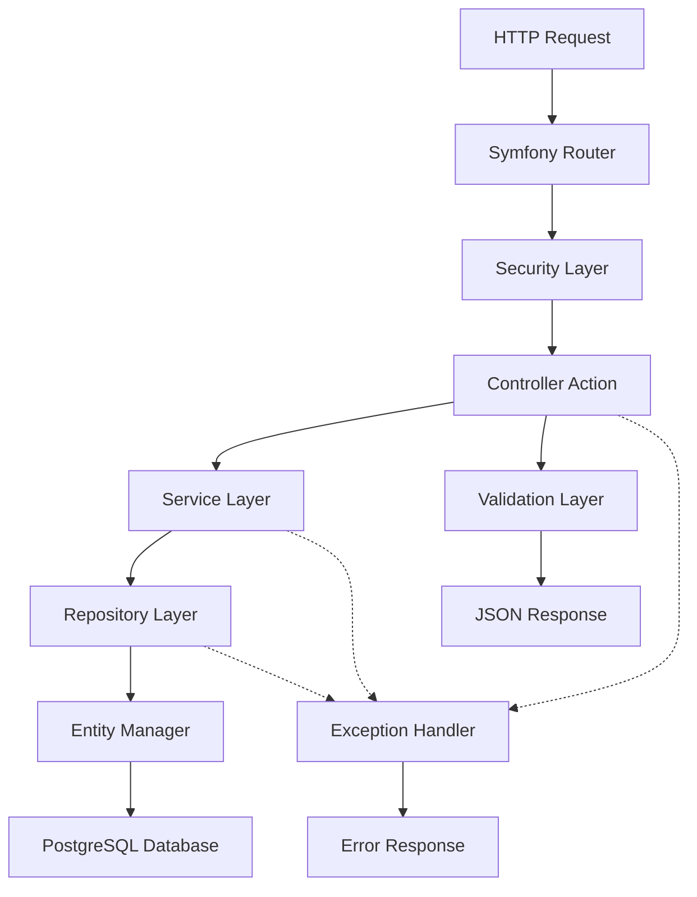

# 🖥️ Backend Controllers - Documentación Técnica

/* ! 01/06/2025 - Documentación técnica completa de controladores del backend EYRA */

## 📋 Índice

1. [Resumen de la Arquitectura](#-resumen-de-la-arquitectura)
2. [Controladores Principales](#-controladores-principales)
3. [AdminController](#-admincontroller)
4. [ConditionController](#-conditioncontroller)
5. [CycleController](#-cyclecontroller)
6. [Patrones y Convenciones](#-patrones-y-convenciones)
7. [Servicios de Soporte](#-servicios-de-soporte)
8. [Manejo de Errores](#-manejo-de-errores)

---

## 🎯 Resumen de la Arquitectura

El backend de EYRA está construido sobre **Symfony 7.2** siguiendo una arquitectura MVC con principios de separación de responsabilidades y inyección de dependencias.

### 🏗️ Estructura de Controladores



### 📊 Métricas de Controladores

| Controlador | Endpoints | Autenticación | Admin Only | Estado |
|-------------|:---------:|:-------------:|:----------:|:------:|
| **AdminController** | 4 | JWT | ✅ | ✅ Implementado |
| **AuthController** | 8 | Mixto | ❌ | ✅ Implementado |
| **ConditionController** | 14 | JWT | Parcial | ✅ Implementado |
| **CycleController** | 11 | JWT | ❌ | ✅ Implementado |
| **NotificationController** | 10 | JWT | ❌ | ✅ Implementado |
| **ContentController** | 6 | JWT | Parcial | ✅ Implementado |
| **GuestController** | 6 | JWT | ❌ | ✅ Implementado |
| **OnboardingController** | 2 | JWT | ❌ | ✅ Implementado |

---

## 🏛️ Controladores Principales

### 📑 Estructura Base de Controladores

```php
<?php
// ! 01/06/2025 - Estructura base común para todos los controladores

namespace App\Controller;

use Symfony\Bundle\FrameworkBundle\Controller\AbstractController;
use Symfony\Component\HttpFoundation\JsonResponse;
use Symfony\Component\HttpFoundation\Request;
use Symfony\Component\Routing\Annotation\Route;
use Symfony\Component\Security\Http\Attribute\IsGranted;
use Symfony\Component\Security\Core\Exception\AccessDeniedException;

abstract class BaseController extends AbstractController
{
    // Validación común de usuario autenticado
    protected function validateAuthenticatedUser(): User
    {
        /** @var User|null $user */
        $user = $this->getUser();
        if (!$user) {
            throw new AccessDeniedException('User not authenticated');
        }
        return $user;
    }

    // Parseo seguro de datos JSON
    protected function parseJsonData(Request $request): array
    {
        $data = json_decode($request->getContent(), true);
        if (!$data) {
            throw new \InvalidArgumentException('Invalid JSON data');
        }
        return $data;
    }

    // Respuesta de error estandarizada
    protected function errorResponse(string $message, int $code = 400): JsonResponse
    {
        return $this->json(['message' => $message], $code);
    }

    // Respuesta de éxito estandarizada
    protected function successResponse($data, string $message = 'Success', int $code = 200): JsonResponse
    {
        return $this->json([
            'message' => $message,
            'data' => $data
        ], $code);
    }
}
```

---

## 👑 AdminController

### 🔑 Propósito y Responsabilidades

El **AdminController** maneja todas las operaciones administrativas del sistema, permitiendo a los administradores gestionar usuarios del sistema.

### 📋 Endpoints Implementados

| Método | Endpoint | Descripción | Validaciones |
|--------|----------|-------------|--------------|
| `GET` | `/admin/users` | Listar usuarios con filtros | Paginación, filtros por rol/perfil |
| `GET` | `/admin/users/{id}` | Obtener usuario específico | Verificación de existencia |
| `PUT` | `/admin/users/{id}` | Actualizar usuario | Validación completa, unicidad email |
| `DELETE` | `/admin/users/{id}` | Desactivar usuario | Protección auto-eliminación |

### 🔧 Características Técnicas

#### Gestión de Filtros Avanzada

```php
// ! 01/06/2025 - Sistema de filtrado híbrido en AdminController
public function listUsers(Request $request): JsonResponse
{
    // Obtener parámetros de filtrado
    $page = max(1, $request->query->getInt('page', 1));
    $limit = min(100, max(1, $request->query->getInt('limit', 20)));
    $role = $request->query->get('role');
    $profileType = $request->query->get('profileType');
    $search = $request->query->get('search');

    // Procesar filtro de tipo de perfil de forma segura
    $profileTypeEnum = null;
    if ($profileType) {
        try {
            $profileTypeEnum = ProfileType::from($profileType);
        } catch (ValueError $e) {
            $profileTypeEnum = null; // Ignorar filtro inválido
        }
    }

    // Obtener datos con filtros aplicados
    $total = $this->userRepository->countUsersWithFilters($search, $role, $profileTypeEnum);
    $users = $this->userRepository->findUsersWithFilters($search, $role, $profileTypeEnum, $limit, $offset);

    // Transformar y devolver respuesta paginada
    return $this->json([
        'users' => $this->transformUsersData($users),
        'pagination' => [
            'page' => $page,
            'limit' => $limit,
            'total' => $total,
            'totalPages' => ceil($total / $limit)
        ]
    ]);
}
```

---

## 🏥 ConditionController

### 🎯 Propósito y Responsabilidades

Gestiona el catálogo de condiciones médicas y las relaciones entre usuarios y condiciones.

### 📋 Endpoints por Categoría

#### 📚 Gestión de Catálogo

| Método | Endpoint | Descripción | Permisos |
|--------|----------|-------------|----------|
| `GET` | `/conditions` | Listar todas las condiciones | USER |
| `GET` | `/conditions/active` | Solo condiciones activas | USER |
| `GET` | `/conditions/{id}` | Condición específica | USER |
| `GET` | `/conditions/categories` | Categorías disponibles | USER |
| `GET` | `/conditions/search?query=` | Búsqueda por nombre/descripción | USER |

#### 👤 Relaciones Usuario-Condición

| Método | Endpoint | Descripción | Validaciones |
|--------|----------|-------------|--------------|
| `GET` | `/conditions/user` | Condiciones del usuario | Ownership check |
| `POST` | `/conditions/user/add` | Asignar condición | Duplicado check |
| `PUT` | `/conditions/user/{id}` | Actualizar relación | Ownership check |
| `DELETE` | `/conditions/user/{id}` | Remover condición | Soft delete |

---

## 🔄 CycleController

### 🎯 Propósito y Responsabilidades

Gestiona los ciclos menstruales, predicciones y calendario de las usuarias.

### 📋 Endpoints por Funcionalidad

#### 📊 Estado Actual del Ciclo

| Método | Endpoint | Descripción | Características |
|--------|----------|-------------|-----------------|
| `GET` | `/cycles/current` | Ciclo actual con fases | Auto-organización de fases |
| `GET` | `/cycles/today` | Información del día actual | Auto-creación si no existe |
| `GET` | `/cycles/recommendations` | Recomendaciones personalizadas | Por fase del ciclo |

#### 📅 Calendario y Predicciones

| Método | Endpoint | Descripción | Algoritmos |
|--------|----------|-------------|------------|
| `GET` | `/cycles/calendar` | Vista de calendario | Filtrado por rango de fechas |
| `GET` | `/cycles/predict` | Predicción básica | Promedio ponderado |
| `GET` | `/cycles/prediction-details` | Predicción avanzada | Múltiples algoritmos |
| `POST` | `/cycles/sync-algorithm` | Recalcular predicciones | Algoritmo adaptativo |

#### 🔄 Gestión de Ciclos

| Método | Endpoint | Descripción | Validaciones |
|--------|----------|-------------|--------------|
| `POST` | `/cycles/start-cycle` | Iniciar nuevo ciclo | Detección de conflictos |
| `POST` | `/cycles/end-cycle/{id}` | Finalizar ciclo | Solo fase menstrual |
| `GET` | `/cycles/statistics` | Estadísticas detalladas | Análisis temporal |

---

## 🎯 Patrones y Convenciones

### 🏗️ Arquitectura de Controladores

#### Inyección de Dependencias

```php
// ! 01/06/2025 - Patrón de inyección de dependencias estándar
public function __construct(
    private EntityRepository $repository,           // Acceso a datos
    private EntityManagerInterface $entityManager, // Persistencia
    private ValidatorInterface $validator,         // Validación
    private LoggerInterface $logger,              // Logging
    private CustomService $customService          // Servicios especializados
) {}
```

#### Validación de Usuarios

```php
// ! 01/06/2025 - Patrón estándar de validación de autenticación
/** @var User $user */
$user = $this->getUser();
if (!$user) {
    throw new AccessDeniedException('User not authenticated');
}
```

### 🔒 Seguridad y Autorización

#### Atributos de Seguridad

```php
// ! 01/06/2025 - Patrones de autorización usando atributos PHP 8
#[Route('/admin')]
#[IsGranted('ROLE_ADMIN')]
class AdminController extends AbstractController {}

#[Route('/conditions/{id}', methods: ['DELETE'])]
#[IsGranted('ROLE_ADMIN')]
public function deleteCondition(int $id): JsonResponse {}
```

### 📊 Serialización y Grupos

```php
// ! 01/06/2025 - Uso de grupos de serialización para control de datos
return $this->json($userCondition, 201, [], [
    'groups' => ['user_condition:read', 'condition:read']
]);
```

### 🔄 Paginación Estándar

```php
// ! 01/06/2025 - Patrón estándar de paginación
$page = max(1, $request->query->getInt('page', 1));
$limit = min(100, max(1, $request->query->getInt('limit', 20)));
$offset = ($page - 1) * $limit;

return $this->json([
    'data' => $results,
    'pagination' => [
        'page' => $page,
        'limit' => $limit,
        'total' => $total,
        'totalPages' => ceil($total / $limit)
    ]
]);
```

---

## 🛠️ Servicios de Soporte

### 🧮 CycleCalculatorService

Servicio especializado para cálculos de ciclo menstrual con algoritmos adaptativos según la regularidad de los datos históricos.

### 🔔 NotificationService

Sistema de notificaciones médicas con diferentes niveles de prioridad y contexto específico para condiciones de salud.

### 📄 ContentRecommendationService

Servicio de recomendaciones personalizadas basado en la fase actual del ciclo menstrual y el perfil del usuario.

---

## ⚠️ Manejo de Errores

### 🎯 Estrategias de Manejo de Errores

#### Exception Handlers Globales

El sistema implementa manejo global de excepciones con respuestas JSON estandarizadas y logging contextual para debugging y monitoreo.

#### Validación con Mensajes Detallados

Todas las operaciones incluyen validación exhaustiva con mensajes de error específicos para cada campo y contexto.

#### Logging Contextual

Sistema de logging enriquecido con información de contexto, usuario, IP, parámetros y stack trace para debugging eficiente.

---

**📝 Última actualización:** 01/06/2025  
**👨‍💻 Autor:** Sistema de Documentación EYRA  
**🔄 Versión:** 1.0.0
