# Mejores Prácticas de Desarrollo EYRA

> **Archivo**: Mejores_Practicas.md  
> **Actualizado**: 01/06/2025  
> **Propósito**: Estándares de código y mejores prácticas del proyecto  

---

## 📋 Convenciones Obligatorias

### **📝 Sistema de Comentarios con Fecha**

**TODOS los cambios** deben incluir comentarios con fecha siguiendo este formato específico:

```
// ! DD/MM/AAAA - Descripción del cambio
/* ! DD/MM/AAAA - Para bloques de código */  
# ! DD/MM/AAAA - En archivos de configuración
```

### **📍 Ubicación de Comentarios**
- **Al inicio** de cada archivo modificado (después de namespace)
- **Junto a** cada nueva propiedad, método o función añadida
- **En migraciones**, al inicio de cada bloque funcional relevante

### **📋 Ejemplos Reales del Proyecto**

#### **Backend PHP/Symfony**
```php
<?php
// ! 28/05/2025 - Implementado endpoint para administradores editar usuarios
#[Route('/admin/users/{id}', methods: ['PUT'])]
public function editUser(int $id, Request $request): JsonResponse
{
    // ! 28/05/2025 - Añadido soporte para avatar desde panel admin
    if (isset($data['avatar'])) {
        try {
            if (is_string($data['avatar']) && !empty($data['avatar'])) {
                $avatarData = json_decode($data['avatar'], true);
                if (json_last_error() === JSON_ERROR_NONE) {
                    $user->setAvatar($avatarData);
                }
            }
        } catch (Exception $e) {
            $this->logger->error('Error procesando avatar: ' . $e->getMessage());
        }
    }
}
```

#### **Frontend TypeScript/React**
```typescript
// ! 31/05/2025 - Página de administración completamente actualizada
const AdminPage = () => {
  const [activeTab, setActiveTab] = useState<'overview' | 'users' | 'conditions'>('overview');
  
  // ! 01/06/2025 - Añadida pestaña de condiciones médicas
  const tabs = [
    { id: 'conditions', label: 'Condiciones', icon: '🎯' },
  ] as const;
};
```

---

## 🏗️ Arquitectura Backend (Symfony)

### **📊 Estructura de Controladores**

#### **✅ Patrón Estándar**
```php
<?php
namespace App\Controller;

#[Route('/admin')]
#[IsGranted('ROLE_ADMIN')]
class AdminController extends AbstractController
{
    public function __construct(
        private UserRepository $userRepository,
        private EntityManagerInterface $entityManager,
        private ValidatorInterface $validator,
        private LoggerInterface $logger
    ) {}

    #[Route('/users/{id}', methods: ['PUT'])]
    public function editUser(int $id, Request $request): JsonResponse
    {
        try {
            // 1. Validación de permisos
            $currentUser = $this->getUser();
            if (!in_array('ROLE_ADMIN', $currentUser->getRoles())) {
                $this->logger->warning('Acceso no autorizado', [
                    'userId' => $currentUser->getId(),
                    'ip' => $request->getClientIp()
                ]);
                return $this->json(['message' => 'Acceso denegado'], 403);
            }

            // 2. Validación de datos
            $data = json_decode($request->getContent(), true);
            if (!$data) {
                return $this->json(['message' => 'Datos inválidos'], 400);
            }

            // 3. Lógica de negocio
            $user = $this->userRepository->find($id);
            $this->updateUserData($user, $data);

            // 4. Respuesta y logging
            $this->logger->info('Usuario actualizado', [
                'targetUserId' => $user->getId(),
                'adminId' => $currentUser->getId()
            ]);

            return $this->json(['message' => 'Usuario actualizado', 'user' => $userData]);

        } catch (Exception $e) {
            $this->logger->error('Error actualizando usuario: ' . $e->getMessage());
            return $this->json(['message' => 'Error interno'], 500);
        }
    }
}
```

### **🔒 Seguridad y Validación**

#### **JWT y Permisos**
```php
// Protección a nivel de controlador
#[Route('/admin')]
#[IsGranted('ROLE_ADMIN')]
class AdminController extends AbstractController {}

// Validación adicional en métodos críticos
private function validateAdminPermissions(): void
{
    $user = $this->getUser();
    if (!$user || !in_array('ROLE_ADMIN', $user->getRoles())) {
        throw new AccessDeniedException('Insufficient permissions');
    }
}
```

#### **Validación de Entrada**
```php
private function validateUserData(array $data): array
{
    $errors = [];

    // Email validation
    if (isset($data['email']) && !filter_var($data['email'], FILTER_VALIDATE_EMAIL)) {
        $errors['email'] = 'Email inválido';
    }

    // Enum validation
    if (isset($data['profileType'])) {
        try {
            ProfileType::from($data['profileType']);
        } catch (ValueError $e) {
            $errors['profileType'] = 'Tipo de perfil inválido';
        }
    }

    // Date validation
    if (isset($data['birthDate'])) {
        try {
            new DateTime($data['birthDate']);
        } catch (Exception $e) {
            $errors['birthDate'] = 'Fecha inválida';
        }
    }

    return $errors;
}
```

### **🔄 Servicios Especializados**

```php
// ! 20/05/2025 - Servicio para cálculos complejos de ciclos menstruales
class CycleCalculatorService
{
    private const MAX_CYCLES_FOR_PREDICTION = 12;
    private const REGULARITY_WEIGHT = 0.7;

    public function __construct(
        private MenstrualCycleRepository $cycleRepository,
        private LoggerInterface $logger
    ) {}

    public function predictNextCycle(User $user): array
    {
        $cycles = $this->cycleRepository->findRecentByUser(
            $user->getId(), 
            self::MAX_CYCLES_FOR_PREDICTION
        );

        if (count($cycles) < 2) {
            return [
                'success' => false,
                'message' => 'Datos insuficientes',
                'confidence' => 50,
                'algorithm' => 'default'
            ];
        }

        $analysisResult = $this->analyzePattern($cycles);
        $confidence = $this->calculateConfidence($analysisResult, count($cycles));

        return [
            'success' => true,
            'expectedStartDate' => $nextStartDate->format('Y-m-d'),
            'confidence' => $confidence,
            'basedOnCycles' => count($cycles)
        ];
    }
}
```

---

## ⚛️ Arquitectura Frontend (React + TypeScript)

### **🎯 Componentes con TypeScript Estricto**

```typescript
// ! 31/05/2025 - Componente Button con diseño neomórfico y estados completos
interface ButtonProps {
  children: ReactNode;
  onClick?: () => void;
  disabled?: boolean;
  variant?: "primary" | "secondary" | "outline";
  size?: "small" | "medium" | "large";
  isLoading?: boolean;
  className?: string;
}

const Button: React.FC<ButtonProps> = ({
  children,
  onClick,
  disabled = false,
  variant = "primary",
  size = "medium",
  isLoading = false,
  className = "",
}) => {
  const baseClasses = "relative overflow-hidden rounded-2xl font-semibold transition-all duration-300";

  const sizeClasses = {
    small: "px-6 py-2 text-sm",
    medium: "px-8 py-3 text-base", 
    large: "px-12 py-4 text-lg",
  };

  const variantClasses = {
    primary: `
      bg-white/15 border-white/20 text-[#E7E0D5] 
      hover:bg-white/25 hover:scale-105 hover:shadow-[0_8px_32px_rgba(231,224,213,0.2)]
      active:scale-95 focus:ring-2 focus:ring-white/30
    `,
    secondary: `bg-[#E7E0D5]/15 border-[#E7E0D5]/20`,
    outline: `bg-transparent border-[#E7E0D5]/40`,
  };

  return (
    <button
      onClick={onClick}
      disabled={disabled || isLoading}
      className={`${baseClasses} ${sizeClasses[size]} ${variantClasses[variant]} ${className}`}
    >
      <span className="relative z-10 flex items-center justify-center gap-2">
        {isLoading ? (
          <>
            <LoadingSpinner />
            Cargando...
          </>
        ) : (
          children
        )}
      </span>
    </button>
  );
};
```

### **🌐 Cliente HTTP con Manejo de Errores**

```typescript
// ! 01/06/2025 - Cliente HTTP centralizado con manejo completo de errores
export async function apiFetch<T>(
  path: string,
  options: FetchOptions = {},
  silent = false
): Promise<T> {
  const url = path.startsWith("http") ? path : `${API_URL}${path}`;
  
  const fetchOptions: RequestInit = {
    ...options,
    headers: {
      "Content-Type": "application/json",
      "Accept": "application/json",
      ...options.headers,
    },
    credentials: "include", // Para cookies JWT
  };

  if (options.body) {
    fetchOptions.body = JSON.stringify(options.body);
  }

  try {
    const response = await fetch(url, fetchOptions);

    console.log(`httpClient: ${url}`, {
      status: response.status,
      ok: response.ok,
    });

    if (!response.ok) {
      if (response.status === 401) {
        if (!path.includes('/api/profile')) {
          authEvents.onUnauthorized();
        }
      }
      throw new Error(`Error: ${response.status} ${response.statusText}`);
    }

    return await response.json();
  } catch (error) {
    console.error("Error en petición API:", error);
    throw error;
  }
}
```

### **📊 Estado y Efectos Organizados**

```typescript
const AdminPage = () => {
  // Estados agrupados por funcionalidad
  const [activeTab, setActiveTab] = useState<TabType>('overview');
  const [data, setData] = useState<AdminStats | null>(null);
  const [isLoading, setIsLoading] = useState(true);
  const [error, setError] = useState<string | null>(null);

  // Efectos con dependencias específicas
  useEffect(() => {
    loadData();
  }, [user]);

  const loadData = async () => {
    try {
      setIsLoading(true);
      setError(null);
      
      const [statsData, activityData] = await Promise.all([
        adminStatsService.getSystemStats(),
        adminStatsService.getRecentActivity()
      ]);
      
      setStats(statsData);
      setRecentActivity(activityData);
    } catch (err: any) {
      console.error('Error cargando datos:', err);
      setError(err.message || 'Error al cargar datos');
    } finally {
      setIsLoading(false);
    }
  };

  // Estados de carga con skeleton
  if (isLoading) {
    return (
      <div className="animate-pulse">
        <div className="h-8 bg-gray-200 rounded mb-2"></div>
        <div className="h-4 bg-gray-200 rounded w-3/4"></div>
      </div>
    );
  }

  if (error) {
    return (
      <div className="text-red-500 p-4">
        Error: {error}
        <button onClick={loadData} className="ml-2 underline">
          Reintentar
        </button>
      </div>
    );
  }

  return <div>{/* Contenido principal */}</div>;
};
```

---

## 🗄️ Base de Datos y Migraciones

### **📋 Estructura de Entidades**

```php
<?php
// ! 28/05/2025 - Añadido campo avatar para personalización
#[ORM\Entity(repositoryClass: UserRepository::class)]
#[ORM\Table(name: '`user`')]
class User implements UserInterface
{
    #[ORM\Id]
    #[ORM\GeneratedValue]
    #[ORM\Column]
    private ?int $id = null;

    #[ORM\Column(length: 180, unique: true)]
    #[Assert\Email(message: 'Email debe ser válido')]
    #[Assert\NotBlank(message: 'Email es obligatorio')]
    private ?string $email = null;

    #[ORM\Column(type: 'json', nullable: true)]
    #[Assert\Json(message: 'Avatar debe ser JSON válido')]
    private ?array $avatar = null;

    public function setAvatar(?array $avatar): static
    {
        $this->avatar = $avatar;
        return $this;
    }

    public function getAvatar(): ?array
    {
        return $this->avatar;
    }
}
```

### **🔄 Migraciones Seguras**

```php
<?php
// ! 28/05/2025 - Migración para campo avatar sin romper datos existentes
declare(strict_types=1);

final class Version20250528000000 extends AbstractMigration
{
    public function getDescription(): string
    {
        return 'Añade campo avatar (JSON) a tabla user';
    }

    public function up(Schema $schema): void
    {
        // Añadir columna con valor por defecto
        $this->addSql('ALTER TABLE "user" ADD avatar JSON DEFAULT NULL');
        
        // Constraint de validación
        $this->addSql('
            ALTER TABLE "user" 
            ADD CONSTRAINT avatar_structure_check 
            CHECK (
                avatar IS NULL OR (
                    json_typeof(avatar) = "object" AND
                    avatar ? "skinColor" AND
                    avatar ? "eyes"
                )
            )
        ');

        // Índice para consultas eficientes
        $this->addSql('CREATE INDEX IDX_user_avatar_skin ON "user" USING GIN ((avatar->>\'skinColor\'))');
    }

    public function down(Schema $schema): void
    {
        $this->addSql('DROP INDEX IF EXISTS IDX_user_avatar_skin');
        $this->addSql('ALTER TABLE "user" DROP CONSTRAINT IF EXISTS avatar_structure_check');
        $this->addSql('ALTER TABLE "user" DROP COLUMN avatar');
    }
}
```

---

## 🚀 API y Endpoints

### **📋 Estructura REST Consistente**

| Método | Endpoint | Propósito | Respuesta |
|--------|----------|-----------|-----------|
| `GET` | `/admin/users` | Listar con paginación | `{users: [], pagination: {}}` |
| `GET` | `/admin/users/{id}` | Usuario específico | `{user: {}}` |
| `POST` | `/admin/users` | Crear usuario | `{message: "", user: {}}` |
| `PUT` | `/admin/users/{id}` | Actualizar usuario | `{message: "", user: {}}` |
| `DELETE` | `/admin/users/{id}` | Desactivar usuario | `{message: ""}` |

### **📊 Códigos de Estado HTTP**

| Código | Uso en EYRA | Ejemplo |
|--------|-------------|---------|
| **200** | Operación exitosa | GET, PUT exitosos |
| **201** | Recurso creado | POST exitoso |
| **400** | Datos inválidos | Validación fallida |
| **401** | No autenticado | JWT expirado |
| **403** | Sin permisos | No ROLE_ADMIN |
| **404** | No encontrado | Usuario inexistente |
| **409** | Conflicto | Email duplicado |
| **500** | Error servidor | Excepción no controlada |

### **🔄 Paginación Estándar**

```php
// Patrón de paginación reutilizable
$page = max(1, $request->query->getInt('page', 1));
$limit = min(100, max(1, $request->query->getInt('limit', 20)));
$offset = ($page - 1) * $limit;

return $this->json([
    'data' => $results,
    'pagination' => [
        'page' => $page,
        'limit' => $limit,
        'total' => $total,
        'totalPages' => ceil($total / $limit)
    ]
]);
```

---

## 🔐 Seguridad

### **🛡️ Autenticación JWT**

```yaml
# Configuración segura JWT
lexik_jwt_authentication:
    secret_key: '%env(JWT_SECRET_KEY)%'
    public_key: '%env(JWT_PUBLIC_KEY)%'
    pass_phrase: '%env(JWT_PASSPHRASE)%'
    token_ttl: 1800  # 30 minutos
    
    set_cookies:
        jwt_token:
            lifetime: 1800
            samesite: lax
            path: /
            secure: true      # Solo HTTPS
            httpOnly: true    # No JavaScript
```

### **🔒 Validación Multi-Capa**

1. **Frontend**: Validación en tiempo real
2. **API**: Tipos TypeScript
3. **Backend**: Symfony Validator
4. **Database**: Constraints SQL

```php
// Ejemplo de validación completa
private function validateUserInput(array $data): array
{
    $errors = [];

    // Validación de email
    if (isset($data['email'])) {
        if (!filter_var($data['email'], FILTER_VALIDATE_EMAIL)) {
            $errors['email'] = 'Email inválido';
        }
        
        // Verificar unicidad
        $existing = $this->userRepository->findOneBy(['email' => $data['email']]);
        if ($existing) {
            $errors['email'] = 'Email ya registrado';
        }
    }

    return $errors;
}
```

---

## 📊 Logging y Monitoreo

### **📝 Logging Contextual**

```php
// Logging estructurado para auditoría
$this->logger->info('Usuario actualizado por administrador', [
    'action' => 'user.update',
    'admin_id' => $currentUser->getId(),
    'target_id' => $user->getId(),
    'changes' => array_keys($data),
    'ip' => $request->getClientIp(),
    'user_agent' => $request->headers->get('User-Agent'),
    'timestamp' => new \DateTime()
]);

// Logging de errores con contexto
$this->logger->error('Error crítico en operación', [
    'exception' => $e->getMessage(),
    'trace' => $e->getTraceAsString(),
    'user_id' => $user->getId(),
    'operation' => 'update_user',
    'data' => $sanitizedData
]);
```

### **🔍 Health Checks**

```php
#[Route('/health', methods: ['GET'])]
public function healthCheck(): JsonResponse
{
    $status = [
        'status' => 'healthy',
        'timestamp' => new \DateTime(),
        'services' => []
    ];

    // Check database
    try {
        $this->entityManager->getConnection()->connect();
        $status['services']['database'] = 'healthy';
    } catch (\Exception $e) {
        $status['services']['database'] = 'unhealthy';
        $status['status'] = 'degraded';
    }

    // Check memory
    $memoryUsage = memory_get_usage(true);
    $status['services']['memory'] = [
        'usage' => $memoryUsage,
        'percentage' => round(($memoryUsage / $this->getMemoryLimit()) * 100, 2)
    ];

    return $this->json($status);
}
```

---

## 📋 Control de Versiones

### **📝 Versionado Semántico**

Formato: `MAYOR.MENOR.PARCHE`

- **MAYOR**: Cambios incompatibles de API
- **MENOR**: Nueva funcionalidad compatible
- **PARCHE**: Correcciones de errores

### **📊 Proceso de Actualización**

```mermaid
graph LR
    A[Desarrollo] --> B[Comentario // ! DD/MM/AAAA]
    B --> C[Commit]
    C --> D[Actualizar Control_cambios_backend.md]
    D --> E[Incrementar Versión]
    E --> F[Deploy]
```



### **📋 Ejemplo de Entrada en Control de Cambios**

```markdown
## v0.7.8 - 01/06/2025

| Archivo | Descripción | Tipo | Cambio |
|---------|-------------|------|--------|
| Mejores_Practicas.md | Estándares completos con ejemplos | Documentación | Nueva funcionalidad |
| AdminController.php | Validación adicional de permisos | Controlador | Mejora seguridad |
| Button.tsx | Optimización estados de carga | Componente | Mejora UX |
```

---

## 🔗 Enlaces Relacionados

- ← **[Controladores Backend](./Controladores.md)** - Implementación técnica
- → **[Guía de Desarrollo](../Guias/Agregar_Funcionalidad.md)** - Cómo añadir features
- 🔐 **[Seguridad](../../03_Análisis-Diseño/Seguridad/)** - Sistema de permisos
- 📋 **[API Endpoints](../../03_Análisis-Diseño/API/Endpoints.md)** - Documentación API
- 🏠 **[Volver al Índice](../../00_Indice/README.md)** - Navegación principal

---

*Mejores prácticas actualizadas el 01/06/2025*

<!-- ! 01/06/2025 - Documentación completa de mejores prácticas con ejemplos reales del proyecto EYRA -->
