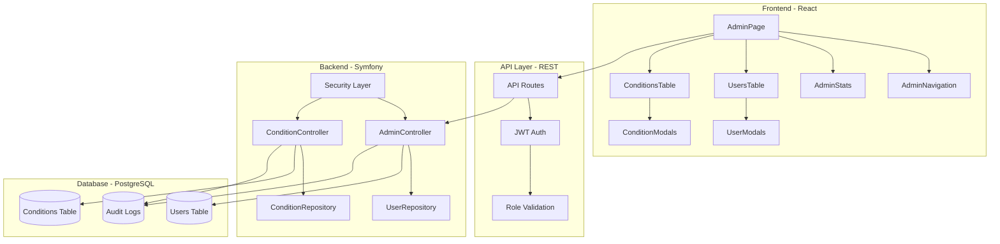

# 🏗️ Arquitectura del Sistema de Administración

> **Archivo**: 02-Arquitectura-Admin.md  
> **Tags**: #admin #backend #frontend #architecture #system-design

---

## 📐 Visión General de la Arquitectura

El sistema de administración de EYRA sigue una arquitectura de tres capas claramente definidas:



---

## 🎯 Principios de Diseño

### 1. **Separación de Responsabilidades**

```typescript
// Frontend: Presentación y UX
const AdminPage = () => {
    // Solo lógica de presentación
    // Delegación a servicios para datos
}

// Servicios: Lógica de negocio
const adminService = {
    // Comunicación con API
    // Transformación de datos
}

// Backend: Persistencia y validación
class AdminController {
    // Validación de permisos
    // Operaciones CRUD
}
```

### 2. **Seguridad en Profundidad**

- **Capa 1**: Validación de JWT en cada petición
- **Capa 2**: Verificación de roles con `@IsGranted`
- **Capa 3**: Validación de datos con Symfony Validator
- **Capa 4**: Logs de auditoría para trazabilidad

### 3. **Escalabilidad Horizontal**

```yaml
# Diseñado para escalar:
- Stateless controllers
- JWT tokens sin estado de sesión
- Caché distribuido compatible
- Sin dependencias de archivos locales
```

---

## 🔧 Componentes Principales

### Backend - Controladores

#### **AdminController**
```php
#[Route('/admin')]
#[IsGranted('ROLE_ADMIN')]
class AdminController extends AbstractController
{
    // Gestión de usuarios
    // Estadísticas del sistema
    // Operaciones administrativas
}
```

**Responsabilidades**:
- ✅ CRUD de usuarios
- ✅ Búsqueda y filtrado avanzado
- ✅ Gestión de roles y permisos
- ✅ Auditoría de acciones

#### **ConditionController**
```php
#[Route('/api/conditions')]
class ConditionController extends AbstractController
{
    // Gestión de condiciones médicas
    // Endpoints públicos y privados
}
```

**Responsabilidades**:
- ✅ CRUD de condiciones (admin only)
- ✅ Listado público de condiciones
- ✅ Asociación usuario-condición
- ✅ Búsqueda de condiciones

### Frontend - Componentes React

#### **Estructura de Carpetas**
```
src/
├── features/
│   └── admin/
│       └── components/
│           ├── AdminStats.tsx         # Dashboard estadísticas
│           ├── UsersTable.tsx         # Tabla de usuarios
│           ├── UserCreateModal.tsx    # Modal crear usuario
│           ├── UserEditModal.tsx      # Modal editar usuario
│           ├── UserViewModal.tsx      # Modal ver usuario
│           ├── ConditionsTable.tsx    # Tabla condiciones
│           ├── ConditionCreateModal.tsx
│           ├── ConditionEditModal.tsx
│           └── ConditionViewModal.tsx
├── services/
│   ├── adminService.ts               # API usuarios
│   └── adminConditionService.ts      # API condiciones
└── pages/
    └── AdminPage.tsx                 # Página principal admin
```

#### **Patrón de Componentes**
```typescript
// Componente contenedor (Smart)
const AdminPage: React.FC = () => {
    const [data, setData] = useState();
    // Lógica de estado y efectos
    
    return <PresentationalComponent data={data} />;
};

// Componente presentacional (Dumb)
const UsersTable: React.FC<Props> = ({ users, onRefresh }) => {
    // Solo renderizado y eventos
    return <table>...</table>;
};
```

---

## 🔄 Flujo de Datos

### 1. **Petición desde Frontend**

```typescript
// 1. Usuario hace click en acción
const handleCreateUser = async (userData) => {
    // 2. Servicio prepara la petición
    const response = await adminService.createUser(userData);
    
    // 3. Actualización del estado local
    setUsers([...users, response.user]);
    
    // 4. Feedback al usuario
    showNotification('Usuario creado exitosamente');
};
```

### 2. **Procesamiento en Backend**

```php
// 1. Recepción en controlador
#[Route('/users', methods: ['POST'])]
public function createUser(Request $request): JsonResponse
{
    // 2. Validación de permisos
    $this->denyAccessUnlessGranted('ROLE_ADMIN');
    
    // 3. Validación de datos
    $errors = $this->validator->validate($user);
    
    // 4. Persistencia
    $this->entityManager->persist($user);
    $this->entityManager->flush();
    
    // 5. Auditoría
    $this->logger->info('Usuario creado', ['admin' => $adminId]);
    
    // 6. Respuesta
    return $this->json(['user' => $userData]);
}
```

---

## 🗄️ Modelo de Datos

### Entidades Principales

```php
// User Entity
class User
{
    private int $id;
    private string $email;
    private string $username;
    private array $roles = ['ROLE_USER'];
    private ProfileType $profileType;
    private bool $state = true;
    private bool $onboardingCompleted = false;
    private ?array $avatar = null;
    // ... más campos
}

// Condition Entity
class Condition
{
    private int $id;
    private string $name;
    private string $description;
    private bool $isChronic = false;
    private bool $state = true;
    // ... relaciones
}
```

### Repositorios con Métodos Optimizados

```php
// UserRepository
class UserRepository extends ServiceEntityRepository
{
    /**
     * Búsqueda optimizada con filtros
     * ! 31/05/2025 - Implementación eficiente con SQL
     */
    public function findUsersWithFilters(
        ?string $search = null,
        ?string $role = null,
        ?ProfileType $profileType = null,
        int $limit = 20,
        int $offset = 0
    ): array {
        $qb = $this->createQueryBuilder('u')
            ->orderBy('u.id', 'ASC')
            ->setMaxResults($limit)
            ->setFirstResult($offset);
            
        // Aplicación de filtros en SQL
        // ...
        
        return $qb->getQuery()->getResult();
    }
}
```

---

## 🚀 Optimizaciones Implementadas

### 1. **Paginación Eficiente**
- Límites en consultas SQL
- Lazy loading de relaciones
- Índices en campos de búsqueda

### 2. **Caché de Consultas**
```php
$qb->getQuery()
   ->setResultCacheId('admin_users_list')
   ->setResultCacheLifetime(300); // 5 minutos
```

### 3. **Reducción de Consultas N+1**
```php
$qb->leftJoin('u.onboarding', 'o')
   ->addSelect('o'); // Eager loading
```

### 4. **Respuestas Optimizadas**
- Solo campos necesarios en JSON
- Compresión gzip habilitada
- HTTP/2 para multiplexing

---

## 📊 Métricas de Rendimiento

### Tiempos de Respuesta Objetivo

| Operación | Objetivo | Actual |
|-----------|----------|--------|
| Listado usuarios (20 items) | < 200ms | ~150ms |
| Búsqueda | < 300ms | ~180ms |
| Crear/Editar | < 500ms | ~350ms |
| Eliminar | < 200ms | ~120ms |

### Capacidad del Sistema

- **Usuarios concurrentes**: 100+
- **Registros por tabla**: 100k+
- **Peticiones por segundo**: 50 RPS
- **Uptime objetivo**: 99.9%

---

## 🔐 Consideraciones de Seguridad

### Autenticación y Autorización

```yaml
security:
    firewalls:
        api:
            pattern: ^/api
            stateless: true
            jwt: ~
            
    access_control:
        - { path: ^/api/admin, roles: ROLE_ADMIN }
```

### Validación de Datos

```php
// Validación en múltiples capas
1. Frontend: Validación en tiempo real
2. API: Tipos TypeScript
3. Backend: Symfony Validator
4. Database: Constraints SQL
```

### Logs de Auditoría

```php
$this->logger->info('Acción administrativa', [
    'action' => 'user.update',
    'admin_id' => $adminId,
    'target_id' => $userId,
    'changes' => array_keys($data),
    'ip' => $request->getClientIp(),
    'timestamp' => time()
]);
```

---

## 🔗 Enlaces Relacionados

- ← [[01-Indice-Principal|Volver al Índice]]
- → [[03-Seguridad-Permisos|Siguiente: Seguridad y Permisos]]
- 🔧 [[10-Backend-Controllers|Detalles de Controladores]]
- 🎨 [[11-Frontend-Components|Detalles de Componentes]]

---

#admin #architecture #backend #frontend #system-design