# 🔐 Seguridad y Permisos del Panel de Administración

> **Archivo**: 03-Seguridad-Permisos.md  
> **Tags**: #admin #security #authentication #authorization #jwt #roles

---

## 🛡️ Modelo de Seguridad de EYRA

El sistema implementa un modelo de seguridad en capas múltiples que garantiza la protección de datos sensibles y el control de acceso granular.

```mermaid
graph TD
    A[Usuario] --> B{Autenticación JWT}
    B -->|Token Válido| C{Verificación de Rol}
    B -->|Token Inválido| D[Acceso Denegado]
    C -->|ROLE_ADMIN| E[Panel Admin]
    C -->|ROLE_USER| F[Acceso Usuario]
    C -->|Sin Rol Admin| D
    E --> G{Validación de Permisos}
    G -->|Permitido| H[Ejecutar Acción]
    G -->|Denegado| D
    H --> I[Log de Auditoría]
```



---

## 🔑 Sistema de Autenticación JWT

### Configuración JWT

```yaml
# config/packages/lexik_jwt_authentication.yaml
lexik_jwt_authentication:
    secret_key: '%env(resolve:JWT_SECRET_KEY)%'
    public_key: '%env(resolve:JWT_PUBLIC_KEY)%'
    pass_phrase: '%env(JWT_PASSPHRASE)%'
    token_ttl: 1800  # 30 minutos
    
    # Configuración de cookies
    token_extractors:
        authorization_header:
            enabled: true
            prefix: Bearer
            name: Authorization
        cookie:
            enabled: true
            name: jwt_token
            
    # Configuración de seguridad
    set_cookies:
        jwt_token:
            lifetime: 1800
            samesite: lax
            path: /
            domain: null
            secure: true    # Solo HTTPS en producción
            httpOnly: true  # No accesible via JavaScript
```

### Flujo de Autenticación

```php
// AuthController.php
#[Route('/login_check', name: 'api_login_check', methods: ['POST'])]
public function login(Request $request): JsonResponse
{
    // 1. Validación de credenciales
    $user = $this->userRepository->findOneBy(['email' => $email]);
    
    if (!$user || !$this->passwordHasher->isPasswordValid($user, $password)) {
        throw new AuthenticationException('Invalid credentials');
    }
    
    // 2. Verificación de estado de cuenta
    if (!$user->getState()) {
        throw new DisabledException('Account is disabled');
    }
    
    // 3. Generación de tokens
    $jwtToken = $this->tokenService->createJwtToken($user);
    $refreshToken = $this->tokenService->createRefreshToken($user, $request);
    
    // 4. Configuración de cookies seguras
    $response = new JsonResponse([...]);
    $response->headers->setCookie(
        Cookie::create('jwt_token')
            ->withValue($jwtToken)
            ->withExpires(time() + 1800)
            ->withPath('/')
            ->withSecure(true)
            ->withHttpOnly(true)
            ->withSameSite(Cookie::SAMESITE_LAX)
    );
    
    // 5. Log de auditoría
    $this->logger->info('Usuario autenticado', [
        'user_id' => $user->getId(),
        'ip' => $request->getClientIp(),
        'user_agent' => $request->headers->get('User-Agent')
    ]);
    
    return $response;
}
```

---

## 👥 Sistema de Roles y Permisos

### Jerarquía de Roles

```yaml
# config/packages/security.yaml
security:
    role_hierarchy:
        ROLE_ADMIN: [ROLE_USER]
        ROLE_GUEST: [ROLE_USER]
        ROLE_PARENT: [ROLE_USER]
```

### Definición de Roles

| Rol | Descripción | Permisos |
|-----|-------------|----------|
| `ROLE_USER` | Usuario estándar | - Acceso a su perfil<br>- Gestión de su ciclo<br>- Lectura de contenido |
| `ROLE_ADMIN` | Administrador | - Todo de ROLE_USER<br>- Panel de administración<br>- CRUD de usuarios<br>- CRUD de condiciones<br>- Acceso a logs |
| `ROLE_GUEST` | Invitado (pareja) | - Ver información compartida<br>- Sin modificación de datos |
| `ROLE_PARENT` | Control parental | - Ver información del menor<br>- Gestión limitada |

### Implementación de Permisos

```php
// AdminController.php
#[Route('/admin')]
#[IsGranted('ROLE_ADMIN')] // Protección a nivel de controlador
class AdminController extends AbstractController
{
    #[Route('/users/{id}', methods: ['DELETE'])]
    public function deleteUser(int $id): JsonResponse
    {
        // Verificación adicional de permisos
        $currentUser = $this->getUser();
        
        // No puede eliminarse a sí mismo
        if ($currentUser->getId() === $id) {
            throw new AccessDeniedException('Cannot delete your own account');
        }
        
        // No puede eliminar a otros admins
        $targetUser = $this->userRepository->find($id);
        if (in_array('ROLE_ADMIN', $targetUser->getRoles())) {
            throw new AccessDeniedException('Cannot delete other administrators');
        }
        
        // Proceder con la eliminación
        // ...
    }
}
```

---

## 🔒 Validación de Acceso Frontend

### RoleRoute Component

```typescript
// components/RoleRoute.tsx
interface RoleRouteProps {
    allowedRoles: string[];
    requireOnboarding?: boolean;
    children: React.ReactNode;
}

const RoleRoute: React.FC<RoleRouteProps> = ({
    allowedRoles,
    requireOnboarding = false,
    children
}) => {
    const { user } = useAuth();
    const navigate = useNavigate();
    
    useEffect(() => {
        // Verificación de autenticación
        if (!user) {
            navigate('/login');
            return;
        }
        
        // Verificación de roles
        const hasRequiredRole = allowedRoles.some(role => 
            user.roles.includes(role)
        );
        
        if (!hasRequiredRole) {
            navigate('/unauthorized');
            return;
        }
        
        // Verificación de onboarding
        if (requireOnboarding && !user.onboardingCompleted) {
            navigate('/onboarding');
            return;
        }
    }, [user, allowedRoles, requireOnboarding]);
    
    // Renderizar solo si tiene permisos
    return hasAccess ? <>{children}</> : null;
};
```

### Uso en Router

```typescript
// router/index.tsx
{
    path: ROUTES.ADMIN,
    element: (
        <RoleRoute 
            allowedRoles={["ROLE_ADMIN"]} 
            requireOnboarding={true}
        >
            <AdminPage />
        </RoleRoute>
    ),
}
```

---

## 🛠️ Protección contra Vulnerabilidades

### 1. **Cross-Site Request Forgery (CSRF)**

```typescript
// No aplicable con JWT stateless
// Las cookies JWT incluyen:
- httpOnly: true  // Previene acceso XSS
- secure: true    // Solo HTTPS
- sameSite: lax   // Protección CSRF
```

### 2. **Cross-Site Scripting (XSS)**

```typescript
// Sanitización de entrada
const sanitizeInput = (input: string): string => {
    return DOMPurify.sanitize(input, {
        ALLOWED_TAGS: [],
        ALLOWED_ATTR: []
    });
};

// Renderizado seguro en React
<div dangerouslySetInnerHTML={{__html: sanitizedContent}} />
```

### 3. **SQL Injection**

```php
// Uso de prepared statements con Doctrine
$qb = $this->createQueryBuilder('u')
    ->where('u.email = :email')
    ->setParameter('email', $email); // Escapado automático

// NUNCA hacer esto:
// $query = "SELECT * FROM users WHERE email = '" . $email . "'";
```

### 4. **Rate Limiting**

```yaml
# config/packages/rate_limiter.yaml
framework:
    rate_limiter:
        admin_api:
            policy: 'sliding_window'
            limit: 100
            interval: '1 minute'
            
        login_attempts:
            policy: 'fixed_window'
            limit: 5
            interval: '15 minutes'
```

---

## 📝 Sistema de Auditoría

### Estructura de Logs

```php
// Service/AuditService.php
class AuditService
{
    public function logAdminAction(
        string $action,
        User $admin,
        ?int $targetId = null,
        array $changes = []
    ): void {
        $logEntry = [
            'timestamp' => time(),
            'action' => $action,
            'admin' => [
                'id' => $admin->getId(),
                'email' => $admin->getEmail(),
                'roles' => $admin->getRoles()
            ],
            'target_id' => $targetId,
            'changes' => $changes,
            'request' => [
                'ip' => $this->request->getClientIp(),
                'user_agent' => $this->request->headers->get('User-Agent'),
                'method' => $this->request->getMethod(),
                'uri' => $this->request->getRequestUri()
            ]
        ];
        
        $this->logger->info('Admin action', $logEntry);
        
        // Opcional: Guardar en base de datos
        $this->auditRepository->save($logEntry);
    }
}
```

### Eventos Auditados

| Evento | Nivel | Datos Registrados |
|--------|-------|-------------------|
| Login exitoso | INFO | Usuario, IP, timestamp |
| Login fallido | WARNING | Email intentado, IP, razón |
| Creación usuario | INFO | Admin, datos nuevo usuario |
| Edición usuario | INFO | Admin, campos modificados |
| Eliminación usuario | WARNING | Admin, usuario eliminado |
| Cambio de roles | WARNING | Admin, roles anteriores/nuevos |
| Acceso denegado | ERROR | Usuario, recurso intentado |

---

## 🚨 Manejo de Errores de Seguridad

### Respuestas Estandarizadas

```php
// Security/ExceptionListener.php
class SecurityExceptionListener
{
    public function onKernelException(ExceptionEvent $event): void
    {
        $exception = $event->getThrowable();
        
        // Mapeo de excepciones a respuestas
        $responseMap = [
            AuthenticationException::class => [
                'code' => 401,
                'message' => 'Authentication required'
            ],
            AccessDeniedException::class => [
                'code' => 403,
                'message' => 'Access denied'
            ],
            TokenExpiredException::class => [
                'code' => 401,
                'message' => 'Token expired'
            ],
        ];
        
        // Nunca exponer detalles internos
        $response = new JsonResponse([
            'error' => $responseMap[get_class($exception)] ?? [
                'code' => 500,
                'message' => 'Internal server error'
            ]
        ]);
        
        $event->setResponse($response);
    }
}
```

---

## 🔄 Flujo de Refresh Token

### Implementación Segura

```php
// TokenService.php
public function refreshToken(string $refreshToken): array
{
    // 1. Validar refresh token
    $token = $this->refreshTokenRepository->findOneBy([
        'token' => hash('sha256', $refreshToken),
        'revoked' => false
    ]);
    
    if (!$token || $token->getExpiresAt() < new \DateTime()) {
        throw new InvalidRefreshTokenException();
    }
    
    // 2. Verificar dispositivo/IP
    if ($token->getIpAddress() !== $this->request->getClientIp()) {
        $this->logger->warning('Refresh token used from different IP', [
            'original_ip' => $token->getIpAddress(),
            'current_ip' => $this->request->getClientIp()
        ]);
    }
    
    // 3. Generar nuevos tokens
    $user = $token->getUser();
    $newJwtToken = $this->createJwtToken($user);
    $newRefreshToken = $this->createRefreshToken($user);
    
    // 4. Revocar token anterior
    $token->setRevoked(true);
    $this->entityManager->flush();
    
    return [
        'jwt' => $newJwtToken,
        'refresh' => $newRefreshToken->getToken()
    ];
}
```

---

## 📊 Métricas de Seguridad

### KPIs de Seguridad

| Métrica | Objetivo | Actual |
|---------|----------|--------|
| Intentos de login fallidos | < 1% | 0.8% |
| Tokens expirados manejados | 100% | 100% |
| Tiempo detección intrusión | < 1s | 0.5s |
| Logs de auditoría completos | 100% | 100% |

### Monitoreo Activo

```yaml
# Alertas configuradas:
- Login desde IP sospechosa
- Múltiples intentos fallidos
- Acceso a recursos no autorizados
- Cambios masivos de datos
- Patrones anormales de uso
```

---

## 🔗 Enlaces Relacionados

- ← [[02-Arquitectura-Admin|Arquitectura del Sistema]]
- → [[04-Flujo-Autenticacion|Flujo de Autenticación Detallado]]
- 📋 [[06-Roles-Perfiles|Sistema de Roles y Perfiles]]
- 🔧 [[18-Troubleshooting|Resolución de Problemas de Seguridad]]

---

#admin #security #authentication #authorization #jwt #roles #audit