# 🔑 Flujo de Autenticación del Sistema

> **Archivo**: 04-Flujo-Autenticacion.md  
> **Tags**: #admin #authentication #jwt #security #flow #cookies

---

## 🌊 Flujo Completo de Autenticación

El sistema EYRA implementa un flujo de autenticación robusto basado en JWT con refresh tokens, diseñado para máxima seguridad y experiencia de usuario fluida.

```mermaid
sequenceDiagram
    participant U as Usuario
    participant F as Frontend
    participant B as Backend
    participant DB as Database
    participant JWT as JWT Service
    
    U->>F: Ingresa credenciales
    F->>F: Validación básica
    F->>B: POST /api/login_check
    B->>DB: Buscar usuario
    DB-->>B: Usuario encontrado
    B->>B: Verificar password
    B->>JWT: Generar tokens
    JWT-->>B: JWT + Refresh Token
    B->>DB: Guardar Refresh Token
    B->>B: Configurar cookies
    B-->>F: Response + Cookies
    F->>F: Guardar en Context
    F-->>U: Acceso concedido
    
    Note over U,F: Navegación autenticada
    
    F->>B: GET /api/admin/users
    B->>B: Validar JWT
    B->>B: Verificar rol ADMIN
    B-->>F: Datos autorizados
```



---

## 🚀 Proceso de Login Detallado

### 1. **Formulario de Login**

```typescript
// LoginForm.tsx
const LoginForm: React.FC = () => {
    const [formData, setFormData] = useState({
        email: '',
        password: ''
    });
    const [errors, setErrors] = useState<ValidationErrors>({});
    
    const validateForm = (): boolean => {
        const newErrors: ValidationErrors = {};
        
        // Validación de email
        if (!formData.email) {
            newErrors.email = 'El email es requerido';
        } else if (!/^[^\s@]+@[^\s@]+\.[^\s@]+$/.test(formData.email)) {
            newErrors.email = 'Email inválido';
        }
        
        // Validación de password
        if (!formData.password) {
            newErrors.password = 'La contraseña es requerida';
        } else if (formData.password.length < 8) {
            newErrors.password = 'Mínimo 8 caracteres';
        }
        
        setErrors(newErrors);
        return Object.keys(newErrors).length === 0;
    };
    
    const handleSubmit = async (e: FormEvent) => {
        e.preventDefault();
        
        if (!validateForm()) return;
        
        try {
            await authService.login(formData);
            navigate('/dashboard');
        } catch (error) {
            setErrors({ general: 'Credenciales inválidas' });
        }
    };
    
    return (
        <form onSubmit={handleSubmit}>
            {/* Campos del formulario */}
        </form>
    );
};
```

### 2. **Servicio de Autenticación Frontend**

```typescript
// authService.ts
class AuthService {
    async login(credentials: LoginCredentials): Promise<AuthResponse> {
        try {
            const response = await fetch(`${API_URL}/api/login_check`, {
                method: 'POST',
                headers: {
                    'Content-Type': 'application/json',
                },
                credentials: 'include', // Importante para cookies
                body: JSON.stringify(credentials)
            });
            
            if (!response.ok) {
                throw new AuthenticationError(response.status);
            }
            
            const data = await response.json();
            
            // Guardar datos del usuario en contexto
            // Las cookies JWT se configuran automáticamente
            return data;
            
        } catch (error) {
            this.handleAuthError(error);
            throw error;
        }
    }
    
    private handleAuthError(error: any): void {
        if (error.status === 401) {
            console.error('Credenciales inválidas');
        } else if (error.status === 403) {
            console.error('Cuenta deshabilitada');
        } else if (error.status === 429) {
            console.error('Demasiados intentos');
        }
    }
}
```

### 3. **Procesamiento Backend**

```php
// AuthController.php
#[Route('/api/login_check', name: 'api_login_check', methods: ['POST'])]
public function login(Request $request): JsonResponse
{
    $data = json_decode($request->getContent(), true);
    
    // Validación de entrada
    if (!isset($data['email']) || !isset($data['password'])) {
        return $this->json([
            'message' => 'Email and password are required'
        ], Response::HTTP_BAD_REQUEST);
    }
    
    $email = $data['email'];
    $password = $data['password'];
    
    // Rate limiting
    $this->rateLimiter->checkLimit('login_attempts', $email);
    
    // Buscar usuario
    $user = $this->userRepository->findOneBy(['email' => $email]);
    
    if (!$user) {
        $this->logger->warning('Login attempt for non-existent user', [
            'email' => $email,
            'ip' => $request->getClientIp()
        ]);
        
        // Respuesta genérica por seguridad
        return $this->json([
            'message' => 'Invalid credentials'
        ], Response::HTTP_UNAUTHORIZED);
    }
    
    // Verificar contraseña
    if (!$this->passwordHasher->isPasswordValid($user, $password)) {
        $this->logger->warning('Failed login attempt', [
            'user_id' => $user->getId(),
            'ip' => $request->getClientIp()
        ]);
        
        return $this->json([
            'message' => 'Invalid credentials'
        ], Response::HTTP_UNAUTHORIZED);
    }
    
    // Verificar estado de cuenta
    if (!$user->getState()) {
        return $this->json([
            'message' => 'Account is disabled'
        ], Response::HTTP_FORBIDDEN);
    }
    
    // Generar tokens
    $jwtToken = $this->tokenService->createJwtToken($user);
    $refreshToken = $this->tokenService->createRefreshToken($user, $request);
    
    // Preparar respuesta
    $response = new JsonResponse([
        'message' => 'Login successful',
        'user' => [
            'id' => $user->getId(),
            'email' => $user->getEmail(),
            'username' => $user->getUsername(),
            'name' => $user->getName(),
            'lastName' => $user->getLastName(),
            'roles' => $user->getRoles(),
            'profileType' => $user->getProfileType()->value,
            'onboardingCompleted' => $user->isOnboardingCompleted(),
            'avatar' => $user->getAvatar()
        ]
    ]);
    
    // Configurar cookies seguras
    $this->setCookies($response, $jwtToken, $refreshToken);
    
    // Log exitoso
    $this->logger->info('Successful login', [
        'user_id' => $user->getId(),
        'ip' => $request->getClientIp()
    ]);
    
    return $response;
}

private function setCookies(
    JsonResponse $response, 
    string $jwtToken, 
    RefreshToken $refreshToken
): void {
    // Cookie JWT (30 minutos)
    $response->headers->setCookie(
        Cookie::create('jwt_token')
            ->withValue($jwtToken)
            ->withExpires(time() + 1800)
            ->withPath('/')
            ->withSecure($this->isProduction())
            ->withHttpOnly(true)
            ->withSameSite(Cookie::SAMESITE_LAX)
    );
    
    // Cookie Refresh Token (30 días)
    $response->headers->setCookie(
        Cookie::create('refresh_token')
            ->withValue($refreshToken->getToken())
            ->withExpires($refreshToken->getExpiresAt()->getTimestamp())
            ->withPath('/')
            ->withSecure($this->isProduction())
            ->withHttpOnly(true)
            ->withSameSite(Cookie::SAMESITE_LAX)
    );
}
```

---

## 🔄 Renovación Automática de Token

### Frontend - Auto Refresh

```typescript
// hooks/useAuthRefresh.ts
const useAuthRefresh = () => {
    const { user, logout } = useAuth();
    const refreshTimeoutRef = useRef<NodeJS.Timeout>();
    
    useEffect(() => {
        if (!user) return;
        
        // Programar refresh 5 minutos antes de expiración
        const scheduleRefresh = () => {
            const tokenExp = parseJwt(getCookie('jwt_token')).exp;
            const now = Date.now() / 1000;
            const timeUntilRefresh = (tokenExp - now - 300) * 1000; // 5 min antes
            
            if (timeUntilRefresh > 0) {
                refreshTimeoutRef.current = setTimeout(async () => {
                    try {
                        await authService.refreshToken();
                        scheduleRefresh(); // Re-programar
                    } catch (error) {
                        console.error('Failed to refresh token');
                        logout();
                    }
                }, timeUntilRefresh);
            }
        };
        
        scheduleRefresh();
        
        return () => {
            if (refreshTimeoutRef.current) {
                clearTimeout(refreshTimeoutRef.current);
            }
        };
    }, [user]);
};
```

### Backend - Refresh Endpoint

```php
// AuthController.php
#[Route('/api/refresh-token', name: 'api_refresh_token', methods: ['POST'])]
public function refreshToken(Request $request): JsonResponse
{
    $refreshToken = $request->cookies->get('refresh_token');
    
    if (!$refreshToken) {
        return $this->json([
            'message' => 'Refresh token not provided'
        ], Response::HTTP_BAD_REQUEST);
    }
    
    try {
        // Validar y procesar refresh token
        $tokens = $this->tokenService->refreshToken($refreshToken);
        
        $response = new JsonResponse([
            'message' => 'Token refreshed successfully'
        ]);
        
        // Actualizar cookies
        $this->setCookies(
            $response, 
            $tokens['jwt'], 
            $tokens['refresh']
        );
        
        return $response;
        
    } catch (InvalidRefreshTokenException $e) {
        return $this->json([
            'message' => 'Invalid refresh token'
        ], Response::HTTP_UNAUTHORIZED);
    }
}
```

---

## 🚪 Proceso de Logout

### Logout Simple (Sesión Actual)

```typescript
// Frontend
const logout = async () => {
    try {
        await authService.logout();
        // Limpiar estado local
        setUser(null);
        // Redireccionar
        navigate('/login');
    } catch (error) {
        console.error('Logout failed', error);
    }
};
```

```php
// Backend
#[Route('/api/logout', name: 'api_logout', methods: ['POST'])]
public function logout(Request $request): JsonResponse
{
    $refreshToken = $request->cookies->get('refresh_token');
    
    if ($refreshToken) {
        // Revocar refresh token
        $this->tokenService->revokeRefreshToken($refreshToken);
    }
    
    $response = new JsonResponse([
        'message' => 'Logout successful'
    ]);
    
    // Limpiar cookies
    $response->headers->clearCookie('jwt_token', '/');
    $response->headers->clearCookie('refresh_token', '/');
    
    // Log
    if ($user = $this->getUser()) {
        $this->logger->info('User logged out', [
            'user_id' => $user->getId()
        ]);
    }
    
    return $response;
}
```

### Logout Global (Todas las Sesiones)

```php
#[Route('/api/logout-all', name: 'api_logout_all', methods: ['POST'])]
public function logoutAll(): JsonResponse
{
    $user = $this->getUser();
    
    if (!$user) {
        return $this->json([
            'message' => 'Not authenticated'
        ], Response::HTTP_UNAUTHORIZED);
    }
    
    // Revocar todos los refresh tokens del usuario
    $revokedCount = $this->tokenService->revokeAllUserTokens($user);
    
    $response = new JsonResponse([
        'message' => 'All sessions terminated',
        'sessions_revoked' => $revokedCount
    ]);
    
    // Limpiar cookies actuales
    $response->headers->clearCookie('jwt_token', '/');
    $response->headers->clearCookie('refresh_token', '/');
    
    $this->logger->info('User logged out from all devices', [
        'user_id' => $user->getId(),
        'sessions_revoked' => $revokedCount
    ]);
    
    return $response;
}
```

---

## 🛡️ Manejo de Sesiones Activas

### Visualización de Sesiones

```php
#[Route('/api/active-sessions', name: 'api_active_sessions', methods: ['GET'])]
public function getActiveSessions(): JsonResponse
{
    $user = $this->getUser();
    
    $sessions = $this->refreshTokenRepository->findBy([
        'user' => $user,
        'revoked' => false,
        'expiresAt' => ['>', new \DateTime()]
    ]);
    
    $sessionsData = array_map(function($token) {
        return [
            'id' => $token->getId(),
            'device' => $this->parseUserAgent($token->getUserAgent()),
            'ip_address' => $token->getIpAddress(),
            'location' => $this->geolocateIp($token->getIpAddress()),
            'created_at' => $token->getCreatedAt()->format('c'),
            'last_used' => $token->getLastUsedAt()->format('c'),
            'expires_at' => $token->getExpiresAt()->format('c'),
            'is_current' => $token->getToken() === hash('sha256', 
                $this->request->cookies->get('refresh_token')
            )
        ];
    }, $sessions);
    
    return $this->json([
        'sessions' => $sessionsData,
        'total' => count($sessionsData)
    ]);
}
```

---

## 📊 Métricas de Autenticación

### KPIs de Autenticación

```yaml
# Métricas monitoreadas
authentication_metrics:
    login_success_rate: 98.5%
    average_login_time: 1.2s
    token_refresh_success_rate: 99.8%
    concurrent_sessions_avg: 1.8
    failed_attempts_per_hour: 12
    
# Alertas configuradas
alerts:
    - failed_login_spike: > 50/hour
    - unusual_location_login: true
    - multiple_device_login: > 5
    - token_refresh_failures: > 10/hour
```

---

## 🔧 Configuración de Seguridad

### Variables de Entorno

```env
# .env.local
JWT_SECRET_KEY=%kernel.project_dir%/config/jwt/private.pem
JWT_PUBLIC_KEY=%kernel.project_dir%/config/jwt/public.pem
JWT_PASSPHRASE=your-secret-passphrase
JWT_TTL=1800 # 30 minutes
REFRESH_TOKEN_TTL=2592000 # 30 days

# Seguridad adicional
CORS_ALLOWED_ORIGINS=https://app.eyra.com
SECURE_COOKIES=true
CSRF_PROTECTION=true
```

---

## 🔗 Enlaces Relacionados

- ← [[03-Seguridad-Permisos|Seguridad y Permisos]]
- → [[05-CRUD-Usuarios|CRUD Completo de Usuarios]]
- 🔐 [[TokenService|Servicio de Tokens Detallado]]
- 🛠️ [[18-Troubleshooting|Problemas Comunes de Autenticación]]

---

#admin #authentication #jwt #flow #security #cookies #session