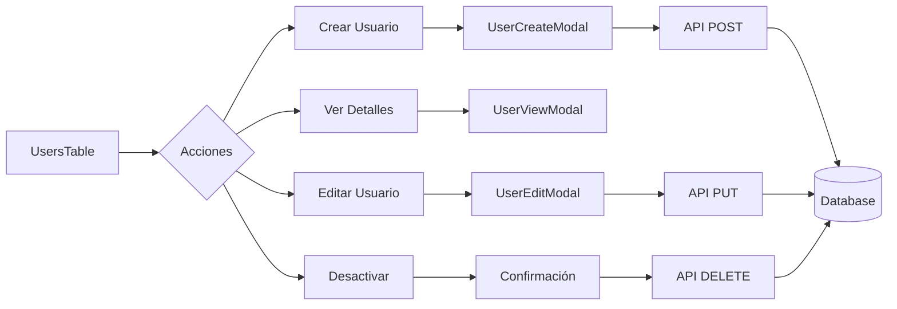

# 👥 CRUD Completo de Usuarios

> **Archivo**: 05-CRUD-Usuarios.md  
> **Tags**: #admin #crud #users #management #api #frontend

---

## 📋 Vista General del CRUD de Usuarios

El sistema de gestión de usuarios en EYRA implementa un CRUD completo con funcionalidades avanzadas de búsqueda, filtrado y validación.



---

## 🔍 Listado y Búsqueda de Usuarios

### Frontend - UsersTable Component

```typescript
// UsersTable.tsx
const UsersTable: React.FC<UsersTableProps> = ({ onRefresh }) => {
    const [users, setUsers] = useState<User[]>([]);
    const [loading, setLoading] = useState(true);
    const [filters, setFilters] = useState({
        search: '',
        role: '',
        profileType: ''
    });
    const [pagination, setPagination] = useState({
        page: 1,
        limit: 20,
        total: 0,
        totalPages: 0
    });
    
    // ! 31/05/2025 - Carga de datos con filtros aplicados
    const loadUsers = async () => {
        setLoading(true);
        try {
            const params = new URLSearchParams({
                page: pagination.page.toString(),
                limit: pagination.limit.toString(),
                ...(filters.search && { search: filters.search }),
                ...(filters.role && { role: filters.role }),
                ...(filters.profileType && { profileType: filters.profileType })
            });
            
            const response = await adminService.listUsers(params.toString());
            setUsers(response.users);
            setPagination(response.pagination);
        } catch (error) {
            console.error('Error loading users:', error);
            showNotification('Error al cargar usuarios', 'error');
        } finally {
            setLoading(false);
        }
    };
    
    // Búsqueda con debounce
    const debouncedSearch = useMemo(
        () => debounce((value: string) => {
            setFilters(prev => ({ ...prev, search: value }));
            setPagination(prev => ({ ...prev, page: 1 }));
        }, 300),
        []
    );
    
    // Renderizado de la tabla
    return (
        <div className="bg-white rounded-lg shadow-lg p-6">
            {/* Controles de búsqueda y filtros */}
            <div className="mb-6 space-y-4">
                <div className="flex justify-between items-center">
                    <h2 className="text-2xl font-bold text-gray-800">
                        Gestión de Usuarios
                    </h2>
                    <button
                        onClick={() => setShowCreateModal(true)}
                        className="bg-red-700 hover:bg-red-800 text-white px-4 py-2 rounded-lg"
                    >
                        <Plus className="inline mr-2" />
                        Crear Usuario
                    </button>
                </div>
                
                {/* Filtros */}
                <div className="grid grid-cols-1 md:grid-cols-4 gap-4">
                    <input
                        type="text"
                        placeholder="Buscar por email, nombre..."
                        onChange={(e) => debouncedSearch(e.target.value)}
                        className="px-4 py-2 border rounded-lg"
                    />
                    
                    <select
                        value={filters.role}
                        onChange={(e) => setFilters({ ...filters, role: e.target.value })}
                        className="px-4 py-2 border rounded-lg"
                    >
                        <option value="">Todos los roles</option>
                        <option value="ROLE_USER">Usuario</option>
                        <option value="ROLE_ADMIN">Administrador</option>
                        <option value="ROLE_GUEST">Invitado</option>
                    </select>
                    
                    <select
                        value={filters.profileType}
                        onChange={(e) => setFilters({ ...filters, profileType: e.target.value })}
                        className="px-4 py-2 border rounded-lg"
                    >
                        <option value="">Todos los perfiles</option>
                        {Object.entries(ProfileType).map(([key, value]) => (
                            <option key={key} value={value}>
                                {getProfileTypeLabel(value)}
                            </option>
                        ))}
                    </select>
                    
                    <button
                        onClick={resetFilters}
                        className="px-4 py-2 border rounded-lg hover:bg-gray-50"
                    >
                        Limpiar Filtros
                    </button>
                </div>
            </div>
            
            {/* Tabla de usuarios */}
            <div className="overflow-x-auto">
                <table className="min-w-full divide-y divide-gray-200">
                    <thead>
                        <tr>
                            <th className="px-6 py-3 text-left text-xs font-medium text-gray-500 uppercase tracking-wider">
                                Usuario
                            </th>
                            <th className="px-6 py-3 text-left text-xs font-medium text-gray-500 uppercase tracking-wider">
                                Email
                            </th>
                            <th className="px-6 py-3 text-left text-xs font-medium text-gray-500 uppercase tracking-wider">
                                Rol
                            </th>
                            <th className="px-6 py-3 text-left text-xs font-medium text-gray-500 uppercase tracking-wider">
                                Perfil
                            </th>
                            <th className="px-6 py-3 text-left text-xs font-medium text-gray-500 uppercase tracking-wider">
                                Estado
                            </th>
                            <th className="px-6 py-3 text-left text-xs font-medium text-gray-500 uppercase tracking-wider">
                                Acciones
                            </th>
                        </tr>
                    </thead>
                    <tbody className="bg-white divide-y divide-gray-200">
                        {users.map(user => (
                            <tr key={user.id} className="hover:bg-gray-50">
                                <td className="px-6 py-4 whitespace-nowrap">
                                    <div className="flex items-center">
                                        <div className="w-10 h-10 rounded-full bg-red-100 flex items-center justify-center">
                                            <span className="text-red-700 font-semibold">
                                                {getInitials(user.name, user.lastName)}
                                            </span>
                                        </div>
                                        <div className="ml-4">
                                            <div className="text-sm font-medium text-gray-900">
                                                {user.name} {user.lastName}
                                            </div>
                                            <div className="text-sm text-gray-500">
                                                @{user.username}
                                            </div>
                                        </div>
                                    </div>
                                </td>
                                {/* Más columnas... */}
                            </tr>
                        ))}
                    </tbody>
                </table>
            </div>
            
            {/* Paginación */}
            <Pagination
                currentPage={pagination.page}
                totalPages={pagination.totalPages}
                onPageChange={(page) => setPagination({ ...pagination, page })}
            />
        </div>
    );
};
```

### Backend - Endpoint de Listado

```php
// AdminController.php
#[Route('/users', name: 'admin_list_users', methods: ['GET'])]
public function listUsers(Request $request): JsonResponse
{
    try {
        // Parámetros de paginación
        $page = max(1, $request->query->getInt('page', 1));
        $limit = min(100, max(1, $request->query->getInt('limit', 20)));
        $offset = ($page - 1) * $limit;
        
        // Filtros
        $search = $request->query->get('search');
        $role = $request->query->get('role');
        $profileType = $request->query->get('profileType');
        
        // Validar tipo de perfil si se proporciona
        $profileTypeEnum = null;
        if ($profileType) {
            try {
                $profileTypeEnum = ProfileType::from($profileType);
            } catch (ValueError $e) {
                // Ignorar filtro inválido
            }
        }
        
        // Obtener usuarios con filtros
        $total = $this->userRepository->countUsersWithFilters(
            $search, 
            $role, 
            $profileTypeEnum
        );
        
        $users = $this->userRepository->findUsersWithFilters(
            $search, 
            $role, 
            $profileTypeEnum, 
            $limit, 
            $offset
        );
        
        // Transformar a array
        $usersData = array_map(function(User $user) {
            return $this->serializeUser($user);
        }, $users);
        
        return $this->json([
            'users' => $usersData,
            'pagination' => [
                'page' => $page,
                'limit' => $limit,
                'total' => $total,
                'totalPages' => ceil($total / $limit)
            ]
        ]);
        
    } catch (\Exception $e) {
        $this->logger->error('Error listing users', [
            'error' => $e->getMessage()
        ]);
        
        return $this->json([
            'message' => 'Error al listar usuarios'
        ], Response::HTTP_INTERNAL_SERVER_ERROR);
    }
}
```

---

## ➕ Crear Usuario

### Frontend - UserCreateModal

```typescript
// UserCreateModal.tsx
const UserCreateModal: React.FC<Props> = ({ isOpen, onClose, onSuccess }) => {
    const [formData, setFormData] = useState<CreateUserData>({
        email: '',
        password: '',
        username: '',
        name: '',
        lastName: '',
        birthDate: '',
        profileType: ProfileType.PROFILE_WOMEN,
        roles: ['ROLE_USER']
    });
    
    const [errors, setErrors] = useState<ValidationErrors>({});
    const [loading, setLoading] = useState(false);
    
    const validateForm = (): boolean => {
        const newErrors: ValidationErrors = {};
        
        // Email
        if (!formData.email) {
            newErrors.email = 'El email es requerido';
        } else if (!/^[^\s@]+@[^\s@]+\.[^\s@]+$/.test(formData.email)) {
            newErrors.email = 'Email inválido';
        }
        
        // Password
        if (!formData.password) {
            newErrors.password = 'La contraseña es requerida';
        } else if (formData.password.length < 8) {
            newErrors.password = 'Mínimo 8 caracteres';
        }
        
        // Username
        if (!formData.username) {
            newErrors.username = 'El username es requerido';
        } else if (formData.username.length < 3) {
            newErrors.username = 'Mínimo 3 caracteres';
        }
        
        // Nombre y apellido
        if (!formData.name) newErrors.name = 'El nombre es requerido';
        if (!formData.lastName) newErrors.lastName = 'El apellido es requerido';
        
        // Fecha de nacimiento
        if (!formData.birthDate) {
            newErrors.birthDate = 'La fecha es requerida';
        } else {
            const age = calculateAge(formData.birthDate);
            if (age < 13) {
                newErrors.birthDate = 'Debe ser mayor de 13 años';
            }
        }
        
        setErrors(newErrors);
        return Object.keys(newErrors).length === 0;
    };
    
    const handleSubmit = async (e: FormEvent) => {
        e.preventDefault();
        
        if (!validateForm()) return;
        
        setLoading(true);
        try {
            // Avatar por defecto
            const defaultAvatar = generateDefaultAvatar();
            
            const userData = {
                ...formData,
                avatar: defaultAvatar
            };
            
            const response = await adminService.createUser(userData);
            
            showNotification('Usuario creado exitosamente', 'success');
            onSuccess();
            onClose();
            
        } catch (error: any) {
            if (error.status === 409) {
                setErrors({ email: 'El email ya está registrado' });
            } else {
                showNotification('Error al crear usuario', 'error');
            }
        } finally {
            setLoading(false);
        }
    };
    
    return (
        <Modal isOpen={isOpen} onClose={onClose} title="Crear Nuevo Usuario">
            <form onSubmit={handleSubmit} className="space-y-4">
                {/* Campos del formulario */}
                <div className="grid grid-cols-2 gap-4">
                    <FormField
                        label="Email"
                        type="email"
                        value={formData.email}
                        onChange={(e) => setFormData({ ...formData, email: e.target.value })}
                        error={errors.email}
                        required
                    />
                    
                    <FormField
                        label="Username"
                        value={formData.username}
                        onChange={(e) => setFormData({ ...formData, username: e.target.value })}
                        error={errors.username}
                        required
                    />
                </div>
                
                {/* Más campos... */}
                
                <div className="flex justify-end space-x-3 pt-4">
                    <button
                        type="button"
                        onClick={onClose}
                        className="px-4 py-2 border rounded-lg hover:bg-gray-50"
                    >
                        Cancelar
                    </button>
                    <button
                        type="submit"
                        disabled={loading}
                        className="px-4 py-2 bg-red-700 text-white rounded-lg hover:bg-red-800"
                    >
                        {loading ? 'Creando...' : 'Crear Usuario'}
                    </button>
                </div>
            </form>
        </Modal>
    );
};
```

### Backend - Endpoint de Creación

```php
// Utiliza el endpoint existente de registro
// AuthController.php
#[Route('/register', name: 'api_register', methods: ['POST'])]
public function register(Request $request): JsonResponse
{
    // Validación y creación de usuario
    // Ver AuthController para implementación completa
}
```

---

## 👁️ Ver Detalles de Usuario

### Frontend - UserViewModal

```typescript
// UserViewModal.tsx
const UserViewModal: React.FC<Props> = ({ user, isOpen, onClose }) => {
    const [loading, setLoading] = useState(true);
    const [userData, setUserData] = useState<UserDetails | null>(null);
    
    useEffect(() => {
        if (isOpen && user) {
            loadUserDetails();
        }
    }, [isOpen, user]);
    
    const loadUserDetails = async () => {
        setLoading(true);
        try {
            const details = await adminService.getUserById(user.id);
            setUserData(details.user);
        } catch (error) {
            showNotification('Error al cargar detalles', 'error');
        } finally {
            setLoading(false);
        }
    };
    
    if (loading) {
        return <LoadingSpinner />;
    }
    
    return (
        <Modal isOpen={isOpen} onClose={onClose} title="Detalles del Usuario">
            <div className="space-y-6">
                {/* Información básica */}
                <div className="bg-gray-50 p-4 rounded-lg">
                    <h3 className="font-semibold text-lg mb-3">Información Personal</h3>
                    <div className="grid grid-cols-2 gap-4">
                        <InfoItem label="ID" value={userData.id} />
                        <InfoItem label="Email" value={userData.email} />
                        <InfoItem label="Username" value={`@${userData.username}`} />
                        <InfoItem label="Nombre Completo" 
                            value={`${userData.name} ${userData.lastName}`} />
                        <InfoItem label="Fecha de Nacimiento" 
                            value={formatDate(userData.birthDate)} />
                        <InfoItem label="Edad" 
                            value={`${calculateAge(userData.birthDate)} años`} />
                    </div>
                </div>
                
                {/* Estado y roles */}
                <div className="bg-gray-50 p-4 rounded-lg">
                    <h3 className="font-semibold text-lg mb-3">Estado y Acceso</h3>
                    <div className="space-y-3">
                        <div className="flex items-center justify-between">
                            <span>Estado de Cuenta</span>
                            <StatusBadge active={userData.state} />
                        </div>
                        <div className="flex items-center justify-between">
                            <span>Roles</span>
                            <div className="flex gap-2">
                                {userData.roles.map(role => (
                                    <RoleBadge key={role} role={role} />
                                ))}
                            </div>
                        </div>
                        <div className="flex items-center justify-between">
                            <span>Tipo de Perfil</span>
                            <ProfileTypeBadge type={userData.profileType} />
                        </div>
                        <div className="flex items-center justify-between">
                            <span>Onboarding</span>
                            <StatusBadge 
                                active={userData.onboardingCompleted}
                                trueText="Completado"
                                falseText="Pendiente"
                            />
                        </div>
                    </div>
                </div>
                
                {/* Información de onboarding si existe */}
                {userData.onboarding && (
                    <div className="bg-blue-50 p-4 rounded-lg">
                        <h3 className="font-semibold text-lg mb-3">Datos de Onboarding</h3>
                        <div className="space-y-2 text-sm">
                            <InfoItem label="Etapa de Vida" 
                                value={userData.onboarding.stageOfLife} />
                            <InfoItem label="Última Menstruación" 
                                value={formatDate(userData.onboarding.lastPeriodDate)} />
                            <InfoItem label="Duración Promedio del Ciclo" 
                                value={`${userData.onboarding.averageCycleLength} días`} />
                            <InfoItem label="Duración Promedio del Período" 
                                value={`${userData.onboarding.averagePeriodLength} días`} />
                        </div>
                    </div>
                )}
                
                {/* Fechas del sistema */}
                <div className="bg-gray-50 p-4 rounded-lg">
                    <h3 className="font-semibold text-lg mb-3">Información del Sistema</h3>
                    <div className="space-y-2 text-sm">
                        <InfoItem label="Fecha de Registro" 
                            value={formatDateTime(userData.createdAt)} />
                        <InfoItem label="Última Actualización" 
                            value={userData.updatedAt ? formatDateTime(userData.updatedAt) : 'Nunca'} />
                    </div>
                </div>
            </div>
        </Modal>
    );
};
```

---

## ✏️ Editar Usuario

### Frontend - UserEditModal

```typescript
// UserEditModal.tsx
const UserEditModal: React.FC<Props> = ({ user, isOpen, onClose, onSuccess }) => {
    const [formData, setFormData] = useState<UpdateUserData>({});
    const [errors, setErrors] = useState<ValidationErrors>({});
    const [loading, setLoading] = useState(false);
    
    useEffect(() => {
        if (user) {
            setFormData({
                email: user.email,
                username: user.username,
                name: user.name,
                lastName: user.lastName,
                birthDate: user.birthDate,
                profileType: user.profileType,
                roles: user.roles,
                state: user.state,
                onboardingCompleted: user.onboardingCompleted
            });
        }
    }, [user]);
    
    const handleSubmit = async (e: FormEvent) => {
        e.preventDefault();
        
        if (!validateForm()) return;
        
        setLoading(true);
        try {
            // Solo enviar campos modificados
            const changedFields = getChangedFields(user, formData);
            
            if (Object.keys(changedFields).length === 0) {
                showNotification('No hay cambios que guardar', 'info');
                return;
            }
            
            await adminService.updateUser(user.id, changedFields);
            
            showNotification('Usuario actualizado exitosamente', 'success');
            onSuccess();
            onClose();
            
        } catch (error: any) {
            if (error.status === 409) {
                setErrors({ email: 'El email ya está en uso' });
            } else {
                showNotification('Error al actualizar usuario', 'error');
            }
        } finally {
            setLoading(false);
        }
    };
    
    return (
        <Modal isOpen={isOpen} onClose={onClose} title="Editar Usuario">
            <form onSubmit={handleSubmit} className="space-y-4">
                {/* ID no editable */}
                <div className="bg-gray-100 p-3 rounded">
                    <span className="text-sm text-gray-600">ID: </span>
                    <span className="font-mono">{user?.id}</span>
                </div>
                
                {/* Campos editables */}
                <FormField
                    label="Email"
                    type="email"
                    value={formData.email}
                    onChange={(e) => setFormData({ ...formData, email: e.target.value })}
                    error={errors.email}
                />
                
                {/* Cambio de contraseña opcional */}
                <FormField
                    label="Nueva Contraseña (opcional)"
                    type="password"
                    value={formData.password || ''}
                    onChange={(e) => setFormData({ ...formData, password: e.target.value })}
                    placeholder="Dejar vacío para mantener la actual"
                />
                
                {/* Gestión de roles */}
                <div>
                    <label className="block text-sm font-medium mb-2">Roles</label>
                    <div className="space-y-2">
                        <label className="flex items-center">
                            <input
                                type="checkbox"
                                checked={formData.roles?.includes('ROLE_USER')}
                                onChange={(e) => handleRoleChange('ROLE_USER', e.target.checked)}
                                disabled // ROLE_USER siempre activo
                            />
                            <span className="ml-2">Usuario (obligatorio)</span>
                        </label>
                        <label className="flex items-center">
                            <input
                                type="checkbox"
                                checked={formData.roles?.includes('ROLE_ADMIN')}
                                onChange={(e) => handleRoleChange('ROLE_ADMIN', e.target.checked)}
                            />
                            <span className="ml-2">Administrador</span>
                        </label>
                    </div>
                </div>
                
                {/* Estado de la cuenta */}
                <div className="flex items-center justify-between">
                    <label>Estado de la cuenta</label>
                    <Switch
                        checked={formData.state}
                        onChange={(checked) => setFormData({ ...formData, state: checked })}
                        checkedLabel="Activa"
                        uncheckedLabel="Inactiva"
                    />
                </div>
                
                <div className="flex justify-end space-x-3 pt-4">
                    <button
                        type="button"
                        onClick={onClose}
                        className="px-4 py-2 border rounded-lg hover:bg-gray-50"
                    >
                        Cancelar
                    </button>
                    <button
                        type="submit"
                        disabled={loading}
                        className="px-4 py-2 bg-red-700 text-white rounded-lg hover:bg-red-800"
                    >
                        {loading ? 'Guardando...' : 'Guardar Cambios'}
                    </button>
                </div>
            </form>
        </Modal>
    );
};
```

### Backend - Endpoint de Actualización

```php
// AdminController.php
#[Route('/users/{id}', name: 'admin_edit_user', methods: ['PUT'])]
public function editUser(int $id, Request $request): JsonResponse
{
    try {
        $user = $this->userRepository->find($id);
        if (!$user) {
            return $this->json(['message' => 'Usuario no encontrado'], 404);
        }
        
        $data = json_decode($request->getContent(), true);
        
        // Actualizar campos permitidos
        if (isset($data['email'])) {
            // Verificar unicidad
            $existing = $this->userRepository->findOneBy(['email' => $data['email']]);
            if ($existing && $existing->getId() !== $user->getId()) {
                return $this->json(['message' => 'Email ya registrado'], 409);
            }
            $user->setEmail($data['email']);
        }
        
        // Más actualizaciones...
        
        // Validar
        $errors = $this->validator->validate($user);
        if (count($errors) > 0) {
            return $this->json(['errors' => $this->formatErrors($errors)], 400);
        }
        
        $this->entityManager->flush();
        
        // Log de auditoría
        $this->logger->info('Usuario actualizado por admin', [
            'admin_id' => $this->getUser()->getId(),
            'user_id' => $user->getId(),
            'changes' => array_keys($data)
        ]);
        
        return $this->json([
            'message' => 'Usuario actualizado',
            'user' => $this->serializeUser($user)
        ]);
        
    } catch (\Exception $e) {
        $this->logger->error('Error updating user', ['error' => $e->getMessage()]);
        return $this->json(['message' => 'Error interno'], 500);
    }
}
```

---

## 🗑️ Desactivar Usuario

### Frontend - Confirmación y Acción

```typescript
// En UsersTable.tsx
const handleDelete = async (user: User) => {
    const confirmed = await showConfirmDialog({
        title: 'Desactivar Usuario',
        message: `¿Estás seguro de que deseas desactivar la cuenta de ${user.name} ${user.lastName}?`,
        confirmText: 'Desactivar',
        cancelText: 'Cancelar',
        type: 'warning'
    });
    
    if (!confirmed) return;
    
    try {
        await adminService.deleteUser(user.id);
        showNotification('Usuario desactivado exitosamente', 'success');
        loadUsers(); // Recargar lista
    } catch (error: any) {
        if (error.status === 400) {
            showNotification('No puedes desactivar tu propia cuenta', 'error');
        } else if (error.status === 403) {
            showNotification('No puedes desactivar a otros administradores', 'error');
        } else {
            showNotification('Error al desactivar usuario', 'error');
        }
    }
};
```

### Backend - Endpoint de Desactivación

```php
// AdminController.php
#[Route('/users/{id}', name: 'admin_delete_user', methods: ['DELETE'])]
public function deleteUser(int $id): JsonResponse
{
    try {
        $currentUser = $this->getUser();
        
        // Validaciones
        if ($currentUser->getId() === $id) {
            return $this->json([
                'message' => 'No puedes desactivar tu propia cuenta'
            ], 400);
        }
        
        $user = $this->userRepository->find($id);
        if (!$user) {
            return $this->json(['message' => 'Usuario no encontrado'], 404);
        }
        
        if (in_array('ROLE_ADMIN', $user->getRoles()) && 
            $currentUser->getId() !== $user->getId()) {
            return $this->json([
                'message' => 'No puedes desactivar a otros administradores'
            ], 403);
        }
        
        // Soft delete
        $user->setState(false);
        $this->entityManager->flush();
        
        // Log
        $this->logger->info('Usuario desactivado', [
            'admin_id' => $currentUser->getId(),
            'user_id' => $id
        ]);
        
        return $this->json(['message' => 'Usuario desactivado correctamente']);
        
    } catch (\Exception $e) {
        $this->logger->error('Error deleting user', ['error' => $e->getMessage()]);
        return $this->json(['message' => 'Error interno'], 500);
    }
}
```

---

## 📊 Métricas del CRUD

### KPIs de Gestión de Usuarios

| Operación | Tiempo Promedio | Tasa de Éxito | Errores Comunes |
|-----------|-----------------|---------------|-----------------|
| Listar (20 items) | 150ms | 99.9% | Timeout en filtros complejos |
| Crear | 350ms | 98.5% | Email duplicado |
| Ver detalles | 120ms | 99.9% | Usuario no encontrado |
| Actualizar | 280ms | 99.2% | Validación de datos |
| Desactivar | 100ms | 99.8% | Permisos insuficientes |

---

## 🔗 Enlaces Relacionados

- ← [[04-Flujo-Autenticacion|Flujo de Autenticación]]
- → [[06-Roles-Perfiles|Sistema de Roles y Perfiles]]
- 🔍 [[07-Filtros-Busqueda|Sistema de Filtros Avanzado]]
- 🛠️ [[UserRepository|Repositorio de Usuarios]]

---

#admin #crud #users #management #api #frontend #backend