# 👤 Sistema de Roles y Perfiles

> **Archivo**: 06-Roles-Perfiles.md  
> **Tags**: #admin #roles #permissions #profiles #security #users

---

## 🎭 Arquitectura de Roles en EYRA

El sistema implementa un modelo de roles jerárquico con perfiles específicos para diferentes tipos de usuarios, permitiendo un control granular de acceso y funcionalidades personalizadas.

```mermaid
graph TD
    A[Sistema de Autorización] --> B[Roles]
    A --> C[Perfiles]
    
    B --> D[ROLE_USER]
    B --> E[ROLE_ADMIN]
    B --> F[ROLE_GUEST]
    B --> G[ROLE_PARENT]
    
    C --> H[profile_women]
    C --> I[profile_men]
    C --> J[profile_transgender]
    C --> K[profile_parent]
    C --> L[profile_partner]
    C --> M[Otros perfiles...]
    
    D --> N[Funciones Básicas]
    E --> O[Panel Admin]
    F --> P[Acceso Limitado]
    G --> Q[Control Parental]
```



---

## 🔐 Definición de Roles

### Enum de Roles del Sistema

```php
// No existe un enum específico, los roles se manejan como strings
// en el array de roles del usuario

class User implements UserInterface
{
    #[ORM\Column(type: 'json')]
    private array $roles = ['ROLE_USER'];
    
    public function getRoles(): array
    {
        $roles = $this->roles;
        // Garantizar que siempre tenga ROLE_USER
        $roles[] = 'ROLE_USER';
        
        return array_unique($roles);
    }
    
    public function setRoles(array $roles): self
    {
        $this->roles = $roles;
        return $this;
    }
}
```

### Tabla de Roles y Permisos

| Rol | Hereda de | Permisos | Descripción |
|-----|-----------|----------|-------------|
| `ROLE_USER` | - | - Acceso a perfil propio<br>- Gestión de ciclos<br>- Lectura de contenido<br>- Notificaciones personales | Rol base para todos los usuarios registrados |
| `ROLE_ADMIN` | `ROLE_USER` | - Todo de ROLE_USER<br>- Panel de administración<br>- CRUD de usuarios<br>- CRUD de condiciones<br>- Gestión de contenido<br>- Acceso a logs | Administrador total del sistema |
| `ROLE_GUEST` | `ROLE_USER` | - Ver información compartida<br>- Sin modificación<br>- Notificaciones limitadas | Invitados (parejas/amigos) con acceso limitado |
| `ROLE_PARENT` | `ROLE_USER` | - Ver información del menor<br>- Control de configuración<br>- Alertas parentales | Control parental sobre cuentas de menores |

### Configuración de Seguridad

```yaml
# config/packages/security.yaml
security:
    role_hierarchy:
        ROLE_ADMIN: [ROLE_USER]
        ROLE_GUEST: [ROLE_USER]
        ROLE_PARENT: [ROLE_USER]
    
    access_control:
        - { path: ^/api/admin, roles: ROLE_ADMIN }
        - { path: ^/api/profile, roles: ROLE_USER }
        - { path: ^/api/cycles, roles: ROLE_USER }
        - { path: ^/api/guest, roles: [ROLE_GUEST, ROLE_PARENT] }
```

---

## 📋 Sistema de Perfiles (ProfileType)

### Enum ProfileType

```php
// src/Enum/ProfileType.php
namespace App\Enum;

enum ProfileType: string
{
    // ! 31/05/2025 - Enum ampliado con todos los tipos de perfil soportados
    case PROFILE_WOMEN = 'profile_women';           // Mujer cisgénero
    case PROFILE_MEN = 'profile_men';               // Hombre cisgénero
    case PROFILE_NB = 'profile_nb';                 // No binario
    case PROFILE_TRANSGENDER = 'profile_transgender'; // Transgénero
    case PROFILE_CUSTOM = 'profile_custom';         // Personalizado
    case PROFILE_PARENT = 'profile_parent';         // Padre/Madre
    case PROFILE_PARTNER = 'profile_partner';       // Pareja
    case PROFILE_PROVIDER = 'profile_provider';     // Proveedor de salud
    case PROFILE_GUEST = 'profile_guest';           // Invitado
    case PROFILE_TRANS = 'profile_trans';           // Legacy - Transgénero
    case PROFILE_UNDERAGE = 'profile_underage';     // Menor de edad
    
    public function getLabel(): string
    {
        return match($this) {
            self::PROFILE_WOMEN => 'Mujer',
            self::PROFILE_MEN => 'Hombre',
            self::PROFILE_NB => 'No Binario',
            self::PROFILE_TRANSGENDER => 'Transgénero',
            self::PROFILE_CUSTOM => 'Personalizado',
            self::PROFILE_PARENT => 'Padre/Madre',
            self::PROFILE_PARTNER => 'Pareja',
            self::PROFILE_PROVIDER => 'Proveedor de Salud',
            self::PROFILE_GUEST => 'Invitado',
            self::PROFILE_TRANS => 'Transgénero (Legacy)',
            self::PROFILE_UNDERAGE => 'Menor de Edad'
        };
    }
    
    public function getDescription(): string
    {
        return match($this) {
            self::PROFILE_WOMEN => 'Perfil para mujeres cisgénero con ciclo menstrual',
            self::PROFILE_MEN => 'Perfil para hombres sin funciones de ciclo',
            self::PROFILE_NB => 'Perfil para personas no binarias',
            self::PROFILE_TRANSGENDER => 'Perfil para personas en transición de género',
            self::PROFILE_CUSTOM => 'Perfil personalizable según necesidades',
            self::PROFILE_PARENT => 'Perfil para padres/madres con control parental',
            self::PROFILE_PARTNER => 'Perfil para parejas con acceso compartido',
            self::PROFILE_PROVIDER => 'Perfil para proveedores de salud',
            self::PROFILE_GUEST => 'Perfil para invitados con acceso temporal',
            self::PROFILE_TRANS => 'Perfil legacy - usar PROFILE_TRANSGENDER',
            self::PROFILE_UNDERAGE => 'Perfil para menores de edad con supervisión'
        };
    }
    
    public function hasMenustrualTracking(): bool
    {
        return in_array($this, [
            self::PROFILE_WOMEN,
            self::PROFILE_TRANSGENDER,
            self::PROFILE_TRANS,
            self::PROFILE_NB,
            self::PROFILE_CUSTOM
        ]);
    }
    
    public function requiresParentalControl(): bool
    {
        return $this === self::PROFILE_UNDERAGE;
    }
    
    public function canInviteOthers(): bool
    {
        return in_array($this, [
            self::PROFILE_WOMEN,
            self::PROFILE_MEN,
            self::PROFILE_TRANSGENDER,
            self::PROFILE_PARENT
        ]);
    }
}
```

### Uso en Frontend

```typescript
// types/enums.ts
export enum ProfileType {
    PROFILE_WOMEN = 'profile_women',
    PROFILE_MEN = 'profile_men',
    PROFILE_NB = 'profile_nb',
    PROFILE_TRANSGENDER = 'profile_transgender',
    PROFILE_CUSTOM = 'profile_custom',
    PROFILE_PARENT = 'profile_parent',
    PROFILE_PARTNER = 'profile_partner',
    PROFILE_PROVIDER = 'profile_provider',
    PROFILE_GUEST = 'profile_guest',
    PROFILE_TRANS = 'profile_trans',
    PROFILE_UNDERAGE = 'profile_underage'
}

// utils/profileUtils.ts
export const getProfileTypeLabel = (type: ProfileType): string => {
    const labels: Record<ProfileType, string> = {
        [ProfileType.PROFILE_WOMEN]: 'Mujer',
        [ProfileType.PROFILE_MEN]: 'Hombre',
        [ProfileType.PROFILE_NB]: 'No Binario',
        [ProfileType.PROFILE_TRANSGENDER]: 'Transgénero',
        [ProfileType.PROFILE_CUSTOM]: 'Personalizado',
        [ProfileType.PROFILE_PARENT]: 'Padre/Madre',
        [ProfileType.PROFILE_PARTNER]: 'Pareja',
        [ProfileType.PROFILE_PROVIDER]: 'Proveedor',
        [ProfileType.PROFILE_GUEST]: 'Invitado',
        [ProfileType.PROFILE_TRANS]: 'Trans (Legacy)',
        [ProfileType.PROFILE_UNDERAGE]: 'Menor de Edad'
    };
    
    return labels[type] || type;
};

export const getProfileTypeIcon = (type: ProfileType): string => {
    const icons: Record<ProfileType, string> = {
        [ProfileType.PROFILE_WOMEN]: '👩',
        [ProfileType.PROFILE_MEN]: '👨',
        [ProfileType.PROFILE_NB]: '🧑',
        [ProfileType.PROFILE_TRANSGENDER]: '⚧️',
        [ProfileType.PROFILE_CUSTOM]: '✨',
        [ProfileType.PROFILE_PARENT]: '👪',
        [ProfileType.PROFILE_PARTNER]: '💑',
        [ProfileType.PROFILE_PROVIDER]: '👨‍⚕️',
        [ProfileType.PROFILE_GUEST]: '👤',
        [ProfileType.PROFILE_TRANS]: '🏳️‍⚧️',
        [ProfileType.PROFILE_UNDERAGE]: '🧒'
    };
    
    return icons[type] || '👤';
};
```

---

## 🔄 Interacción Roles-Perfiles

### Matriz de Compatibilidad

| Perfil | Roles Permitidos | Funcionalidades Específicas |
|--------|------------------|----------------------------|
| `profile_women` | USER, ADMIN | Ciclo completo, embarazo, menopausia |
| `profile_men` | USER, ADMIN, PARTNER | Sin ciclo, acceso como pareja |
| `profile_transgender` | USER, ADMIN | Ciclo opcional, hormonación |
| `profile_parent` | USER, PARENT | Control parental, supervisión |
| `profile_partner` | USER, GUEST | Acceso compartido limitado |
| `profile_underage` | USER | Requiere supervisión parental |

### Lógica de Asignación

```php
// Service/UserService.php
class UserService
{
    public function assignRolesByProfile(User $user): void
    {
        $profile = $user->getProfileType();
        $roles = ['ROLE_USER']; // Base para todos
        
        switch ($profile) {
            case ProfileType::PROFILE_PARENT:
                $roles[] = 'ROLE_PARENT';
                break;
                
            case ProfileType::PROFILE_PARTNER:
                $roles[] = 'ROLE_GUEST';
                break;
                
            case ProfileType::PROFILE_UNDERAGE:
                // Solo ROLE_USER, requiere vinculación parental
                break;
                
            default:
                // Mantener roles existentes
                break;
        }
        
        // Preservar ROLE_ADMIN si lo tenía
        if (in_array('ROLE_ADMIN', $user->getRoles())) {
            $roles[] = 'ROLE_ADMIN';
        }
        
        $user->setRoles(array_unique($roles));
    }
}
```

---

## 🛡️ Validación de Permisos

### Voters Personalizados

```php
// Security/UserVoter.php
namespace App\Security;

use Symfony\Component\Security\Core\Authentication\Token\TokenInterface;
use Symfony\Component\Security\Core\Authorization\Voter\Voter;
use App\Entity\User;

class UserVoter extends Voter
{
    const VIEW = 'view';
    const EDIT = 'edit';
    const DELETE = 'delete';
    
    protected function supports(string $attribute, mixed $subject): bool
    {
        return in_array($attribute, [self::VIEW, self::EDIT, self::DELETE])
            && $subject instanceof User;
    }
    
    protected function voteOnAttribute(
        string $attribute, 
        mixed $subject, 
        TokenInterface $token
    ): bool {
        $currentUser = $token->getUser();
        
        if (!$currentUser instanceof User) {
            return false;
        }
        
        /** @var User $targetUser */
        $targetUser = $subject;
        
        // Admins pueden todo excepto eliminar otros admins
        if (in_array('ROLE_ADMIN', $currentUser->getRoles())) {
            if ($attribute === self::DELETE && 
                in_array('ROLE_ADMIN', $targetUser->getRoles()) &&
                $currentUser->getId() !== $targetUser->getId()) {
                return false;
            }
            return true;
        }
        
        // Usuarios solo pueden ver/editar su propio perfil
        if ($attribute === self::VIEW || $attribute === self::EDIT) {
            return $currentUser->getId() === $targetUser->getId();
        }
        
        // Parents pueden ver perfiles de menores vinculados
        if ($attribute === self::VIEW && 
            in_array('ROLE_PARENT', $currentUser->getRoles())) {
            return $this->isParentOf($currentUser, $targetUser);
        }
        
        return false;
    }
    
    private function isParentOf(User $parent, User $child): bool
    {
        // Lógica para verificar relación parental
        // Por implementar según modelo de datos
        return false;
    }
}
```

### Uso en Controladores

```php
// En controladores
$this->denyAccessUnlessGranted('edit', $user);

// O con atributos
#[IsGranted('edit', subject: 'user')]
public function editUser(User $user): Response
{
    // Solo se ejecuta si tiene permisos
}
```

---

## 🎨 Componentes UI para Roles y Perfiles

### RoleBadge Component

```typescript
// components/RoleBadge.tsx
interface RoleBadgeProps {
    role: string;
    size?: 'sm' | 'md' | 'lg';
}

const RoleBadge: React.FC<RoleBadgeProps> = ({ role, size = 'md' }) => {
    const getRoleConfig = (role: string) => {
        const configs = {
            'ROLE_ADMIN': {
                label: 'Admin',
                color: 'bg-purple-100 text-purple-800 border-purple-200',
                icon: '👑'
            },
            'ROLE_USER': {
                label: 'Usuario',
                color: 'bg-blue-100 text-blue-800 border-blue-200',
                icon: '👤'
            },
            'ROLE_GUEST': {
                label: 'Invitado',
                color: 'bg-green-100 text-green-800 border-green-200',
                icon: '👥'
            },
            'ROLE_PARENT': {
                label: 'Padre/Madre',
                color: 'bg-orange-100 text-orange-800 border-orange-200',
                icon: '👪'
            }
        };
        
        return configs[role] || {
            label: role,
            color: 'bg-gray-100 text-gray-800 border-gray-200',
            icon: '❓'
        };
    };
    
    const config = getRoleConfig(role);
    const sizeClasses = {
        sm: 'text-xs px-2 py-0.5',
        md: 'text-sm px-2.5 py-1',
        lg: 'text-base px-3 py-1.5'
    };
    
    return (
        <span className={`
            inline-flex items-center gap-1 
            font-medium rounded-full border
            ${config.color} ${sizeClasses[size]}
        `}>
            <span>{config.icon}</span>
            <span>{config.label}</span>
        </span>
    );
};
```

### ProfileTypeSelector Component

```typescript
// components/ProfileTypeSelector.tsx
interface ProfileTypeSelectorProps {
    value: ProfileType;
    onChange: (value: ProfileType) => void;
    disabled?: boolean;
    allowedTypes?: ProfileType[];
}

const ProfileTypeSelector: React.FC<ProfileTypeSelectorProps> = ({
    value,
    onChange,
    disabled = false,
    allowedTypes
}) => {
    const availableTypes = allowedTypes || Object.values(ProfileType);
    
    return (
        <div className="space-y-2">
            <label className="block text-sm font-medium text-gray-700">
                Tipo de Perfil
            </label>
            <select
                value={value}
                onChange={(e) => onChange(e.target.value as ProfileType)}
                disabled={disabled}
                className="w-full px-3 py-2 border border-gray-300 rounded-lg focus:ring-2 focus:ring-red-500"
            >
                {availableTypes.map(type => (
                    <option key={type} value={type}>
                        {getProfileTypeIcon(type)} {getProfileTypeLabel(type)}
                    </option>
                ))}
            </select>
            <p className="text-xs text-gray-500 mt-1">
                {getProfileTypeDescription(value)}
            </p>
        </div>
    );
};
```

---

## 📊 Estadísticas de Roles y Perfiles

### Distribución en el Sistema

```typescript
// hooks/useRoleStats.ts
const useRoleStats = () => {
    const [stats, setStats] = useState<RoleStats | null>(null);
    
    useEffect(() => {
        const loadStats = async () => {
            const data = await adminStatsService.getRoleDistribution();
            setStats(data);
        };
        
        loadStats();
    }, []);
    
    return stats;
};

// Visualización
const RoleDistributionChart: React.FC = () => {
    const stats = useRoleStats();
    
    if (!stats) return <LoadingSpinner />;
    
    return (
        <PieChart data={[
            { name: 'Usuarios', value: stats.ROLE_USER, color: '#3B82F6' },
            { name: 'Admins', value: stats.ROLE_ADMIN, color: '#8B5CF6' },
            { name: 'Invitados', value: stats.ROLE_GUEST, color: '#10B981' },
            { name: 'Padres', value: stats.ROLE_PARENT, color: '#F59E0B' }
        ]} />
    );
};
```

---

## 🔗 Enlaces Relacionados

- ← [[05-CRUD-Usuarios|CRUD Completo de Usuarios]]
- → [[07-Filtros-Busqueda|Sistema de Filtros y Búsqueda]]
- 🔐 [[03-Seguridad-Permisos|Seguridad y Permisos]]
- 👤 [[ProfileType|Enum ProfileType Detallado]]

---

#admin #roles #permissions #profiles #security #users #authorization