# 🔗 Sistema de Relación Condiciones-Usuarios

> **📁 Ubicación:** `EYRA/documentacion-admin/09-Sistema-Condiciones.md`  
> **🔗 Enlaces:** [[01-Indice-Principal]] | [[08-CRUD-Condiciones]] | [[05-CRUD-Usuarios]]  
> **🏷️ Tags:** #condiciones #usuarios #relaciones #medicina #admin

---

## 📋 Índice

1. [Resumen del Sistema](#-resumen-del-sistema)
2. [Modelo de Relaciones](#-modelo-de-relaciones)
3. [Entidad UserCondition](#-entidad-usercondition)
4. [Operaciones CRUD](#%EF%B8%8F-operaciones-crud)
5. [Gestión de Estados](#-gestión-de-estados)
6. [Implementación Backend](#-implementación-backend)
7. [Implementación Frontend](#-implementación-frontend)
8. [Notificaciones y Alertas](#-notificaciones-y-alertas)

---

## 🎯 Resumen del Sistema

El **Sistema de Relación Condiciones-Usuarios** gestiona la asociación entre usuarios y sus condiciones médicas, permitiendo un seguimiento personalizado de la salud de cada usuaria en EYRA.

### 🔑 Características Principales

| Funcionalidad | Descripción | Estado |
|---------------|-------------|--------|
| **Asignación** | Asignar condiciones médicas a usuarios | ✅ Implementado |
| **Seguimiento** | Rastrear inicio/fin de condiciones | ✅ Implementado |
| **Historial** | Mantener historial médico completo | ✅ Implementado |
| **Notificaciones** | Alertas sobre condiciones activas | ✅ Implementado |
| **Exportación** | Generar reportes médicos | ⏳ Pendiente |
| **Estadísticas** | Métricas de prevalencia | ⏳ Pendiente |

### 📊 Métricas del Sistema

```typescript
interface UserConditionMetrics {
  totalAssignments: number;        // ~245 asignaciones activas
  activeConditions: number;        // ~189 condiciones activas
  usersWithConditions: number;     // ~67% usuarios con condiciones
  averageConditionsPerUser: number; // ~2.8 condiciones por usuario
  mostCommonConditions: string[];  // Top 5 condiciones más comunes
  chronicConditionsRatio: number;  // 72% son crónicas
}
```

---

## 🗄️ Modelo de Relaciones

### 📊 Diagrama de Relaciones


### 🔄 Flujo de Vida de la Relación

```mermaid
stateDiagram-v2
    [*] --> PendingAssignment: Usuario solicita/Admin asigna
    
    PendingAssignment --> Active: Condición confirmada
    PendingAssignment --> Rejected: Condición rechazada
    
    Active --> InTreatment: Tratamiento iniciado
    Active --> Monitoring: En seguimiento
    
    InTreatment --> Monitoring: Tratamiento completado
    InTreatment --> Remission: En remisión
    
    Monitoring --> Remission: Mejora confirmada
    Monitoring --> Inactive: Condición finalizada
    
    Remission --> Active: Reactivación
    Remission --> Inactive: Curación confirmada
    
    Inactive --> [*]: Relación archivada
    Rejected --> [*]: Sin seguimiento
```



---

## 🏗️ Entidad UserCondition

### 📝 Modelo de Datos

```php
<?php
// ! 01/06/2025 - Entidad para relación Usuario-Condición

namespace App\Entity;

use App\Repository\UserConditionRepository;
use Doctrine\DBAL\Types\Types;
use Doctrine\ORM\Mapping as ORM;
use Symfony\Component\Serializer\Annotation\Groups;

#[ORM\Entity(repositoryClass: UserConditionRepository::class)]
#[ORM\HasLifecycleCallbacks]
class UserCondition
{
    #[ORM\Id]
    #[ORM\GeneratedValue]
    #[ORM\Column]
    #[Groups(['user_condition:read'])]
    private ?int $id = null;

    #[ORM\ManyToOne(targetEntity: User::class, inversedBy: 'userConditions')]
    #[ORM\JoinColumn(nullable: false)]
    #[Groups(['user_condition:read'])]
    private ?User $user = null;

    #[ORM\ManyToOne(targetEntity: Condition::class, inversedBy: 'userConditions')]
    #[ORM\JoinColumn(nullable: false)]
    #[Groups(['user_condition:read'])]
    private ?Condition $condition = null;

    #[ORM\Column(type: Types::DATE_MUTABLE)]
    #[Groups(['user_condition:read', 'user_condition:write'])]
    private ?\DateTimeInterface $startDate = null;

    #[ORM\Column(type: Types::DATE_MUTABLE, nullable: true)]
    #[Groups(['user_condition:read', 'user_condition:write'])]
    private ?\DateTimeInterface $endDate = null;

    #[ORM\Column(type: Types::TEXT, nullable: true)]
    #[Groups(['user_condition:read', 'user_condition:write'])]
    private ?string $notes = null;

    #[ORM\Column]
    #[Groups(['user_condition:read'])]
    private ?bool $state = true;

    #[ORM\Column(type: Types::DATETIME_MUTABLE)]
    #[Groups(['user_condition:read'])]
    private ?\DateTimeInterface $createdAt = null;

    #[ORM\Column(type: Types::DATETIME_MUTABLE, nullable: true)]
    #[Groups(['user_condition:read'])]
    private ?\DateTimeInterface $updatedAt = null;

    // ! 01/06/2025 - Campos adicionales para seguimiento avanzado
    #[ORM\Column(length: 50, nullable: true)]
    #[Groups(['user_condition:read', 'user_condition:write'])]
    private ?string $severity = null; // mild, moderate, severe

    #[ORM\Column(length: 50, nullable: true)]
    #[Groups(['user_condition:read', 'user_condition:write'])]
    private ?string $status = null; // active, treatment, remission, inactive

    #[ORM\Column(type: Types::JSON, nullable: true)]
    #[Groups(['user_condition:read', 'user_condition:write'])]
    private ?array $metadata = null; // Información adicional específica

    // Lifecycle callbacks
    #[ORM\PrePersist]
    public function setCreatedAtValue(): void
    {
        $this->createdAt = new \DateTime();
        $this->updatedAt = new \DateTime();
    }

    #[ORM\PreUpdate]
    public function setUpdatedAtValue(): void
    {
        $this->updatedAt = new \DateTime();
    }

    // Métodos de conveniencia
    public function isActive(): bool
    {
        return $this->state && 
               ($this->endDate === null || $this->endDate > new \DateTime());
    }

    public function getDurationInDays(): ?int
    {
        if (!$this->startDate) return null;
        
        $endDate = $this->endDate ?? new \DateTime();
        return $this->startDate->diff($endDate)->days;
    }

    public function isInTreatment(): bool
    {
        return $this->status === 'treatment';
    }

    public function isInRemission(): bool
    {
        return $this->status === 'remission';
    }
}
```

### 🔗 Interfaces TypeScript

```typescript
// ! 01/06/2025 - Interfaces para relación Usuario-Condición

export interface UserCondition {
  id: number;
  user: User;
  condition: Condition;
  startDate: string;           // YYYY-MM-DD
  endDate?: string;            // YYYY-MM-DD
  notes?: string;
  state: boolean;
  severity?: 'mild' | 'moderate' | 'severe';
  status?: 'active' | 'treatment' | 'remission' | 'inactive';
  metadata?: Record<string, any>;
  createdAt: string;           // ISO 8601
  updatedAt?: string;          // ISO 8601
}

export interface CreateUserConditionRequest {
  conditionId: number;
  startDate: string;           // YYYY-MM-DD
  endDate?: string;            // YYYY-MM-DD
  notes?: string;
  severity?: 'mild' | 'moderate' | 'severe';
  status?: 'active' | 'treatment' | 'remission' | 'inactive';
  metadata?: Record<string, any>;
}

export interface UpdateUserConditionRequest {
  endDate?: string;
  notes?: string;
  severity?: 'mild' | 'moderate' | 'severe';
  status?: 'active' | 'treatment' | 'remission' | 'inactive';
  metadata?: Record<string, any>;
}

export interface UserConditionSummary {
  totalConditions: number;
  activeConditions: number;
  chronicConditions: number;
  conditionsByCategory: Record<string, number>;
  recentlyAdded: UserCondition[];
  needingAttention: UserCondition[];
}
```

---

## ⚙️ Operaciones CRUD

### 📋 CREATE - Asignar Condición

```php
<?php
// ! 01/06/2025 - Endpoint para asignar condición a usuario

#[Route('/conditions/user/add', name: 'api_user_conditions_add', methods: ['POST'])]
public function addUserCondition(Request $request): JsonResponse
{
    /** @var User $user */
    $user = $this->getUser();
    if (!$user) {
        throw new AccessDeniedException('User not authenticated');
    }

    // Parsear datos
    $data = json_decode($request->getContent(), true);

    if (!isset($data['conditionId']) || !isset($data['startDate'])) {
        return $this->json([
            'message' => 'Missing required fields: conditionId, startDate'
        ], 400);
    }

    // Buscar la condición
    $condition = $this->conditionRepository->find($data['conditionId']);
    if (!$condition) {
        return $this->json(['message' => 'Condition not found'], 404);
    }

    // Verificar que la condición esté activa
    if (!$condition->getState()) {
        return $this->json([
            'message' => 'Cannot assign inactive condition'
        ], 400);
    }

    // Verificar que el usuario no tenga ya esta condición activa
    $existingCondition = $this->userConditionRepository->findOneBy([
        'user' => $user,
        'condition' => $condition,
        'state' => true
    ]);

    if ($existingCondition && $existingCondition->isActive()) {
        return $this->json([
            'message' => 'User already has this condition assigned and active'
        ], 409);
    }

    // Crear una nueva relación UserCondition
    $userCondition = new UserCondition();
    $userCondition->setUser($user);
    $userCondition->setCondition($condition);
    $userCondition->setStartDate(new \DateTime($data['startDate']));

    // Campos opcionales
    if (isset($data['endDate'])) {
        $userCondition->setEndDate(new \DateTime($data['endDate']));
    }

    if (isset($data['notes'])) {
        $userCondition->setNotes($data['notes']);
    }

    if (isset($data['severity'])) {
        $userCondition->setSeverity($data['severity']);
    }

    if (isset($data['status'])) {
        $userCondition->setStatus($data['status']);
    } else {
        $userCondition->setStatus('active'); // Estado por defecto
    }

    if (isset($data['metadata'])) {
        $userCondition->setMetadata($data['metadata']);
    }

    // Validar
    $errors = $this->validator->validate($userCondition);
    if (count($errors) > 0) {
        $errorMessages = [];
        foreach ($errors as $error) {
            $errorMessages[$error->getPropertyPath()] = $error->getMessage();
        }
        return $this->json([
            'message' => 'Validation failed', 
            'errors' => $errorMessages
        ], 400);
    }

    // Guardar
    $this->userConditionRepository->save($userCondition, true);

    // Crear notificación sobre la nueva condición
    $this->notificationService->createMedicalNotification(
        $user,
        $condition,
        'Nueva condición registrada',
        "Se ha registrado la condición {$condition->getName()} en tu perfil.",
        NotificationService::PRIORITY_NORMAL
    );

    return $this->json($userCondition, 201, [], [
        'groups' => ['user_condition:read', 'condition:read']
    ]);
}
```

### 📖 READ - Obtener Condiciones del Usuario

```php
<?php
// ! 01/06/2025 - Endpoints para obtener condiciones del usuario

// Obtener todas las condiciones del usuario
#[Route('/conditions/user', name: 'api_user_conditions', methods: ['GET'])]
public function getUserConditions(): JsonResponse
{
    /** @var User $user */
    $user = $this->getUser();
    if (!$user) {
        throw new AccessDeniedException('User not authenticated');
    }

    // Obtener condiciones activas del usuario
    $userConditions = $this->userConditionRepository->findActiveByUser($user->getId());

    return $this->json($userConditions, 200, [], [
        'groups' => ['user_condition:read', 'condition:read']
    ]);
}

// Obtener solo condiciones activas
#[Route('/conditions/user/active', name: 'api_user_conditions_active', methods: ['GET'])]
public function getActiveUserConditions(): JsonResponse
{
    /** @var User $user */
    $user = $this->getUser();
    if (!$user) {
        throw new AccessDeniedException('User not authenticated');
    }

    $activeConditions = $this->userConditionRepository->findActiveByUser($user->getId());

    return $this->json($activeConditions, 200, [], [
        'groups' => ['user_condition:read', 'condition:read']
    ]);
}

// Obtener resumen de condiciones del usuario
#[Route('/conditions/user/summary', name: 'api_user_conditions_summary', methods: ['GET'])]
public function getUserConditionsSummary(): JsonResponse
{
    /** @var User $user */
    $user = $this->getUser();
    if (!$user) {
        throw new AccessDeniedException('User not authenticated');
    }

    $allConditions = $this->userConditionRepository->findBy(['user' => $user]);
    $activeConditions = $this->userConditionRepository->findActiveByUser($user->getId());
    
    $chronicConditions = array_filter($activeConditions, function($uc) {
        return $uc->getCondition()->getIsChronic();
    });

    // Agrupar por categoría (implementar según sistema de categorías)
    $conditionsByCategory = [];
    foreach ($activeConditions as $userCondition) {
        $category = $this->categorizeCondition($userCondition->getCondition());
        $conditionsByCategory[$category] = ($conditionsByCategory[$category] ?? 0) + 1;
    }

    // Condiciones que necesitan atención
    $needingAttention = array_filter($activeConditions, function($uc) {
        return $uc->getSeverity() === 'severe' || 
               $uc->getStatus() === 'treatment' ||
               ($uc->getStartDate() && $uc->getStartDate()->diff(new \DateTime())->days < 30);
    });

    $summary = [
        'totalConditions' => count($allConditions),
        'activeConditions' => count($activeConditions),
        'chronicConditions' => count($chronicConditions),
        'conditionsByCategory' => $conditionsByCategory,
        'recentlyAdded' => array_slice(
            array_reverse($activeConditions), 
            0, 3
        ),
        'needingAttention' => array_values($needingAttention)
    ];

    return $this->json($summary, 200);
}
```

### ✏️ UPDATE - Actualizar Condición del Usuario

```php
<?php
// ! 01/06/2025 - Endpoint para actualizar condición del usuario

#[Route('/conditions/user/{id}', name: 'api_user_conditions_update', methods: ['PUT'])]
public function updateUserCondition(int $id, Request $request): JsonResponse
{
    /** @var User $user */
    $user = $this->getUser();
    if (!$user) {
        throw new AccessDeniedException('User not authenticated');
    }

    // Buscar la relación UserCondition
    $userCondition = $this->userConditionRepository->find($id);
    if (!$userCondition) {
        return $this->json(['message' => 'User condition not found'], 404);
    }

    // Verificar que pertenece al usuario autenticado
    if ($userCondition->getUser()->getId() !== $user->getId()) {
        throw new AccessDeniedException('Cannot modify condition from another user');
    }

    // Parsear datos
    $data = json_decode($request->getContent(), true);

    // Actualizar campos permitidos
    if (isset($data['endDate'])) {
        if ($data['endDate']) {
            $userCondition->setEndDate(new \DateTime($data['endDate']));
        } else {
            $userCondition->setEndDate(null);
        }
    }

    if (isset($data['notes'])) {
        $userCondition->setNotes($data['notes']);
    }

    if (isset($data['severity'])) {
        $userCondition->setSeverity($data['severity']);
    }

    if (isset($data['status'])) {
        $oldStatus = $userCondition->getStatus();
        $userCondition->setStatus($data['status']);
        
        // Crear notificación si cambió el estado
        if ($oldStatus !== $data['status']) {
            $this->notificationService->createMedicalNotification(
                $user,
                $userCondition->getCondition(),
                'Estado de condición actualizado',
                "El estado de {$userCondition->getCondition()->getName()} cambió a {$data['status']}.",
                NotificationService::PRIORITY_NORMAL
            );
        }
    }

    if (isset($data['metadata'])) {
        $currentMetadata = $userCondition->getMetadata() ?? [];
        $userCondition->setMetadata(array_merge($currentMetadata, $data['metadata']));
    }

    // Validar
    $errors = $this->validator->validate($userCondition);
    if (count($errors) > 0) {
        $errorMessages = [];
        foreach ($errors as $error) {
            $errorMessages[$error->getPropertyPath()] = $error->getMessage();
        }
        return $this->json([
            'message' => 'Validation failed', 
            'errors' => $errorMessages
        ], 400);
    }

    // Guardar
    $this->userConditionRepository->save($userCondition, true);

    return $this->json($userCondition, 200, [], [
        'groups' => ['user_condition:read', 'condition:read']
    ]);
}
```

### 🗑️ DELETE - Remover Condición del Usuario

```php
<?php
// ! 01/06/2025 - Endpoint para remover condición del usuario

#[Route('/conditions/user/{id}', name: 'api_user_conditions_delete', methods: ['DELETE'])]
public function removeUserCondition(int $id): JsonResponse
{
    /** @var User $user */
    $user = $this->getUser();
    if (!$user) {
        throw new AccessDeniedException('User not authenticated');
    }

    // Buscar la relación UserCondition
    $userCondition = $this->userConditionRepository->find($id);
    if (!$userCondition) {
        return $this->json(['message' => 'User condition not found'], 404);
    }

    // Verificar que pertenece al usuario autenticado
    if ($userCondition->getUser()->getId() !== $user->getId()) {
        throw new AccessDeniedException('Cannot delete condition from another user');
    }

    // En lugar de eliminar físicamente, marcamos como inactivo
    $userCondition->setState(false);
    $userCondition->setStatus('inactive');
    
    // Si no tiene fecha de fin, establecer fecha actual
    if (!$userCondition->getEndDate()) {
        $userCondition->setEndDate(new \DateTime());
    }

    $this->userConditionRepository->save($userCondition, true);

    // Crear notificación
    $this->notificationService->createMedicalNotification(
        $user,
        $userCondition->getCondition(),
        'Condición removida',
        "La condición {$userCondition->getCondition()->getName()} ha sido removida de tu perfil.",
        NotificationService::PRIORITY_LOW
    );

    return $this->json(['message' => 'User condition removed successfully'], 200);
}
```

---

## 🔄 Gestión de Estados

### 📊 Estados de Relación

```typescript
// ! 01/06/2025 - Estados y transiciones de relaciones Usuario-Condición

export enum UserConditionStatus {
  ACTIVE = 'active',           // Condición activa
  TREATMENT = 'treatment',     // En tratamiento
  REMISSION = 'remission',     // En remisión
  INACTIVE = 'inactive',       // Inactiva/Curada
  MONITORING = 'monitoring'    // En seguimiento
}

export enum ConditionSeverity {
  MILD = 'mild',              // Leve
  MODERATE = 'moderate',      // Moderada  
  SEVERE = 'severe'           // Severa
}

// Transiciones permitidas entre estados
export const STATUS_TRANSITIONS: Record<UserConditionStatus, UserConditionStatus[]> = {
  [UserConditionStatus.ACTIVE]: [
    UserConditionStatus.TREATMENT,
    UserConditionStatus.MONITORING,
    UserConditionStatus.INACTIVE
  ],
  [UserConditionStatus.TREATMENT]: [
    UserConditionStatus.ACTIVE,
    UserConditionStatus.REMISSION,
    UserConditionStatus.MONITORING
  ],
  [UserConditionStatus.REMISSION]: [
    UserConditionStatus.ACTIVE,
    UserConditionStatus.INACTIVE,
    UserConditionStatus.MONITORING
  ],
  [UserConditionStatus.MONITORING]: [
    UserConditionStatus.ACTIVE,
    UserConditionStatus.TREATMENT,
    UserConditionStatus.REMISSION,
    UserConditionStatus.INACTIVE
  ],
  [UserConditionStatus.INACTIVE]: [] // Estado final
};
```

### 🎯 Componente de Gestión de Estados

```tsx
// ! 01/06/2025 - Componente para gestionar estados de condiciones de usuario
interface UserConditionStatusManagerProps {
  userCondition: UserCondition;
  onStatusChange: (newStatus: UserConditionStatus) => Promise<void>;
  onSeverityChange: (newSeverity: ConditionSeverity) => Promise<void>;
}

const UserConditionStatusManager: React.FC<UserConditionStatusManagerProps> = ({
  userCondition,
  onStatusChange,
  onSeverityChange
}) => {
  const [loading, setLoading] = useState(false);
  const currentStatus = userCondition.status as UserConditionStatus;
  const currentSeverity = userCondition.severity as ConditionSeverity;
  const availableTransitions = STATUS_TRANSITIONS[currentStatus] || [];

  const getStatusColor = (status: UserConditionStatus): string => {
    switch (status) {
      case UserConditionStatus.ACTIVE:
        return 'bg-red-100 text-red-800';
      case UserConditionStatus.TREATMENT:
        return 'bg-blue-100 text-blue-800';
      case UserConditionStatus.REMISSION:
        return 'bg-yellow-100 text-yellow-800';
      case UserConditionStatus.MONITORING:
        return 'bg-purple-100 text-purple-800';
      case UserConditionStatus.INACTIVE:
        return 'bg-gray-100 text-gray-800';
      default:
        return 'bg-gray-100 text-gray-800';
    }
  };

  const getSeverityColor = (severity: ConditionSeverity): string => {
    switch (severity) {
      case ConditionSeverity.MILD:
        return 'bg-green-100 text-green-800';
      case ConditionSeverity.MODERATE:
        return 'bg-orange-100 text-orange-800';
      case ConditionSeverity.SEVERE:
        return 'bg-red-100 text-red-800';
      default:
        return 'bg-gray-100 text-gray-800';
    }
  };

  const handleStatusChange = async (newStatus: UserConditionStatus) => {
    if (!availableTransitions.includes(newStatus)) {
      alert('Transición de estado no permitida');
      return;
    }

    const confirmation = confirm(
      `¿Cambiar el estado de "${userCondition.condition.name}" a ${newStatus}?`
    );

    if (!confirmation) return;

    try {
      setLoading(true);
      await onStatusChange(newStatus);
    } catch (error) {
      console.error('Error changing status:', error);
      alert('Error al cambiar el estado');
    } finally {
      setLoading(false);
    }
  };

  const handleSeverityChange = async (newSeverity: ConditionSeverity) => {
    try {
      setLoading(true);
      await onSeverityChange(newSeverity);
    } catch (error) {
      console.error('Error changing severity:', error);
      alert('Error al cambiar la severidad');
    } finally {
      setLoading(false);
    }
  };

  return (
    <div className="space-y-3">
      {/* Estado actual */}
      <div className="flex items-center space-x-2">
        <span className="text-sm font-medium text-gray-700">Estado:</span>
        <span className={`px-2 py-1 text-xs font-semibold rounded-full ${getStatusColor(currentStatus)}`}>
          {currentStatus}
        </span>
        
        {availableTransitions.length > 0 && (
          <select
            onChange={(e) => handleStatusChange(e.target.value as UserConditionStatus)}
            disabled={loading}
            className="text-xs border border-gray-300 rounded px-2 py-1"
            defaultValue=""
          >
            <option value="" disabled>Cambiar estado</option>
            {availableTransitions.map(status => (
              <option key={status} value={status}>
                {status}
              </option>
            ))}
          </select>
        )}
      </div>

      {/* Severidad */}
      <div className="flex items-center space-x-2">
        <span className="text-sm font-medium text-gray-700">Severidad:</span>
        <span className={`px-2 py-1 text-xs font-semibold rounded-full ${getSeverityColor(currentSeverity)}`}>
          {currentSeverity || 'No especificada'}
        </span>
        
        <select
          onChange={(e) => handleSeverityChange(e.target.value as ConditionSeverity)}
          disabled={loading}
          className="text-xs border border-gray-300 rounded px-2 py-1"
          value={currentSeverity || ''}
        >
          <option value="">Sin especificar</option>
          <option value={ConditionSeverity.MILD}>Leve</option>
          <option value={ConditionSeverity.MODERATE}>Moderada</option>
          <option value={ConditionSeverity.SEVERE}>Severa</option>
        </select>
      </div>

      {/* Duración */}
      {userCondition.startDate && (
        <div className="flex items-center space-x-2">
          <span className="text-sm font-medium text-gray-700">Duración:</span>
          <span className="text-sm text-gray-600">
            {calculateDuration(userCondition.startDate, userCondition.endDate)}
          </span>
        </div>
      )}
    </div>
  );
};

// Helper function para calcular duración
const calculateDuration = (startDate: string, endDate?: string): string => {
  const start = new Date(startDate);
  const end = endDate ? new Date(endDate) : new Date();
  const diffTime = Math.abs(end.getTime() - start.getTime());
  const diffDays = Math.ceil(diffTime / (1000 * 60 * 60 * 24));
  
  if (diffDays < 30) {
    return `${diffDays} días`;
  } else if (diffDays < 365) {
    const months = Math.floor(diffDays / 30);
    return `${months} mes${months > 1 ? 'es' : ''}`;
  } else {
    const years = Math.floor(diffDays / 365);
    const remainingMonths = Math.floor((diffDays % 365) / 30);
    return `${years} año${years > 1 ? 's' : ''} ${remainingMonths > 0 ? `y ${remainingMonths} mes${remainingMonths > 1 ? 'es' : ''}` : ''}`;
  }
};
```

---

## 🖥️ Implementación Backend

### 🗃️ UserConditionRepository

```php
<?php
// ! 01/06/2025 - Repositorio especializado para relaciones Usuario-Condición

namespace App\Repository;

use App\Entity\UserCondition;
use Doctrine\Bundle\DoctrineBundle\Repository\ServiceEntityRepository;
use Doctrine\Persistence\ManagerRegistry;
use Doctrine\ORM\QueryBuilder;

class UserConditionRepository extends ServiceEntityRepository
{
    public function __construct(ManagerRegistry $registry)
    {
        parent::__construct($registry, UserCondition::class);
    }

    public function save(UserCondition $entity, bool $flush = false): void
    {
        $this->getEntityManager()->persist($entity);

        if ($flush) {
            $this->getEntityManager()->flush();
        }
    }

    public function remove(UserCondition $entity, bool $flush = false): void
    {
        $this->getEntityManager()->remove($entity);

        if ($flush) {
            $this->getEntityManager()->flush();
        }
    }

    /**
     * Encuentra condiciones activas del usuario
     */
    public function findActiveByUser(int $userId): array
    {
        return $this->createQueryBuilder('uc')
            ->join('uc.condition', 'c')
            ->where('uc.user = :userId')
            ->andWhere('uc.state = :state')
            ->andWhere('c.state = :conditionState')
            ->andWhere('uc.endDate IS NULL OR uc.endDate > :today')
            ->setParameter('userId', $userId)
            ->setParameter('state', true)
            ->setParameter('conditionState', true)
            ->setParameter('today', new \DateTime())
            ->orderBy('uc.createdAt', 'DESC')
            ->getQuery()
            ->getResult();
    }

    /**
     * Encuentra condiciones por estado específico del usuario
     */
    public function findByUserAndStatus(int $userId, string $status): array
    {
        return $this->createQueryBuilder('uc')
            ->join('uc.condition', 'c')
            ->where('uc.user = :userId')
            ->andWhere('uc.status = :status')
            ->andWhere('uc.state = :state')
            ->setParameter('userId', $userId)
            ->setParameter('status', $status)
            ->setParameter('state', true)
            ->orderBy('uc.updatedAt', 'DESC')
            ->getQuery()
            ->getResult();
    }

    /**
     * Encuentra condiciones crónicas del usuario
     */
    public function findChronicByUser(int $userId): array
    {
        return $this->createQueryBuilder('uc')
            ->join('uc.condition', 'c')
            ->where('uc.user = :userId')
            ->andWhere('c.isChronic = :chronic')
            ->andWhere('uc.state = :state')
            ->setParameter('userId', $userId)
            ->setParameter('chronic', true)
            ->setParameter('state', true)
            ->orderBy('uc.startDate', 'ASC')
            ->getQuery()
            ->getResult();
    }

    /**
     * Encuentra condiciones que necesitan atención
     */
    public function findNeedingAttention(int $userId): array
    {
        return $this->createQueryBuilder('uc')
            ->join('uc.condition', 'c')
            ->where('uc.user = :userId')
            ->andWhere('uc.state = :state')
            ->andWhere(
                '(uc.severity = :severe OR uc.status = :treatment OR uc.startDate > :recentDate)'
            )
            ->setParameter('userId', $userId)
            ->setParameter('state', true)
            ->setParameter('severe', 'severe')
            ->setParameter('treatment', 'treatment')
            ->setParameter('recentDate', new \DateTime('-30 days'))
            ->orderBy('uc.severity', 'DESC')
            ->addOrderBy('uc.startDate', 'DESC')
            ->getQuery()
            ->getResult();
    }

    /**
     * Estadísticas de condiciones por usuario
     */
    public function getUserConditionStats(int $userId): array
    {
        $qb = $this->createQueryBuilder('uc')
            ->select([
                'COUNT(uc.id) as total',
                'COUNT(CASE WHEN uc.state = true AND (uc.endDate IS NULL OR uc.endDate > :today) THEN 1 END) as active',
                'COUNT(CASE WHEN c.isChronic = true AND uc.state = true THEN 1 END) as chronic',
                'COUNT(CASE WHEN uc.severity = :severe THEN 1 END) as severe'
            ])
            ->join('uc.condition', 'c')
            ->where('uc.user = :userId')
            ->setParameter('userId', $userId)
            ->setParameter('today', new \DateTime())
            ->setParameter('severe', 'severe');

        return $qb->getQuery()->getSingleResult();
    }

    /**
     * Busca condiciones por nombre para un usuario
     */
    public function searchUserConditions(int $userId, string $query): array
    {
        return $this->createQueryBuilder('uc')
            ->join('uc.condition', 'c')
            ->where('uc.user = :userId')
            ->andWhere('uc.state = :state')
            ->andWhere('LOWER(c.name) LIKE :query OR LOWER(c.description) LIKE :query')
            ->setParameter('userId', $userId)
            ->setParameter('state', true)
            ->setParameter('query', '%' . strtolower($query) . '%')
            ->orderBy('c.name', 'ASC')
            ->getQuery()
            ->getResult();
    }
}
```

---

## 💻 Implementación Frontend

### 📊 Componente de Resumen de Condiciones

```tsx
// ! 01/06/2025 - Componente de resumen de condiciones del usuario
interface UserConditionsSummaryProps {
  userId?: number;
  showActions?: boolean;
}

const UserConditionsSummary: React.FC<UserConditionsSummaryProps> = ({
  userId,
  showActions = true
}) => {
  const [summary, setSummary] = useState<UserConditionSummary | null>(null);
  const [loading, setLoading] = useState(true);
  const [error, setError] = useState<string | null>(null);

  useEffect(() => {
    loadSummary();
  }, [userId]);

  const loadSummary = async () => {
    try {
      setLoading(true);
      setError(null);
      
      const summaryData = await userConditionService.getSummary(userId);
      setSummary(summaryData);
    } catch (err: any) {
      setError(err.message || 'Error al cargar resumen de condiciones');
    } finally {
      setLoading(false);
    }
  };

  if (loading) {
    return (
      <div className="flex justify-center items-center py-8">
        <div className="animate-spin rounded-full h-8 w-8 border-b-2 border-[#b91c1c]"></div>
      </div>
    );
  }

  if (error) {
    return (
      <div className="text-center py-8">
        <div className="text-red-600 mb-4">{error}</div>
        <button
          onClick={loadSummary}
          className="bg-[#b91c1c] text-white px-4 py-2 rounded-lg hover:bg-[#991b1b]"
        >
          Reintentar
        </button>
      </div>
    );
  }

  if (!summary) return null;

  return (
    <div className="space-y-6">
      {/* Estadísticas generales */}
      <div className="grid grid-cols-1 md:grid-cols-4 gap-4">
        <div className="bg-white p-4 rounded-lg shadow">
          <div className="text-2xl font-bold text-[#b91c1c]">
            {summary.totalConditions}
          </div>
          <div className="text-sm text-gray-600">Total Condiciones</div>
        </div>
        
        <div className="bg-white p-4 rounded-lg shadow">
          <div className="text-2xl font-bold text-orange-600">
            {summary.activeConditions}
          </div>
          <div className="text-sm text-gray-600">Condiciones Activas</div>
        </div>
        
        <div className="bg-white p-4 rounded-lg shadow">
          <div className="text-2xl font-bold text-purple-600">
            {summary.chronicConditions}
          </div>
          <div className="text-sm text-gray-600">Condiciones Crónicas</div>
        </div>
        
        <div className="bg-white p-4 rounded-lg shadow">
          <div className="text-2xl font-bold text-red-600">
            {summary.needingAttention.length}
          </div>
          <div className="text-sm text-gray-600">Necesitan Atención</div>
        </div>
      </div>

      {/* Condiciones por categoría */}
      {Object.keys(summary.conditionsByCategory).length > 0 && (
        <div className="bg-white p-6 rounded-lg shadow">
          <h3 className="text-lg font-semibold mb-4">Condiciones por Categoría</h3>
          <div className="space-y-2">
            {Object.entries(summary.conditionsByCategory).map(([category, count]) => (
              <div key={category} className="flex justify-between items-center">
                <span className="text-gray-700 capitalize">
                  {category.replace('_', ' ')}
                </span>
                <span className="bg-gray-100 px-2 py-1 rounded text-sm">
                  {count}
                </span>
              </div>
            ))}
          </div>
        </div>
      )}

      {/* Condiciones agregadas recientemente */}
      {summary.recentlyAdded.length > 0 && (
        <div className="bg-white p-6 rounded-lg shadow">
          <h3 className="text-lg font-semibold mb-4">Agregadas Recientemente</h3>
          <div className="space-y-3">
            {summary.recentlyAdded.map((userCondition) => (
              <div key={userCondition.id} className="flex justify-between items-center">
                <div>
                  <div className="font-medium">{userCondition.condition.name}</div>
                  <div className="text-sm text-gray-600">
                    Desde: {new Date(userCondition.startDate).toLocaleDateString('es-ES')}
                  </div>
                </div>
                <span className={`px-2 py-1 text-xs rounded-full ${
                  userCondition.severity === 'severe' ? 'bg-red-100 text-red-800' :
                  userCondition.severity === 'moderate' ? 'bg-orange-100 text-orange-800' :
                  'bg-green-100 text-green-800'
                }`}>
                  {userCondition.severity || 'No especificada'}
                </span>
              </div>
            ))}
          </div>
        </div>
      )}

      {/* Condiciones que necesitan atención */}
      {summary.needingAttention.length > 0 && (
        <div className="bg-red-50 border border-red-200 p-6 rounded-lg">
          <h3 className="text-lg font-semibold text-red-800 mb-4">
            ⚠️ Condiciones que Necesitan Atención
          </h3>
          <div className="space-y-3">
            {summary.needingAttention.map((userCondition) => (
              <div key={userCondition.id} className="flex justify-between items-center">
                <div>
                  <div className="font-medium text-red-900">
                    {userCondition.condition.name}
                  </div>
                  <div className="text-sm text-red-700">
                    Estado: {userCondition.status} | 
                    Severidad: {userCondition.severity}
                  </div>
                </div>
                {showActions && (
                  <button className="bg-red-600 text-white px-3 py-1 rounded text-sm hover:bg-red-700">
                    Ver Detalles
                  </button>
                )}
              </div>
            ))}
          </div>
        </div>
      )}
    </div>
  );
};
```

---

## 🔔 Notificaciones y Alertas

### 📧 Sistema de Notificaciones Médicas

```php
<?php
// ! 01/06/2025 - Servicio especializado para notificaciones médicas

namespace App\Service;

use App\Entity\User;
use App\Entity\Condition;
use App\Entity\UserCondition;
use App\Entity\Notification;

class MedicalNotificationService
{
    public const PRIORITY_LOW = 'low';
    public const PRIORITY_NORMAL = 'normal';
    public const PRIORITY_HIGH = 'high';
    public const PRIORITY_URGENT = 'urgent';

    public function __construct(
        private NotificationService $notificationService,
        private EntityManagerInterface $entityManager
    ) {}

    /**
     * Crea notificación para nueva condición asignada
     */
    public function notifyConditionAssigned(UserCondition $userCondition): void
    {
        $user = $userCondition->getUser();
        $condition = $userCondition->getCondition();

        $message = "Se ha registrado la condición '{$condition->getName()}' en tu perfil.";
        
        if ($condition->getIsChronic()) {
            $message .= " Esta es una condición crónica que requerirá seguimiento continuo.";
        }

        $this->notificationService->createMedicalNotification(
            $user,
            $condition,
            'Nueva condición registrada',
            $message,
            self::PRIORITY_NORMAL
        );
    }

    /**
     * Crea notificación para cambio de estado de condición
     */
    public function notifyStatusChange(UserCondition $userCondition, string $oldStatus): void
    {
        $user = $userCondition->getUser();
        $condition = $userCondition->getCondition();
        $newStatus = $userCondition->getStatus();

        $statusMessages = [
            'active' => 'está ahora activa',
            'treatment' => 'está en tratamiento',
            'remission' => 'está en remisión',
            'monitoring' => 'está bajo seguimiento',
            'inactive' => 'ha sido marcada como inactiva'
        ];

        $message = "Tu condición '{$condition->getName()}' " . 
                  ($statusMessages[$newStatus] ?? 'ha cambiado de estado') . ".";

        $priority = $newStatus === 'active' ? self::PRIORITY_HIGH : self::PRIORITY_NORMAL;

        $this->notificationService->createMedicalNotification(
            $user,
            $condition,
            'Estado de condición actualizado',
            $message,
            $priority
        );
    }

    /**
     * Crea alertas para condiciones severas
     */
    public function notifySevereCondition(UserCondition $userCondition): void
    {
        $user = $userCondition->getUser();
        $condition = $userCondition->getCondition();

        $message = "Tu condición '{$condition->getName()}' ha sido marcada como severa. " .
                  "Te recomendamos consultar con un profesional de la salud.";

        $this->notificationService->createMedicalNotification(
            $user,
            $condition,
            '⚠️ Condición severa detectada',
            $message,
            self::PRIORITY_URGENT
        );
    }

    /**
     * Notifica seguimiento requerido para condiciones crónicas
     */
    public function notifyChronicConditionFollowUp(): void
    {
        // Buscar condiciones crónicas que requieren seguimiento
        $qb = $this->entityManager->createQueryBuilder();
        $conditions = $qb->select('uc')
            ->from(UserCondition::class, 'uc')
            ->join('uc.condition', 'c')
            ->where('c.isChronic = :chronic')
            ->andWhere('uc.state = :state')
            ->andWhere('uc.status = :status')
            ->andWhere('uc.updatedAt < :lastMonth')
            ->setParameter('chronic', true)
            ->setParameter('state', true)
            ->setParameter('status', 'active')
            ->setParameter('lastMonth', new \DateTime('-1 month'))
            ->getQuery()
            ->getResult();

        foreach ($conditions as $userCondition) {
            $user = $userCondition->getUser();
            $condition = $userCondition->getCondition();

            $message = "Tu condición crónica '{$condition->getName()}' no ha sido actualizada " .
                      "en el último mes. ¿Cómo te encuentras? Considera actualizar tu estado.";

            $this->notificationService->createMedicalNotification(
                $user,
                $condition,
                'Seguimiento de condición crónica',
                $message,
                self::PRIORITY_NORMAL
            );
        }
    }

    /**
     * Programa recordatorios automáticos
     */
    public function scheduleReminders(UserCondition $userCondition): void
    {
        $user = $userCondition->getUser();
        $condition = $userCondition->getCondition();

        // Recordatorio semanal para condiciones en tratamiento
        if ($userCondition->getStatus() === 'treatment') {
            // Implementar programación de recordatorios semanales
            $this->scheduleWeeklyReminder($user, $condition);
        }

        // Recordatorio mensual para condiciones crónicas
        if ($condition->getIsChronic() && $userCondition->getStatus() === 'active') {
            $this->scheduleMonthlyReminder($user, $condition);
        }
    }

    private function scheduleWeeklyReminder(User $user, Condition $condition): void
    {
        // Implementar lógica de programación semanal
        // Por ejemplo, usando un sistema de colas o cron jobs
    }

    private function scheduleMonthlyReminder(User $user, Condition $condition): void
    {
        // Implementar lógica de programación mensual
        // Por ejemplo, usando un sistema de colas o cron jobs
    }
}
```

---

## 🔗 Enlaces Relacionados

- [[08-CRUD-Condiciones]] - Gestión completa de condiciones médicas
- [[05-CRUD-Usuarios]] - Gestión de usuarios del sistema
- [[14-Sistema-Notificaciones]] - Sistema completo de notificaciones
- [[13-Estadisticas-Dashboard]] - Métricas y estadísticas médicas

---

**📝 Última actualización:** 01/06/2025  
**👨‍💻 Autor:** Sistema de Documentación EYRA  
**🔄 Versión:** 1.0.0