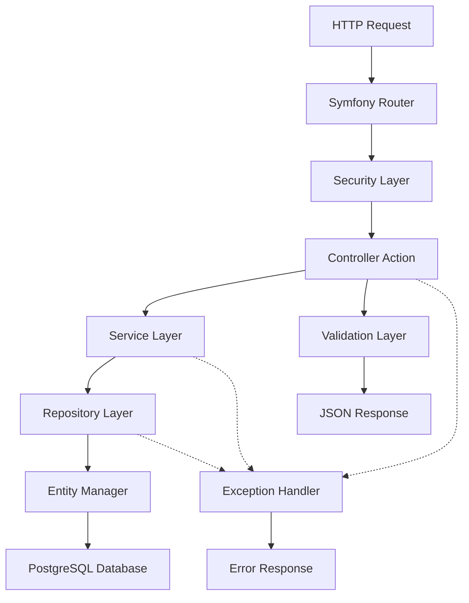

# 🖥️ Backend Controllers - Detalles Técnicos

> **📁 Ubicación:** `EYRA/documentacion-admin/10-Backend-Controllers.md`  
> **🔗 Enlaces:** [[01-Indice-Principal]] | [[05-CRUD-Usuarios]] | [[08-CRUD-Condiciones]]  
> **🏷️ Tags:** #backend #controllers #api #symfony #php

---

## 📋 Índice

1. [Resumen de la Arquitectura](#-resumen-de-la-arquitectura)
2. [Controladores Principales](#-controladores-principales)
3. [AdminController](#-admincontroller)
4. [ConditionController](#-conditioncontroller)
5. [CycleController](#-cyclecontroller)
6. [Patrones y Convenciones](#-patrones-y-convenciones)
7. [Servicios de Soporte](#-servicios-de-soporte)
8. [Manejo de Errores](#-manejo-de-errores)

---

## 🎯 Resumen de la Arquitectura

El backend de EYRA está construido sobre **Symfony 7.2** siguiendo una arquitectura MVC con principios de separación de responsabilidades y inyección de dependencias.

### 🏗️ Estructura de Controladores



### 📊 Métricas de Controladores

| Controlador | Endpoints | Autenticación | Admin Only | Estado |
|-------------|:---------:|:-------------:|:----------:|:------:|
| **AdminController** | 4 | JWT | ✅ | ✅ Implementado |
| **AuthController** | 8 | Mixto | ❌ | ✅ Implementado |
| **ConditionController** | 14 | JWT | Parcial | ✅ Implementado |
| **CycleController** | 11 | JWT | ❌ | ✅ Implementado |
| **NotificationController** | 10 | JWT | ❌ | ✅ Implementado |
| **ContentController** | 6 | JWT | Parcial | ✅ Implementado |
| **GuestController** | 6 | JWT | ❌ | ✅ Implementado |
| **OnboardingController** | 2 | JWT | ❌ | ✅ Implementado |

---

## 🏛️ Controladores Principales

### 📑 Estructura Base de Controladores

```php
<?php
// ! 01/06/2025 - Estructura base común para todos los controladores

namespace App\Controller;

use Symfony\Bundle\FrameworkBundle\Controller\AbstractController;
use Symfony\Component\HttpFoundation\JsonResponse;
use Symfony\Component\HttpFoundation\Request;
use Symfony\Component\Routing\Annotation\Route;
use Symfony\Component\Security\Http\Attribute\IsGranted;
use Symfony\Component\Security\Core\Exception\AccessDeniedException;

abstract class BaseController extends AbstractController
{
    // Validación común de usuario autenticado
    protected function validateAuthenticatedUser(): User
    {
        /** @var User|null $user */
        $user = $this->getUser();
        if (!$user) {
            throw new AccessDeniedException('User not authenticated');
        }
        return $user;
    }

    // Parseo seguro de datos JSON
    protected function parseJsonData(Request $request): array
    {
        $data = json_decode($request->getContent(), true);
        if (!$data) {
            throw new \InvalidArgumentException('Invalid JSON data');
        }
        return $data;
    }

    // Respuesta de error estandarizada
    protected function errorResponse(string $message, int $code = 400): JsonResponse
    {
        return $this->json(['message' => $message], $code);
    }

    // Respuesta de éxito estandarizada
    protected function successResponse($data, string $message = 'Success', int $code = 200): JsonResponse
    {
        return $this->json([
            'message' => $message,
            'data' => $data
        ], $code);
    }
}
```

---

## 👑 AdminController

### 🔑 Propósito y Responsabilidades

El **AdminController** maneja todas las operaciones administrativas del sistema, permitiendo a los administradores gestionar usuarios del sistema.

```php
<?php
// ! 01/06/2025 - Análisis completo del AdminController

#[Route('/admin')]
#[IsGranted('ROLE_ADMIN')]
class AdminController extends AbstractController
{
    public function __construct(
        private UserRepository $userRepository,
        private EntityManagerInterface $entityManager,
        private UserPasswordHasherInterface $passwordHasher,
        private ValidatorInterface $validator,
        LoggerInterface $logger
    ) {
        $this->logger = $logger;
    }
}
```

### 📋 Endpoints Implementados

| Método | Endpoint | Descripción | Validaciones |
|--------|----------|-------------|--------------|
| `GET` | `/admin/users` | Listar usuarios con filtros | Paginación, filtros por rol/perfil |
| `GET` | `/admin/users/{id}` | Obtener usuario específico | Verificación de existencia |
| `PUT` | `/admin/users/{id}` | Actualizar usuario | Validación completa, unicidad email |
| `DELETE` | `/admin/users/{id}` | Desactivar usuario | Protección auto-eliminación |

### 🔧 Características Técnicas

#### Gestión de Filtros Avanzada

```php
// ! 01/06/2025 - Sistema de filtrado híbrido en AdminController
public function listUsers(Request $request): JsonResponse
{
    // Obtener parámetros de filtrado
    $page = max(1, $request->query->getInt('page', 1));
    $limit = min(100, max(1, $request->query->getInt('limit', 20)));
    $role = $request->query->get('role');
    $profileType = $request->query->get('profileType');
    $search = $request->query->get('search');

    // Procesar filtro de tipo de perfil de forma segura
    $profileTypeEnum = null;
    if ($profileType) {
        try {
            $profileTypeEnum = ProfileType::from($profileType);
        } catch (ValueError $e) {
            $profileTypeEnum = null; // Ignorar filtro inválido
        }
    }

    // Obtener datos con filtros aplicados
    $total = $this->userRepository->countUsersWithFilters($search, $role, $profileTypeEnum);
    $users = $this->userRepository->findUsersWithFilters($search, $role, $profileTypeEnum, $limit, $offset);

    // Transformar y devolver respuesta paginada
    return $this->json([
        'users' => $this->transformUsersData($users),
        'pagination' => [
            'page' => $page,
            'limit' => $limit,
            'total' => $total,
            'totalPages' => ceil($total / $limit)
        ]
    ]);
}
```

#### Validación y Seguridad

```php
// ! 01/06/2025 - Validaciones de seguridad en actualización de usuarios
public function editUser(int $id, Request $request): JsonResponse 
{
    // Verificación de rol de administrador
    /** @var User|null $currentUser */
    $currentUser = $this->getUser();
    if (!$currentUser || !in_array('ROLE_ADMIN', $currentUser->getRoles())) {
        $this->logger->warning('Intento de acceso no autorizado', [
            'userId' => $currentUser ? $currentUser->getId() : 'anónimo',
            'ip' => $request->getClientIp()
        ]);
        return $this->json(['message' => 'Acceso denegado'], 403);
    }

    // Verificación de unicidad de email
    if (isset($data['email'])) {
        $existingUser = $this->userRepository->findOneBy(['email' => $data['email']]);
        if ($existingUser && $existingUser->getId() !== $user->getId()) {
            return $this->json(['message' => 'El email ya está registrado'], 409);
        }
    }

    // Protección contra auto-eliminación
    if ($currentUser->getId() === $id) {
        return $this->json(['message' => 'No puedes desactivar tu propia cuenta'], 400);
    }
}
```

#### Logging y Auditoría

```php
// ! 01/06/2025 - Sistema de logging completo
$this->logger->info('Usuario actualizado por administrador', [
    'targetUserId' => $user->getId(),
    'adminId' => $adminId,
    'campos_actualizados' => array_keys($data),
    'ip' => $request->getClientIp(),
    'timestamp' => new \DateTime()
]);
```

---

## 🏥 ConditionController

### 🎯 Propósito y Responsabilidades

Gestiona el catálogo de condiciones médicas y las relaciones entre usuarios y condiciones.

```php
<?php
// ! 01/06/2025 - Estructura del ConditionController

#[Route('/conditions')]
class ConditionController extends AbstractController
{
    public function __construct(
        private ConditionRepository $conditionRepository,
        private UserConditionRepository $userConditionRepository,
        private SerializerInterface $serializer,
        private ValidatorInterface $validator,
        private EntityManagerInterface $entityManager,
        private NotificationService $notificationService
    ) {}
}
```

### 📋 Endpoints por Categoría

#### 📚 Gestión de Catálogo

| Método | Endpoint | Descripción | Permisos |
|--------|----------|-------------|----------|
| `GET` | `/conditions` | Listar todas las condiciones | USER |
| `GET` | `/conditions/active` | Solo condiciones activas | USER |
| `GET` | `/conditions/{id}` | Condición específica | USER |
| `GET` | `/conditions/categories` | Categorías disponibles | USER |
| `GET` | `/conditions/search?query=` | Búsqueda por nombre/descripción | USER |

#### 👤 Relaciones Usuario-Condición

| Método | Endpoint | Descripción | Validaciones |
|--------|----------|-------------|--------------|
| `GET` | `/conditions/user` | Condiciones del usuario | Ownership check |
| `POST` | `/conditions/user/add` | Asignar condición | Duplicado check |
| `PUT` | `/conditions/user/{id}` | Actualizar relación | Ownership check |
| `DELETE` | `/conditions/user/{id}` | Remover condición | Soft delete |

#### 🛡️ Operaciones Administrativas

| Método | Endpoint | Descripción | Permisos |
|--------|----------|-------------|----------|
| `POST` | `/conditions` | Crear condición | ADMIN |
| `PUT` | `/conditions/{id}` | Actualizar condición | ADMIN |
| `DELETE` | `/conditions/{id}` | Eliminar condición | ADMIN |

### 🔧 Características Técnicas

#### Sistema de Categorías

```php
// ! 01/06/2025 - Sistema de categorización de condiciones médicas
#[Route('/categories', name: 'api_conditions_categories', methods: ['GET'])]
public function getConditionCategories(): JsonResponse
{
    $categories = [
        'hormonal' => [
            'name' => 'Trastornos Hormonales',
            'description' => 'Condiciones relacionadas con desequilibrios hormonales',
            'examples' => ['PCOS', 'Hipotiroidismo', 'Hipertiroidismo']
        ],
        'menstrual' => [
            'name' => 'Trastornos Menstruales',
            'description' => 'Condiciones que afectan el ciclo menstrual',
            'examples' => ['Dismenorrea', 'Amenorrea', 'Menorragia']
        ],
        'reproductive' => [
            'name' => 'Salud Reproductiva',
            'description' => 'Condiciones del sistema reproductivo',
            'examples' => ['Endometriosis', 'Fibromas uterinos', 'Quistes ováricos']
        ]
        // ... más categorías
    ];
    
    return $this->json($categories, 200);
}
```

#### Gestión de Relaciones Usuario-Condición

```php
// ! 01/06/2025 - Lógica compleja para asignar condiciones a usuarios
public function addUserCondition(Request $request): JsonResponse
{
    $user = $this->validateAuthenticatedUser();
    $data = $this->parseJsonData($request);

    // Buscar la condición
    $condition = $this->conditionRepository->find($data['conditionId']);
    if (!$condition) {
        return $this->errorResponse('Condition not found', 404);
    }

    // Verificar que la condición esté activa
    if (!$condition->getState()) {
        return $this->errorResponse('Cannot assign inactive condition', 400);
    }

    // Verificar duplicados activos
    $existingCondition = $this->userConditionRepository->findOneBy([
        'user' => $user,
        'condition' => $condition,
        'state' => true
    ]);

    if ($existingCondition && $existingCondition->isActive()) {
        return $this->errorResponse('User already has this condition assigned and active', 409);
    }

    // Crear relación
    $userCondition = new UserCondition();
    $userCondition->setUser($user);
    $userCondition->setCondition($condition);
    $userCondition->setStartDate(new \DateTime($data['startDate']));
    
    // Campos opcionales
    if (isset($data['endDate'])) {
        $userCondition->setEndDate(new \DateTime($data['endDate']));
    }
    
    // Validar y guardar
    $this->validateAndSave($userCondition);

    // Crear notificación
    $this->notificationService->createMedicalNotification(
        $user,
        $condition,
        'Nueva condición registrada',
        "Se ha registrado la condición {$condition->getName()} en tu perfil.",
        NotificationService::PRIORITY_NORMAL
    );

    return $this->json($userCondition, 201, [], [
        'groups' => ['user_condition:read', 'condition:read']
    ]);
}
```

#### Eliminación Inteligente

```php
// ! 01/06/2025 - Eliminación inteligente de condiciones con protección de datos
public function deleteCondition(int $id): JsonResponse
{
    $condition = $this->conditionRepository->find($id);
    if (!$condition) {
        return $this->errorResponse('Condition not found', 404);
    }

    // Verificar si hay usuarios que tienen esta condición activa
    $activeUserConditions = $this->userConditionRepository->findBy([
        'condition' => $condition,
        'state' => true
    ]);

    if (count($activeUserConditions) > 0) {
        // Desactivar en lugar de eliminar para preservar datos
        $condition->setState(false);
        $this->conditionRepository->save($condition, true);
        
        return $this->json([
            'message' => 'Condition deactivated instead of deleted due to active user associations',
            'activeUsers' => count($activeUserConditions)
        ], 200);
    }

    // Eliminación física solo si no hay asociaciones
    $this->conditionRepository->remove($condition, true);
    return $this->json(['message' => 'Condition deleted successfully'], 200);
}
```

---

## 🔄 CycleController

### 🎯 Propósito y Responsabilidades

Gestiona los ciclos menstruales, predicciones y calendario de las usuarias.

```php
<?php
// ! 01/06/2025 - Estructura del CycleController con servicios especializados

#[Route('/api/cycles')]
class CycleController extends AbstractController
{
    public function __construct(
        private MenstrualCycleRepository $cycleRepository,
        private CycleDayRepository $cycleDayRepository,
        private CycleCalculatorService $cycleCalculator,
        private CyclePhaseService $cyclePhaseService,
        private ContentRecommendationService $contentRecommendation,
        private EntityManagerInterface $entityManager
    ) {}
}
```

### 📋 Endpoints por Funcionalidad

#### 📊 Estado Actual del Ciclo

| Método | Endpoint | Descripción | Características |
|--------|----------|-------------|-----------------|
| `GET` | `/cycles/current` | Ciclo actual con fases | Auto-organización de fases |
| `GET` | `/cycles/today` | Información del día actual | Auto-creación si no existe |
| `GET` | `/cycles/recommendations` | Recomendaciones personalizadas | Por fase del ciclo |

#### 📅 Calendario y Predicciones

| Método | Endpoint | Descripción | Algoritmos |
|--------|----------|-------------|------------|
| `GET` | `/cycles/calendar` | Vista de calendario | Filtrado por rango de fechas |
| `GET` | `/cycles/predict` | Predicción básica | Promedio ponderado |
| `GET` | `/cycles/prediction-details` | Predicción avanzada | Múltiples algoritmos |
| `POST` | `/cycles/sync-algorithm` | Recalcular predicciones | Algoritmo adaptativo |

#### 🔄 Gestión de Ciclos

| Método | Endpoint | Descripción | Validaciones |
|--------|----------|-------------|--------------|
| `POST` | `/cycles/start-cycle` | Iniciar nuevo ciclo | Detección de conflictos |
| `POST` | `/cycles/end-cycle/{id}` | Finalizar ciclo | Solo fase menstrual |
| `GET` | `/cycles/statistics` | Estadísticas detalladas | Análisis temporal |

### 🔧 Características Técnicas

#### Sistema de Fases Inteligente

```php
// ! 01/06/2025 - Gestión inteligente de fases del ciclo menstrual
public function getCurrentCycle(): JsonResponse
{
    $user = $this->validateAuthenticatedUser();
    
    // Obtener todas las fases del ciclo actual
    $currentPhases = $this->cycleRepository->findCurrentPhasesForUser($user->getId());
    
    if (empty($currentPhases)) {
        return $this->errorResponse('No active cycle found', 404);
    }

    // Organizar las fases por tipo
    $organizedPhases = [];
    $cycleId = null;

    foreach ($currentPhases as $phase) {
        $cycleId = $phase->getCycleId();
        $organizedPhases[$phase->getPhase()->value] = [
            'phase' => $phase->getPhase()->value,
            'startDate' => $phase->getStartDate()->format('Y-m-d'),
            'endDate' => $phase->getEndDate()?->format('Y-m-d'),
            'cycleId' => $phase->getCycleId(),
            'notes' => $phase->getNotes()
        ];
    }

    // Determinar fase actual basada en la fecha
    $currentPhase = $this->determineCurrentPhase($currentPhases);
    
    return $this->json([
        'cycleId' => $cycleId,
        'phases' => $organizedPhases,
        'currentPhase' => $currentPhase ? [
            'phase' => $currentPhase->getPhase()->value,
            'startDate' => $currentPhase->getStartDate()->format('Y-m-d'),
            'endDate' => $currentPhase->getEndDate()?->format('Y-m-d'),
            'cycleId' => $currentPhase->getCycleId(),
            'notes' => $currentPhase->getNotes()
        ] : null
    ]);
}
```

#### Auto-creación de Días de Ciclo

```php
// ! 01/06/2025 - Sistema de auto-creación de días de ciclo
public function getCurrentDay(): JsonResponse
{
    $user = $this->validateAuthenticatedUser();
    $today = $this->cycleDayRepository->findCurrentForUser($user);

    // Auto-crear día si no existe
    if (!$today) {
        $currentPhases = $this->cycleRepository->findCurrentPhasesForUser($user->getId());
        
        if (empty($currentPhases)) {
            return $this->errorResponse('No active cycle found. Please start a cycle first.', 404);
        }

        $currentPhase = $this->determineCurrentPhase($currentPhases);
        if (!$currentPhase) {
            return $this->errorResponse('Could not determine current cycle phase', 500);
        }

        $date = new \DateTime();
        $dayNumber = $date->diff($currentPhase->getStartDate())->days + 1;

        // Crear nuevo día automáticamente
        $today = new CycleDay();
        $today->setCyclePhase($currentPhase);
        $today->setCycleId($currentPhase->getId());
        $today->setPhase($currentPhase->getPhase()->value);
        $today->setDate($date);
        $today->setDayNumber($dayNumber);

        $this->entityManager->persist($today);
        $this->entityManager->flush();
    }

    return $this->json($today, 200, [], ['groups' => 'cycle_day:read']);
}
```

#### Sistema de Predicciones Avanzado

```php
// ! 01/06/2025 - Algoritmo de predicción con múltiples estrategias
public function getPredictionDetails(): JsonResponse
{
    $user = $this->validateAuthenticatedUser();
    
    // Usar el servicio especializado para predicciones detalladas
    $predictionDetails = $this->cycleCalculator->getPredictionDetails($user);

    if (!isset($predictionDetails['success']) || !$predictionDetails['success']) {
        // Devolver valores por defecto si no hay suficientes datos
        return $this->json([
            'message' => 'No hay suficientes datos para generar una predicción detallada',
            'defaultValues' => true,
            'cycleLength' => 28,
            'periodDuration' => 5,
            'confidence' => 0,
            'algorithm' => 'default'
        ], 200);
    }

    return $this->json($predictionDetails);
}
```

#### Estadísticas Detalladas

```php
// ! 01/06/2025 - Cálculo de estadísticas complejas del ciclo
public function getCycleStatistics(Request $request): JsonResponse
{
    $user = $this->validateAuthenticatedUser();
    $months = $request->query->getInt('months', 6);

    $startDate = (new \DateTime())->modify("-{$months} months");
    
    // Obtener ciclos en el rango temporal
    $cycles = $this->cycleRepository->createQueryBuilder('c')
        ->andWhere('c.user = :user')
        ->andWhere('c.startDate >= :startDate')
        ->setParameter('user', $user)
        ->setParameter('startDate', $startDate)
        ->orderBy('c.startDate', 'ASC')
        ->getQuery()
        ->getResult();

    if (count($cycles) === 0) {
        return $this->json([
            'cyclesAnalyzed' => 0,
            'averageCycleLength' => 28,
            'averagePeriodLength' => 5,
            'regularity' => 0,
            'monthsAnalyzed' => $months
        ]);
    }

    // Calcular métricas estadísticas
    $stats = $this->calculateCycleStatistics($cycles, $months);
    return $this->json($stats);
}

private function calculateCycleStatistics(array $cycles, int $months): array
{
    $totalCycleLength = 0;
    $totalPeriodLength = 0;
    $cycleLengthValues = [];
    $longestCycle = null;
    $shortestCycle = null;

    foreach ($cycles as $cycle) {
        $cycleLength = $cycle->getAverageCycleLength();
        $totalCycleLength += $cycleLength;
        $cycleLengthValues[] = $cycleLength;
        $totalPeriodLength += $cycle->getAverageDuration();

        // Encontrar extremos
        if ($longestCycle === null || $cycleLength > $longestCycle['length']) {
            $longestCycle = [
                'id' => $cycle->getId(),
                'startDate' => $cycle->getStartDate()->format('Y-m-d'),
                'length' => $cycleLength
            ];
        }

        if ($shortestCycle === null || $cycleLength < $shortestCycle['length']) {
            $shortestCycle = [
                'id' => $cycle->getId(),
                'startDate' => $cycle->getStartDate()->format('Y-m-d'),
                'length' => $cycleLength
            ];
        }
    }

    $cycleCount = count($cycles);
    $averageCycleLength = $totalCycleLength / $cycleCount;
    $averagePeriodLength = $totalPeriodLength / $cycleCount;

    // Calcular regularidad usando desviación estándar
    $variance = 0;
    foreach ($cycleLengthValues as $length) {
        $variance += pow($length - $averageCycleLength, 2);
    }
    $variance = $variance / $cycleCount;
    $stdDev = sqrt($variance);

    // Convertir a índice de regularidad (0-100)
    $regularityIndex = max(0, min(100, 100 - ($stdDev * 10)));

    return [
        'cyclesAnalyzed' => $cycleCount,
        'averageCycleLength' => round($averageCycleLength, 1),
        'averagePeriodLength' => round($averagePeriodLength, 1),
        'longestCycle' => $longestCycle,
        'shortestCycle' => $shortestCycle,
        'regularity' => round($regularityIndex),
        'cycleLengthVariation' => round($stdDev, 1),
        'monthsAnalyzed' => $months,
        'cyclesByMonth' => $this->getCycleCountByMonth($cycles, $months)
    ];
}
```

---

## 🎯 Patrones y Convenciones

### 🏗️ Arquitectura de Controladores

#### Inyección de Dependencias

```php
// ! 01/06/2025 - Patrón de inyección de dependencias estándar
public function __construct(
    private EntityRepository $repository,           // Acceso a datos
    private EntityManagerInterface $entityManager, // Persistencia
    private ValidatorInterface $validator,         // Validación
    private LoggerInterface $logger,              // Logging
    private CustomService $customService          // Servicios especializados
) {}
```

#### Validación de Usuarios

```php
// ! 01/06/2025 - Patrón estándar de validación de autenticación
/** @var User $user */
$user = $this->getUser();
if (!$user) {
    throw new AccessDeniedException('User not authenticated');
}
```

#### Manejo de Datos JSON

```php
// ! 01/06/2025 - Patrón para manejo seguro de datos JSON
$data = json_decode($request->getContent(), true);
if (!$data) {
    return $this->json(['message' => 'Invalid request data'], 400);
}
```

### 🔒 Seguridad y Autorización

#### Atributos de Seguridad

```php
// ! 01/06/2025 - Patrones de autorización usando atributos PHP 8
#[Route('/admin')]
#[IsGranted('ROLE_ADMIN')]
class AdminController extends AbstractController {}

#[Route('/conditions/{id}', methods: ['DELETE'])]
#[IsGranted('ROLE_ADMIN')]
public function deleteCondition(int $id): JsonResponse {}
```

#### Verificación de Ownership

```php
// ! 01/06/2025 - Patrón para verificar propiedad de recursos
if ($userCondition->getUser()->getId() !== $user->getId()) {
    throw new AccessDeniedException('Cannot modify condition from another user');
}
```

### 📊 Serialización y Grupos

```php
// ! 01/06/2025 - Uso de grupos de serialización para control de datos
return $this->json($userCondition, 201, [], [
    'groups' => ['user_condition:read', 'condition:read']
]);
```

### 🔄 Paginación Estándar

```php
// ! 01/06/2025 - Patrón estándar de paginación
$page = max(1, $request->query->getInt('page', 1));
$limit = min(100, max(1, $request->query->getInt('limit', 20)));
$offset = ($page - 1) * $limit;

return $this->json([
    'data' => $results,
    'pagination' => [
        'page' => $page,
        'limit' => $limit,
        'total' => $total,
        'totalPages' => ceil($total / $limit)
    ]
]);
```

---

## 🛠️ Servicios de Soporte

### 🧮 CycleCalculatorService

```php
// ! 01/06/2025 - Servicio especializado para cálculos de ciclo
class CycleCalculatorService
{
    public function predictNextCycle(User $user): array
    {
        // Algoritmos de predicción basados en historial
        $cycles = $this->getCycleHistory($user);
        
        if (count($cycles) < 2) {
            return ['success' => false, 'message' => 'Insufficient data'];
        }

        // Algoritmo adaptativo según la regularidad
        $algorithm = $this->selectBestAlgorithm($cycles);
        $prediction = match($algorithm) {
            'weighted_average' => $this->weightedAveragePrediction($cycles),
            'trend_based' => $this->trendBasedPrediction($cycles),
            'seasonal' => $this->seasonalPrediction($cycles),
            default => $this->simplePrediction($cycles)
        };

        return [
            'success' => true,
            'expectedStartDate' => $prediction['startDate'],
            'expectedEndDate' => $prediction['endDate'],
            'confidence' => $prediction['confidence'],
            'algorithm' => $algorithm
        ];
    }
}
```

### 🔔 NotificationService

```php
// ! 01/06/2025 - Servicio de notificaciones médicas
class NotificationService
{
    public const PRIORITY_LOW = 'low';
    public const PRIORITY_NORMAL = 'normal';
    public const PRIORITY_HIGH = 'high';
    public const PRIORITY_URGENT = 'urgent';

    public function createMedicalNotification(
        User $user,
        Condition $condition,
        string $title,
        string $message,
        string $priority = self::PRIORITY_NORMAL
    ): Notification {
        $notification = new Notification();
        $notification->setUser($user);
        $notification->setRelatedCondition($condition);
        $notification->setTitle($title);
        $notification->setMessage($message);
        $notification->setPriority($priority);
        $notification->setType('medical');

        $this->entityManager->persist($notification);
        $this->entityManager->flush();

        return $notification;
    }
}
```

### 📄 ContentRecommendationService

```php
// ! 01/06/2025 - Servicio de recomendaciones personalizadas
class ContentRecommendationService
{
    public function getPersonalizedRecommendations(
        User $user, 
        ?ContentType $type = null, 
        int $limit = 5
    ): array {
        // Obtener fase actual del ciclo
        $currentPhase = $this->getCurrentPhase($user);
        
        if (!$currentPhase) {
            return [
                'success' => false,
                'message' => 'No se encontró información sobre tu ciclo actual'
            ];
        }

        // Buscar contenido específico para la fase
        $content = $this->contentRepository->findByPhaseAndType(
            $currentPhase->getPhase(),
            $type,
            $limit
        );

        return [
            'success' => true,
            'currentPhase' => $currentPhase->getPhase()->value,
            'cycleDay' => $this->calculateCycleDay($currentPhase),
            'recommendations' => $content
        ];
    }
}
```

---

## ⚠️ Manejo de Errores

### 🎯 Estrategias de Manejo de Errores

#### Exception Handlers Globales

```php
// ! 01/06/2025 - Manejo global de excepciones
class GlobalExceptionListener
{
    public function onKernelException(ExceptionEvent $event): void
    {
        $exception = $event->getThrowable();
        
        $response = match (true) {
            $exception instanceof AccessDeniedException => new JsonResponse([
                'message' => 'Access denied',
                'code' => 'ACCESS_DENIED'
            ], 403),
            
            $exception instanceof NotFoundHttpException => new JsonResponse([
                'message' => 'Resource not found',
                'code' => 'NOT_FOUND'
            ], 404),
            
            $exception instanceof ValidationException => new JsonResponse([
                'message' => 'Validation failed',
                'errors' => $exception->getErrors(),
                'code' => 'VALIDATION_FAILED'
            ], 400),
            
            default => new JsonResponse([
                'message' => 'Internal server error',
                'code' => 'INTERNAL_ERROR'
            ], 500)
        };

        $event->setResponse($response);
    }
}
```

#### Validación con Mensajes Detallados

```php
// ! 01/06/2025 - Patrón de validación con errores detallados
$errors = $this->validator->validate($entity);
if (count($errors) > 0) {
    $errorMessages = [];
    foreach ($errors as $error) {
        $errorMessages[$error->getPropertyPath()] = $error->getMessage();
    }
    return $this->json([
        'message' => 'Validation failed', 
        'errors' => $errorMessages
    ], 400);
}
```

#### Logging Contextual

```php
// ! 01/06/2025 - Logging con contexto enriquecido
try {
    // Operación que puede fallar
    $result = $this->dangerousOperation();
} catch (\Exception $e) {
    $this->logger->error('Error en operación crítica', [
        'exception' => $e->getMessage(),
        'trace' => $e->getTraceAsString(),
        'userId' => $user->getId(),
        'ip' => $request->getClientIp(),
        'userAgent' => $request->headers->get('User-Agent'),
        'timestamp' => new \DateTime(),
        'context' => [
            'operation' => 'dangerous_operation',
            'parameters' => $parameters
        ]
    ]);
    
    return $this->json([
        'message' => 'Error interno del servidor',
        'code' => 'OPERATION_FAILED'
    ], 500);
}
```

### 🔍 Debugging y Monitoreo

#### Métricas de Rendimiento

```php
// ! 01/06/2025 - Monitoreo de rendimiento en controladores
public function performanceMonitoredAction(): JsonResponse
{
    $startTime = microtime(true);
    
    try {
        $result = $this->expensiveOperation();
        
        $executionTime = microtime(true) - $startTime;
        
        $this->logger->info('Performance metric', [
            'operation' => 'expensive_operation',
            'execution_time' => $executionTime,
            'memory_usage' => memory_get_peak_usage(true),
            'result_size' => is_countable($result) ? count($result) : strlen(serialize($result))
        ]);
        
        return $this->json($result);
        
    } catch (\Exception $e) {
        $this->logger->error('Performance monitored operation failed', [
            'execution_time' => microtime(true) - $startTime,
            'error' => $e->getMessage()
        ]);
        throw $e;
    }
}
```

#### Health Checks

```php
// ! 01/06/2025 - Health check para monitoreo del sistema
#[Route('/health', name: 'api_health_check', methods: ['GET'])]
public function healthCheck(): JsonResponse
{
    $status = [
        'status' => 'healthy',
        'timestamp' => new \DateTime(),
        'services' => []
    ];

    // Check database
    try {
        $this->entityManager->getConnection()->connect();
        $status['services']['database'] = 'healthy';
    } catch (\Exception $e) {
        $status['services']['database'] = 'unhealthy';
        $status['status'] = 'degraded';
    }

    // Check memory usage
    $memoryUsage = memory_get_usage(true);
    $memoryLimit = ini_get('memory_limit');
    $status['services']['memory'] = [
        'usage' => $memoryUsage,
        'limit' => $memoryLimit,
        'percentage' => round(($memoryUsage / $this->parseMemoryLimit($memoryLimit)) * 100, 2)
    ];

    return $this->json($status);
}
```

---

## 🔗 Enlaces Relacionados

- [[05-CRUD-Usuarios]] - CRUD completo de usuarios
- [[08-CRUD-Condiciones]] - CRUD de condiciones médicas
- [[09-Sistema-Condiciones]] - Relaciones usuario-condición
- [[11-Frontend-Components]] - Componentes React del frontend

---

**📝 Última actualización:** 01/06/2025  
**👨‍💻 Autor:** Sistema de Documentación EYRA  
**🔄 Versión:** 1.0.0