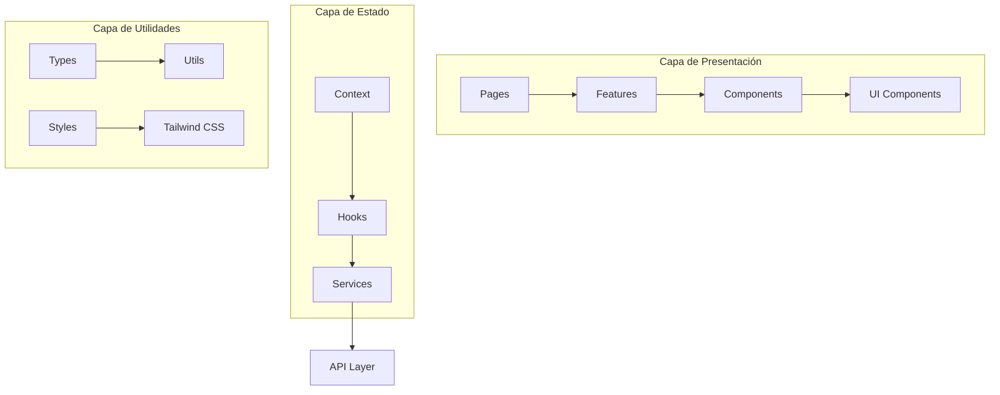

# 💻 Frontend Components - Arquitectura React

> **📁 Ubicación:** `EYRA/documentacion-admin/11-Frontend-Components.md`  
> **🔗 Enlaces:** [[01-Indice-Principal]] | [[10-Backend-Controllers]] | [[07-Filtros-Busqueda]]  
> **🏷️ Tags:** #frontend #react #components #typescript #admin

---

## 📋 Índice

1. [Resumen de la Arquitectura](#-resumen-de-la-arquitectura)
2. [Estructura de Componentes](#-estructura-de-componentes)
3. [Componentes UI Base](#-componentes-ui-base)
4. [Features Administrativas](#-features-administrativas)
5. [Gestión de Estado](#-gestión-de-estado)
6. [Hooks Personalizados](#-hooks-personalizados)
7. [Patrones de Diseño](#-patrones-de-diseño)
8. [Optimización y Rendimiento](#-optimización-y-rendimiento)

---

## 🎯 Resumen de la Arquitectura

El frontend de EYRA está construido con **React 19** y **TypeScript**, siguiendo una arquitectura basada en características (feature-based) con componentes reutilizables y hooks personalizados.

### 🏗️ Arquitectura de Capas



### 📊 Métricas de Componentes

| Categoría | Cantidad | Reutilización | Estado |
|-----------|:--------:|:-------------:|:------:|
| **UI Components** | 15+ | 95% | ✅ Implementado |
| **Admin Features** | 8 | 80% | ✅ Implementado |
| **Form Components** | 12 | 85% | ✅ Implementado |
| **Layout Components** | 6 | 90% | ✅ Implementado |
| **Auth Components** | 5 | 70% | ✅ Implementado |
| **Custom Hooks** | 10+ | 75% | ✅ Implementado |

---

## 🏛️ Estructura de Componentes

### 📁 Organización del Proyecto

```
src/
├── components/          # Componentes reutilizables
│   ├── ui/             # Componentes UI base
│   ├── forms/          # Componentes de formularios
│   ├── layout/         # Componentes de layout
│   └── auth/           # Componentes de autenticación
├── features/           # Funcionalidades por dominio
│   ├── admin/          # Panel de administración
│   ├── auth/           # Autenticación
│   ├── calendar/       # Calendario menstrual
│   └── dashboard/      # Dashboard principal
├── hooks/              # Hooks personalizados
├── context/            # Context providers
├── services/           # Servicios API
├── types/              # Definiciones TypeScript
└── utils/              # Utilidades generales
```

### 🎨 Sistema de Diseño

```typescript
// ! 01/06/2025 - Tokens de diseño unificados
export const designTokens = {
  colors: {
    primary: {
      DEFAULT: '#b91c1c',
      light: '#dc2626',
      dark: '#991b1b'
    },
    gray: {
      50: '#f9fafb',
      100: '#f3f4f6',
      200: '#e5e7eb',
      500: '#6b7280',
      700: '#374151',
      900: '#111827'
    }
  },
  spacing: {
    xs: '0.5rem',
    sm: '1rem',
    md: '1.5rem',
    lg: '2rem',
    xl: '3rem'
  },
  borderRadius: {
    sm: '0.375rem',
    md: '0.5rem',
    lg: '0.75rem',
    xl: '1rem'
  }
} as const;
```

---

## 🧩 Componentes UI Base

### 📦 Card Component

```tsx
// ! 01/06/2025 - Componente Card reutilizable y flexible
interface CardProps {
  children: ReactNode;
  title?: string;
  subtitle?: string;
  footer?: ReactNode;
  className?: string;
  bodyClassName?: string;
  headerClassName?: string;
  footerClassName?: string;
  noPadding?: boolean;
}

export const Card: React.FC<CardProps> = ({
  children,
  title,
  subtitle,
  footer,
  className = '',
  bodyClassName = '',
  headerClassName = '',
  footerClassName = '',
  noPadding = false,
}) => {
  return (
    <div className={`bg-white rounded-lg shadow-sm border border-gray-200 overflow-hidden ${className}`}>
      {(title || subtitle) && (
        <div className={`px-6 py-4 border-b ${headerClassName}`}>
          {title && <h3 className="text-xl font-serif text-primary-DEFAULT">{title}</h3>}
          {subtitle && <p className="mt-1 text-sm text-gray-600">{subtitle}</p>}
        </div>
      )}
      
      <div className={`${noPadding ? '' : 'px-6 py-4'} ${bodyClassName}`}>
        {children}
      </div>
      
      {footer && (
        <div className={`px-6 py-4 bg-gray-50 border-t border-gray-200 ${footerClassName}`}>
          {footer}
        </div>
      )}
    </div>
  );
};
```

### 🔘 Button Component

```tsx
// ! 01/06/2025 - Sistema de botones con variantes
interface ButtonProps extends React.ButtonHTMLAttributes<HTMLButtonElement> {
  variant?: 'primary' | 'secondary' | 'danger' | 'ghost';
  size?: 'sm' | 'md' | 'lg';
  loading?: boolean;
  leftIcon?: React.ReactNode;
  rightIcon?: React.ReactNode;
  fullWidth?: boolean;
}

export const Button: React.FC<ButtonProps> = ({
  children,
  variant = 'primary',
  size = 'md',
  loading = false,
  leftIcon,
  rightIcon,
  fullWidth = false,
  className = '',
  disabled,
  ...props
}) => {
  const baseStyles = 'inline-flex items-center justify-center font-medium rounded-md transition-colors focus:outline-none focus:ring-2 focus:ring-offset-2';
  
  const variants = {
    primary: 'bg-[#b91c1c] text-white hover:bg-[#991b1b] focus:ring-[#b91c1c]',
    secondary: 'bg-gray-200 text-gray-900 hover:bg-gray-300 focus:ring-gray-500',
    danger: 'bg-red-600 text-white hover:bg-red-700 focus:ring-red-500',
    ghost: 'text-gray-700 hover:bg-gray-100 focus:ring-gray-500'
  };

  const sizes = {
    sm: 'px-3 py-2 text-sm',
    md: 'px-4 py-2 text-sm',
    lg: 'px-6 py-3 text-base'
  };

  const isDisabled = disabled || loading;

  return (
    <button
      className={`
        ${baseStyles}
        ${variants[variant]}
        ${sizes[size]}
        ${fullWidth ? 'w-full' : ''}
        ${isDisabled ? 'opacity-50 cursor-not-allowed' : ''}
        ${className}
      `}
      disabled={isDisabled}
      {...props}
    >
      {loading && (
        <div className="mr-2 h-4 w-4 animate-spin rounded-full border-2 border-current border-t-transparent" />
      )}
      {leftIcon && !loading && <span className="mr-2">{leftIcon}</span>}
      {children}
      {rightIcon && <span className="ml-2">{rightIcon}</span>}
    </button>
  );
};
```

### 📝 Input Component

```tsx
// ! 01/06/2025 - Componente de input con validación
interface InputProps extends React.InputHTMLAttributes<HTMLInputElement> {
  label?: string;
  error?: string;
  helperText?: string;
  leftIcon?: React.ReactNode;
  rightIcon?: React.ReactNode;
  containerClassName?: string;
}

export const Input: React.FC<InputProps> = ({
  label,
  error,
  helperText,
  leftIcon,
  rightIcon,
  containerClassName = '',
  className = '',
  id,
  ...props
}) => {
  const inputId = id || `input-${Math.random().toString(36).substr(2, 9)}`;
  const hasError = !!error;

  return (
    <div className={containerClassName}>
      {label && (
        <label htmlFor={inputId} className="block text-sm font-medium text-gray-700 mb-2">
          {label}
        </label>
      )}
      
      <div className="relative">
        {leftIcon && (
          <div className="absolute inset-y-0 left-0 pl-3 flex items-center pointer-events-none">
            <span className="text-gray-400">{leftIcon}</span>
          </div>
        )}
        
        <input
          id={inputId}
          className={`
            block w-full px-3 py-2 border rounded-md shadow-sm focus:outline-none focus:ring-2 focus:ring-offset-0
            ${leftIcon ? 'pl-10' : ''}
            ${rightIcon ? 'pr-10' : ''}
            ${hasError 
              ? 'border-red-300 focus:ring-red-500 focus:border-red-500' 
              : 'border-gray-300 focus:ring-[#b91c1c] focus:border-[#b91c1c]'
            }
            ${className}
          `}
          {...props}
        />
        
        {rightIcon && (
          <div className="absolute inset-y-0 right-0 pr-3 flex items-center pointer-events-none">
            <span className="text-gray-400">{rightIcon}</span>
          </div>
        )}
      </div>
      
      {error && (
        <p className="mt-2 text-sm text-red-600">{error}</p>
      )}
      
      {helperText && !error && (
        <p className="mt-2 text-sm text-gray-500">{helperText}</p>
      )}
    </div>
  );
};
```

### 🔄 LoadingSpinner Component

```tsx
// ! 01/06/2025 - Componente de loading reutilizable
interface LoadingSpinnerProps {
  size?: 'sm' | 'md' | 'lg';
  color?: 'primary' | 'white' | 'gray';
  text?: string;
  center?: boolean;
  overlay?: boolean;
}

export const LoadingSpinner: React.FC<LoadingSpinnerProps> = ({
  size = 'md',
  color = 'primary',
  text,
  center = false,
  overlay = false
}) => {
  const sizes = {
    sm: 'h-4 w-4',
    md: 'h-8 w-8', 
    lg: 'h-12 w-12'
  };

  const colors = {
    primary: 'border-[#b91c1c]',
    white: 'border-white',
    gray: 'border-gray-400'
  };

  const spinner = (
    <div className={`${center ? 'flex flex-col items-center justify-center' : 'inline-flex items-center'}`}>
      <div className={`animate-spin rounded-full border-2 border-t-transparent ${sizes[size]} ${colors[color]}`} />
      {text && <p className="mt-2 text-sm text-gray-600">{text}</p>}
    </div>
  );

  if (overlay) {
    return (
      <div className="fixed inset-0 bg-black bg-opacity-50 flex items-center justify-center z-50">
        {spinner}
      </div>
    );
  }

  if (center) {
    return (
      <div className="flex items-center justify-center py-12">
        {spinner}
      </div>
    );
  }

  return spinner;
};
```

---

## 🏢 Features Administrativas

### 👥 UsersTable Component

```tsx
// ! 01/06/2025 - Componente complejo de tabla de usuarios con filtros
interface UsersTableProps {
  onRefresh?: () => void;
}

const UsersTable: React.FC<UsersTableProps> = ({ onRefresh }) => {
  const [users, setUsers] = useState<User[]>([]);
  const [allUsers, setAllUsers] = useState<User[]>([]);
  const [loading, setLoading] = useState(true);
  const [error, setError] = useState<string | null>(null);
  
  // Estados de filtros
  const [searchTerm, setSearchTerm] = useState('');
  const [roleFilter, setRoleFilter] = useState('');
  const [profileTypeFilter, setProfileTypeFilter] = useState('');
  
  // Estados de modales
  const [selectedUser, setSelectedUser] = useState<User | null>(null);
  const [isEditModalOpen, setIsEditModalOpen] = useState(false);
  const [isViewModalOpen, setIsViewModalOpen] = useState(false);
  const [isCreateModalOpen, setIsCreateModalOpen] = useState(false);

  // Carga de datos con manejo de errores
  const loadUsers = async () => {
    try {
      setLoading(true);
      setError(null);
      
      const response = await adminService.listUsers({
        page: currentPage,
        limit,
      });
      
      setAllUsers(response.users);
      setTotalPages(response.pagination.totalPages);
      setTotalUsers(response.pagination.total);
    } catch (err: any) {
      setError(err.message || 'Error al cargar usuarios');
    } finally {
      setLoading(false);
    }
  };

  // Filtrado local en tiempo real
  useEffect(() => {
    let filteredUsers = [...allUsers];

    // Filtro por término de búsqueda
    if (searchTerm) {
      const term = searchTerm.toLowerCase();
      filteredUsers = filteredUsers.filter(user =>
        user.email.toLowerCase().includes(term) ||
        user.name?.toLowerCase().includes(term) ||
        user.username.toLowerCase().includes(term)
      );
    }

    // Filtro por rol
    if (roleFilter) {
      filteredUsers = filteredUsers.filter(user => 
        user.roles.includes(roleFilter)
      );
    }

    // Filtro por tipo de perfil
    if (profileTypeFilter) {
      filteredUsers = filteredUsers.filter(user => 
        user.profileType === profileTypeFilter
      );
    }

    setUsers(filteredUsers);
  }, [allUsers, searchTerm, roleFilter, profileTypeFilter]);

  // Handlers para acciones CRUD
  const handleViewUser = (user: User) => {
    setSelectedUser(user);
    setIsViewModalOpen(true);
  };

  const handleEditUser = (user: User) => {
    setSelectedUser(user);
    setIsEditModalOpen(true);
  };

  const handleDeleteUser = async (user: User) => {
    if (!confirm(`¿Estás seguro de que quieres desactivar al usuario "${user.username}"?`)) {
      return;
    }

    try {
      await adminService.deleteUser(user.id.toString());
      loadUsers();
      onRefresh?.();
    } catch (err: any) {
      alert(err.message || 'Error al desactivar usuario');
    }
  };

  // Render de la tabla con filtros integrados
  return (
    <>
      <Card title="Gestión de Usuarios" className="mb-6">
        {/* Sistema de filtros */}
        <FilterSection 
          searchTerm={searchTerm}
          roleFilter={roleFilter}
          profileTypeFilter={profileTypeFilter}
          onSearchChange={setSearchTerm}
          onRoleChange={setRoleFilter}
          onProfileTypeChange={setProfileTypeFilter}
          onReset={handleReset}
        />

        {/* Información de resultados */}
        <ResultsInfo 
          filteredCount={users.length}
          totalCount={allUsers.length}
          hasFilters={!!(searchTerm || roleFilter || profileTypeFilter)}
        />

        {/* Tabla de datos */}
        <UsersDataTable 
          users={users}
          loading={loading}
          onView={handleViewUser}
          onEdit={handleEditUser}
          onDelete={handleDeleteUser}
        />

        {/* Paginación */}
        <Pagination 
          currentPage={currentPage}
          totalPages={totalPages}
          onPageChange={setCurrentPage}
        />
      </Card>

      {/* Modales CRUD */}
      <UserModals 
        selectedUser={selectedUser}
        isViewOpen={isViewModalOpen}
        isEditOpen={isEditModalOpen}
        isCreateOpen={isCreateModalOpen}
        onCloseAll={handleCloseModals}
        onSave={handleUserUpdated}
      />
    </>
  );
};
```

### 🏥 ConditionsTable Component

```tsx
// ! 01/06/2025 - Componente para gestión de condiciones médicas
interface ConditionsTableProps {
  onRefresh?: () => void;
}

const ConditionsTable: React.FC<ConditionsTableProps> = ({ onRefresh }) => {
  const [conditions, setConditions] = useState<Condition[]>([]);
  const [allConditions, setAllConditions] = useState<Condition[]>([]);
  const [loading, setLoading] = useState(true);
  const [error, setError] = useState<string | null>(null);
  
  // Estados de filtros específicos para condiciones
  const [searchTerm, setSearchTerm] = useState('');
  const [stateFilter, setStateFilter] = useState('all');
  const [chronicFilter, setChronicFilter] = useState('all');
  
  // Estados de modales
  const [selectedCondition, setSelectedCondition] = useState<Condition | null>(null);
  const [isViewModalOpen, setIsViewModalOpen] = useState(false);
  const [isEditModalOpen, setIsEditModalOpen] = useState(false);
  const [isCreateModalOpen, setIsCreateModalOpen] = useState(false);

  // Carga de condiciones
  const loadConditions = async () => {
    try {
      setLoading(true);
      setError(null);
      
      const conditionsData = await adminConditionService.listConditions();
      setAllConditions(conditionsData);
    } catch (err: any) {
      setError(err.message || 'Error al cargar condiciones médicas');
    } finally {
      setLoading(false);
    }
  };

  // Filtrado específico para condiciones médicas
  useEffect(() => {
    let filteredConditions = [...allConditions];

    // Filtro por término de búsqueda en nombre y descripción
    if (searchTerm) {
      const term = searchTerm.toLowerCase();
      filteredConditions = filteredConditions.filter(condition =>
        condition.name.toLowerCase().includes(term) ||
        condition.description.toLowerCase().includes(term)
      );
    }

    // Filtro por estado (activa/inactiva)
    if (stateFilter !== 'all') {
      const isActive = stateFilter === 'active';
      filteredConditions = filteredConditions.filter(
        condition => condition.state === isActive
      );
    }

    // Filtro por condición crónica
    if (chronicFilter !== 'all') {
      const isChronic = chronicFilter === 'chronic';
      filteredConditions = filteredConditions.filter(
        condition => condition.isChronic === isChronic
      );
    }

    setConditions(filteredConditions);
  }, [allConditions, searchTerm, stateFilter, chronicFilter]);

  // Handlers específicos para condiciones
  const handleToggleState = async (condition: Condition) => {
    try {
      await adminConditionService.updateCondition(condition.id, {
        state: !condition.state
      });
      loadConditions();
      onRefresh?.();
    } catch (err: any) {
      alert(err.message || 'Error al cambiar estado de la condición');
    }
  };

  return (
    <Card title="Gestión de Condiciones Médicas" className="mb-6">
      {/* Filtros específicos para condiciones */}
      <div className="grid grid-cols-1 md:grid-cols-4 gap-4 mb-6">
        <Input
          label="Buscar"
          value={searchTerm}
          onChange={(e) => setSearchTerm(e.target.value)}
          placeholder="Nombre o descripción..."
        />
        
        <div>
          <label className="block text-sm font-medium text-gray-700 mb-2">
            Estado
          </label>
          <select
            value={stateFilter}
            onChange={(e) => setStateFilter(e.target.value)}
            className="w-full px-3 py-2 border border-gray-300 rounded-md focus:outline-none focus:ring-2 focus:ring-[#b91c1c]"
          >
            <option value="all">Todas</option>
            <option value="active">Activas</option>
            <option value="inactive">Inactivas</option>
          </select>
        </div>
        
        <div>
          <label className="block text-sm font-medium text-gray-700 mb-2">
            Tipo
          </label>
          <select
            value={chronicFilter}
            onChange={(e) => setChronicFilter(e.target.value)}
            className="w-full px-3 py-2 border border-gray-300 rounded-md focus:outline-none focus:ring-2 focus:ring-[#b91c1c]"
          >
            <option value="all">Todas</option>
            <option value="chronic">Crónicas</option>
            <option value="non-chronic">No Crónicas</option>
          </select>
        </div>
        
        <div className="flex flex-col justify-end">
          <Button
            variant="secondary"
            onClick={() => {
              setSearchTerm('');
              setStateFilter('all');
              setChronicFilter('all');
            }}
          >
            Reset
          </Button>
        </div>
      </div>

      {/* Tabla de condiciones */}
      <ConditionsDataTable 
        conditions={conditions}
        loading={loading}
        onView={handleViewCondition}
        onEdit={handleEditCondition}
        onToggleState={handleToggleState}
        onDelete={handleDeleteCondition}
      />
    </Card>
  );
};
```

---

## 🔄 Gestión de Estado

### 🎯 Context Providers

```tsx
// ! 01/06/2025 - Context para autenticación
interface AuthContextType {
  user: User | null;
  loading: boolean;
  login: (email: string, password: string) => Promise<void>;
  logout: () => void;
  updateUser: (userData: Partial<User>) => void;
  isAdmin: boolean;
}

const AuthContext = createContext<AuthContextType | undefined>(undefined);

export const AuthProvider: React.FC<{ children: React.ReactNode }> = ({ children }) => {
  const [user, setUser] = useState<User | null>(null);
  const [loading, setLoading] = useState(true);

  // Inicialización del usuario desde token JWT
  useEffect(() => {
    const initializeAuth = async () => {
      try {
        const token = localStorage.getItem('auth_token');
        if (token) {
          const userData = await authService.getProfile();
          setUser(userData);
        }
      } catch (error) {
        console.error('Error initializing auth:', error);
        localStorage.removeItem('auth_token');
      } finally {
        setLoading(false);
      }
    };

    initializeAuth();
  }, []);

  const login = async (email: string, password: string) => {
    try {
      const response = await authService.login(email, password);
      setUser(response.user);
      localStorage.setItem('auth_token', response.token);
    } catch (error) {
      throw error;
    }
  };

  const logout = () => {
    setUser(null);
    localStorage.removeItem('auth_token');
    // Redirect to login page
    window.location.href = '/login';
  };

  const updateUser = (userData: Partial<User>) => {
    if (user) {
      setUser({ ...user, ...userData });
    }
  };

  const isAdmin = user?.roles.includes('ROLE_ADMIN') ?? false;

  return (
    <AuthContext.Provider value={{
      user,
      loading,
      login,
      logout,
      updateUser,
      isAdmin
    }}>
      {children}
    </AuthContext.Provider>
  );
};
```

### 🌊 Estado de Filtros

```tsx
// ! 01/06/2025 - Hook personalizado para gestión de filtros
interface UseFiltersOptions<T> {
  data: T[];
  searchFields: (keyof T)[];
  initialFilters?: Record<string, any>;
}

export function useFilters<T>({ 
  data, 
  searchFields, 
  initialFilters = {} 
}: UseFiltersOptions<T>) {
  const [filters, setFilters] = useState(initialFilters);
  const [filteredData, setFilteredData] = useState<T[]>(data);

  // Aplicar filtros automáticamente cuando cambian datos o filtros
  useEffect(() => {
    let result = [...data];

    // Aplicar cada filtro activo
    Object.entries(filters).forEach(([key, value]) => {
      if (value && value !== '' && value !== 'all') {
        if (key === 'searchTerm') {
          // Filtro de búsqueda de texto
          const searchValue = (value as string).toLowerCase();
          result = result.filter(item =>
            searchFields.some(field => {
              const fieldValue = item[field];
              return fieldValue && 
                     String(fieldValue).toLowerCase().includes(searchValue);
            })
          );
        } else {
          // Filtros de categoría
          result = result.filter(item => {
            const itemValue = item[key as keyof T];
            return Array.isArray(itemValue) 
              ? itemValue.includes(value)
              : itemValue === value;
          });
        }
      }
    });

    setFilteredData(result);
  }, [data, filters, searchFields]);

  const updateFilter = (key: string, value: any) => {
    setFilters(prev => ({ ...prev, [key]: value }));
  };

  const resetFilters = () => {
    setFilters(initialFilters);
  };

  return {
    filteredData,
    filters,
    updateFilter,
    resetFilters,
    totalItems: data.length,
    filteredItems: filteredData.length,
  };
}
```

---

## 🎣 Hooks Personalizados

### 🔄 useAsyncOperation

```tsx
// ! 01/06/2025 - Hook para operaciones asíncronas con estado
interface UseAsyncOperationResult<T> {
  data: T | null;
  loading: boolean;
  error: string | null;
  execute: (...args: any[]) => Promise<T>;
  reset: () => void;
}

export function useAsyncOperation<T>(
  operation: (...args: any[]) => Promise<T>
): UseAsyncOperationResult<T> {
  const [data, setData] = useState<T | null>(null);
  const [loading, setLoading] = useState(false);
  const [error, setError] = useState<string | null>(null);

  const execute = useCallback(async (...args: any[]): Promise<T> => {
    try {
      setLoading(true);
      setError(null);
      
      const result = await operation(...args);
      setData(result);
      return result;
    } catch (err: any) {
      const errorMessage = err.message || 'An error occurred';
      setError(errorMessage);
      throw err;
    } finally {
      setLoading(false);
    }
  }, [operation]);

  const reset = useCallback(() => {
    setData(null);
    setError(null);
    setLoading(false);
  }, []);

  return { data, loading, error, execute, reset };
}
```

### 📋 useForm

```tsx
// ! 01/06/2025 - Hook avanzado para gestión de formularios
interface UseFormOptions<T> {
  initialValues: T;
  validationSchema?: ValidationSchema<T>;
  onSubmit?: (values: T) => Promise<void> | void;
}

interface ValidationSchema<T> {
  [K in keyof T]?: ValidationRule[];
}

interface ValidationRule {
  type: 'required' | 'email' | 'minLength' | 'maxLength' | 'pattern';
  value?: any;
  message: string;
}

export function useForm<T extends Record<string, any>>({
  initialValues,
  validationSchema,
  onSubmit
}: UseFormOptions<T>) {
  const [values, setValues] = useState<T>(initialValues);
  const [errors, setErrors] = useState<Partial<Record<keyof T, string>>>({});
  const [touches, setTouches] = useState<Partial<Record<keyof T, boolean>>>({});
  const [isSubmitting, setIsSubmitting] = useState(false);

  const validateField = useCallback((name: keyof T, value: any): string | null => {
    const rules = validationSchema?.[name];
    if (!rules) return null;

    for (const rule of rules) {
      switch (rule.type) {
        case 'required':
          if (!value || (typeof value === 'string' && !value.trim())) {
            return rule.message;
          }
          break;
        case 'email':
          if (value && !/\S+@\S+\.\S+/.test(value)) {
            return rule.message;
          }
          break;
        case 'minLength':
          if (value && value.length < rule.value) {
            return rule.message;
          }
          break;
        case 'maxLength':
          if (value && value.length > rule.value) {
            return rule.message;
          }
          break;
        case 'pattern':
          if (value && !rule.value.test(value)) {
            return rule.message;
          }
          break;
      }
    }

    return null;
  }, [validationSchema]);

  const setValue = useCallback((name: keyof T, value: any) => {
    setValues(prev => ({ ...prev, [name]: value }));
    
    // Validar campo si ya fue tocado
    if (touches[name]) {
      const error = validateField(name, value);
      setErrors(prev => ({ ...prev, [name]: error || undefined }));
    }
  }, [touches, validateField]);

  const setFieldTouched = useCallback((name: keyof T) => {
    setTouches(prev => ({ ...prev, [name]: true }));
    
    // Validar al tocar el campo
    const error = validateField(name, values[name]);
    setErrors(prev => ({ ...prev, [name]: error || undefined }));
  }, [values, validateField]);

  const validateForm = useCallback((): boolean => {
    const newErrors: Partial<Record<keyof T, string>> = {};
    let isValid = true;

    if (validationSchema) {
      Object.keys(validationSchema).forEach(key => {
        const fieldName = key as keyof T;
        const error = validateField(fieldName, values[fieldName]);
        if (error) {
          newErrors[fieldName] = error;
          isValid = false;
        }
      });
    }

    setErrors(newErrors);
    return isValid;
  }, [validationSchema, values, validateField]);

  const handleSubmit = useCallback(async (e?: React.FormEvent) => {
    e?.preventDefault();
    
    if (!validateForm()) {
      return;
    }

    if (onSubmit) {
      try {
        setIsSubmitting(true);
        await onSubmit(values);
      } catch (error) {
        console.error('Form submission error:', error);
      } finally {
        setIsSubmitting(false);
      }
    }
  }, [validateForm, onSubmit, values]);

  const reset = useCallback(() => {
    setValues(initialValues);
    setErrors({});
    setTouches({});
    setIsSubmitting(false);
  }, [initialValues]);

  return {
    values,
    errors,
    touches,
    isSubmitting,
    setValue,
    setFieldTouched,
    handleSubmit,
    reset,
    isValid: Object.keys(errors).length === 0
  };
}
```

### 🔍 useDebounce

```tsx
// ! 01/06/2025 - Hook de debouncing para optimizar búsquedas
export function useDebounce<T>(value: T, delay: number): T {
  const [debouncedValue, setDebouncedValue] = useState<T>(value);

  useEffect(() => {
    const handler = setTimeout(() => {
      setDebouncedValue(value);
    }, delay);

    return () => {
      clearTimeout(handler);
    };
  }, [value, delay]);

  return debouncedValue;
}

// Uso en componentes de búsqueda
const SearchInput: React.FC = () => {
  const [searchTerm, setSearchTerm] = useState('');
  const debouncedSearchTerm = useDebounce(searchTerm, 300);

  useEffect(() => {
    if (debouncedSearchTerm) {
      // Realizar búsqueda real solo después del debounce
      performSearch(debouncedSearchTerm);
    }
  }, [debouncedSearchTerm]);

  return (
    <Input
      value={searchTerm}
      onChange={(e) => setSearchTerm(e.target.value)}
      placeholder="Buscar..."
    />
  );
};
```

---

## 🎨 Patrones de Diseño

### 🏭 Compound Components

```tsx
// ! 01/06/2025 - Patrón de componentes compuestos para Modal
const Modal = ({ children, isOpen, onClose }: ModalProps) => {
  if (!isOpen) return null;

  return (
    <div className="fixed inset-0 bg-black bg-opacity-50 flex items-center justify-center z-50">
      <div className="bg-white rounded-lg max-w-md w-full mx-4">
        {children}
      </div>
    </div>
  );
};

const ModalHeader = ({ children, onClose }: ModalHeaderProps) => (
  <div className="flex justify-between items-center p-6 border-b">
    <h2 className="text-xl font-semibold">{children}</h2>
    {onClose && (
      <button onClick={onClose} className="text-gray-400 hover:text-gray-600">
        ✕
      </button>
    )}
  </div>
);

const ModalBody = ({ children }: ModalBodyProps) => (
  <div className="p-6">{children}</div>
);

const ModalFooter = ({ children }: ModalFooterProps) => (
  <div className="flex justify-end space-x-3 p-6 border-t bg-gray-50">
    {children}
  </div>
);

// Asignar sub-componentes
Modal.Header = ModalHeader;
Modal.Body = ModalBody;
Modal.Footer = ModalFooter;

// Uso del componente compuesto
const UserModal = () => (
  <Modal isOpen={isOpen} onClose={onClose}>
    <Modal.Header onClose={onClose}>
      Editar Usuario
    </Modal.Header>
    <Modal.Body>
      <UserForm user={selectedUser} />
    </Modal.Body>
    <Modal.Footer>
      <Button variant="secondary" onClick={onClose}>
        Cancelar
      </Button>
      <Button onClick={handleSave}>
        Guardar
      </Button>
    </Modal.Footer>
  </Modal>
);
```

### 🎯 Render Props

```tsx
// ! 01/06/2025 - Patrón Render Props para reutilización de lógica
interface DataFetcherProps<T> {
  url: string;
  children: (data: {
    data: T | null;
    loading: boolean;
    error: string | null;
    retry: () => void;
  }) => React.ReactNode;
}

const DataFetcher = <T,>({ url, children }: DataFetcherProps<T>) => {
  const [data, setData] = useState<T | null>(null);
  const [loading, setLoading] = useState(true);
  const [error, setError] = useState<string | null>(null);

  const fetchData = useCallback(async () => {
    try {
      setLoading(true);
      setError(null);
      
      const response = await fetch(url);
      if (!response.ok) throw new Error('Failed to fetch');
      
      const result = await response.json();
      setData(result);
    } catch (err: any) {
      setError(err.message);
    } finally {
      setLoading(false);
    }
  }, [url]);

  useEffect(() => {
    fetchData();
  }, [fetchData]);

  return <>{children({ data, loading, error, retry: fetchData })}</>;
};

// Uso del componente con render props
const UsersList = () => (
  <DataFetcher<User[]> url="/api/admin/users">
    {({ data, loading, error, retry }) => {
      if (loading) return <LoadingSpinner />;
      if (error) return <ErrorMessage error={error} onRetry={retry} />;
      if (!data) return <EmptyState />;
      
      return <UsersTable users={data} />;
    }}
  </DataFetcher>
);
```

### 🔧 Higher-Order Components (HOC)

```tsx
// ! 01/06/2025 - HOC para autorización de componentes
interface WithAuthorizationProps {
  requiredRoles?: string[];
  fallback?: React.ComponentType;
}

function withAuthorization<P extends object>(
  WrappedComponent: React.ComponentType<P>,
  { requiredRoles = [], fallback: Fallback }: WithAuthorizationProps = {}
) {
  const AuthorizedComponent: React.FC<P> = (props) => {
    const { user } = useAuth();

    // Verificar si el usuario tiene los roles requeridos
    const hasRequiredRoles = requiredRoles.length === 0 || 
      requiredRoles.some(role => user?.roles.includes(role));

    if (!user) {
      return <div>Por favor, inicia sesión</div>;
    }

    if (!hasRequiredRoles) {
      return Fallback ? <Fallback /> : <div>No tienes permisos para ver este contenido</div>;
    }

    return <WrappedComponent {...props} />;
  };

  AuthorizedComponent.displayName = `withAuthorization(${WrappedComponent.displayName || WrappedComponent.name})`;

  return AuthorizedComponent;
};

// Uso del HOC
const AdminPanel = withAuthorization(AdminPanelComponent, {
  requiredRoles: ['ROLE_ADMIN'],
  fallback: UnauthorizedComponent
});
```

---

## ⚡ Optimización y Rendimiento

### 🚀 Lazy Loading

```tsx
// ! 01/06/2025 - Lazy loading de componentes pesados
const LazyAdminPanel = lazy(() => import('../features/admin/AdminPanel'));
const LazyCalendar = lazy(() => import('../features/calendar/Calendar'));
const LazyDashboard = lazy(() => import('../features/dashboard/Dashboard'));

// Uso con Suspense
const App = () => (
  <BrowserRouter>
    <Routes>
      <Route path="/admin" element={
        <Suspense fallback={<LoadingSpinner center text="Cargando panel de administración..." />}>
          <LazyAdminPanel />
        </Suspense>
      } />
      <Route path="/calendar" element={
        <Suspense fallback={<LoadingSpinner center text="Cargando calendario..." />}>
          <LazyCalendar />
        </Suspense>
      } />
      <Route path="/dashboard" element={
        <Suspense fallback={<LoadingSpinner center text="Cargando dashboard..." />}>
          <LazyDashboard />
        </Suspense>
      } />
    </Routes>
  </BrowserRouter>
);
```

### 🧠 Memoización Inteligente

```tsx
// ! 01/06/2025 - Memoización de componentes costosos
const ExpensiveUserCard = memo(({ user, onEdit, onDelete }: UserCardProps) => {
  console.log('Rendering UserCard for:', user.id);
  
  return (
    <div className="border rounded-lg p-4">
      <h3>{user.name}</h3>
      <p>{user.email}</p>
      <div className="mt-4 space-x-2">
        <Button onClick={() => onEdit(user)}>Editar</Button>
        <Button variant="danger" onClick={() => onDelete(user)}>Eliminar</Button>
      </div>
    </div>
  );
}, (prevProps, nextProps) => {
  // Comparación personalizada para evitar re-renders innecesarios
  return (
    prevProps.user.id === nextProps.user.id &&
    prevProps.user.name === nextProps.user.name &&
    prevProps.user.email === nextProps.user.email &&
    prevProps.user.state === nextProps.user.state
  );
});

// Uso de useMemo para cálculos costosos
const UsersStatistics = ({ users }: { users: User[] }) => {
  const statistics = useMemo(() => {
    console.log('Calculating user statistics...');
    
    return {
      total: users.length,
      active: users.filter(u => u.state).length,
      admins: users.filter(u => u.roles.includes('ROLE_ADMIN')).length,
      byProfileType: users.reduce((acc, user) => {
        acc[user.profileType] = (acc[user.profileType] || 0) + 1;
        return acc;
      }, {} as Record<string, number>)
    };
  }, [users]);

  return (
    <div className="grid grid-cols-4 gap-4">
      <div>Total: {statistics.total}</div>
      <div>Activos: {statistics.active}</div>
      <div>Admins: {statistics.admins}</div>
      <div>Tipos: {Object.keys(statistics.byProfileType).length}</div>
    </div>
  );
};
```

### 🔄 Virtual Scrolling

```tsx
// ! 01/06/2025 - Virtual scrolling para listas grandes
import { FixedSizeList as List } from 'react-window';

interface VirtualizedTableProps {
  items: any[];
  height: number;
  itemHeight: number;
  renderItem: ({ index, style }: { index: number; style: React.CSSProperties }) => React.ReactNode;
}

const VirtualizedTable: React.FC<VirtualizedTableProps> = ({
  items,
  height,
  itemHeight,
  renderItem
}) => {
  return (
    <List
      height={height}
      itemCount={items.length}
      itemSize={itemHeight}
      itemData={items}
    >
      {renderItem}
    </List>
  );
};

// Uso para tabla de usuarios grande
const LargeUsersTable = ({ users }: { users: User[] }) => {
  const Row = ({ index, style }: { index: number; style: React.CSSProperties }) => (
    <div style={style} className="flex items-center px-4 border-b">
      <div className="flex-1">{users[index].name}</div>
      <div className="flex-1">{users[index].email}</div>
      <div className="flex-1">{users[index].roles.join(', ')}</div>
    </div>
  );

  return (
    <VirtualizedTable
      items={users}
      height={400}
      itemHeight={50}
      renderItem={Row}
    />
  );
};
```

---

## 🔗 Enlaces Relacionados

- [[10-Backend-Controllers]] - Controladores del backend
- [[07-Filtros-Busqueda]] - Sistema de filtros avanzados
- [[05-CRUD-Usuarios]] - CRUD completo de usuarios
- [[08-CRUD-Condiciones]] - CRUD de condiciones médicas

---

**📝 Última actualización:** 01/06/2025  
**👨‍💻 Autor:** Sistema de Documentación EYRA  
**🔄 Versión:** 1.0.0