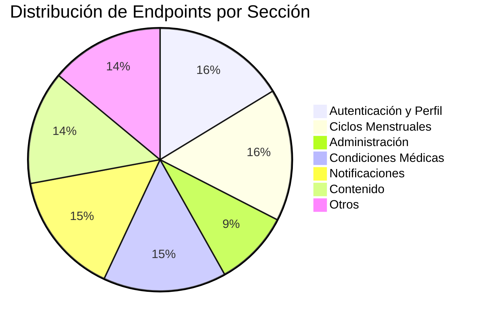
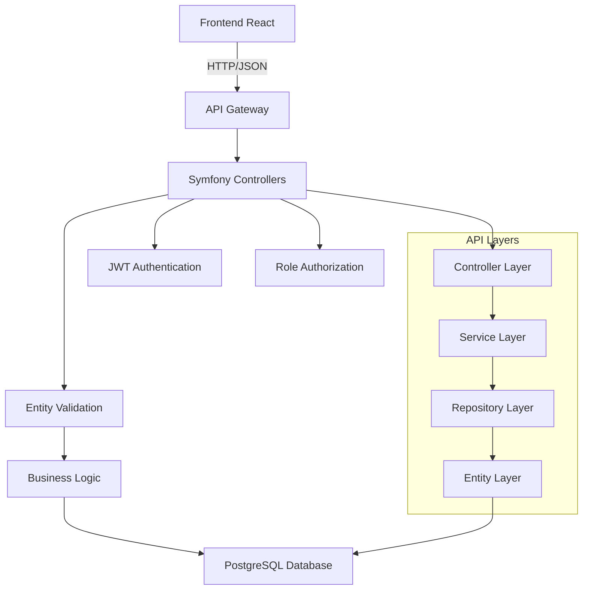

# 🌐 API Endpoints - Referencia Completa

> **📁 Ubicación:** `EYRA/documentacion-admin/12-API-Endpoints.md`  
> **🔗 Enlaces:** [[01-Indice-Principal]] | [[10-Backend-Controllers]] | [[02-Arquitectura-Admin]]  
> **🏷️ Tags:** #api #endpoints #backend #admin #referencia

---

## 📋 Índice

1. [🎯 Resumen del Sistema API](#-resumen-del-sistema-api)
2. [🔐 Autenticación y Autorización](#-autenticación-y-autorización)
3. [👥 Endpoints de Administración de Usuarios](#-endpoints-de-administración-de-usuarios)
4. [🏥 Endpoints de Condiciones Médicas](#-endpoints-de-condiciones-médicas)
5. [🔄 Endpoints de Ciclos Menstruales](#-endpoints-de-ciclos-menstruales)
6. [🔔 Sistema de Notificaciones](#-sistema-de-notificaciones)
7. [📊 Códigos de Respuesta HTTP](#-códigos-de-respuesta-http)
8. [🔗 Enlaces Relacionados](#-enlaces-relacionados)

---

## 🎯 Resumen del Sistema API

### 📊 Estadísticas de Endpoints



| **Métrica** | **Valor** | **Estado** |
|-------------|-----------|------------|
| Total Endpoints | 86 | 📈 Estable |
| Implementados | 53 | ✅ 62% |
| Pendientes | 33 | ⏳ 38% |
| Admin Endpoints | 8 | ✅ 100% |
| Autenticación | JWT | 🔒 Seguro |

### 🏗️ Arquitectura de la API



---

## 🔐 Autenticación y Autorización

### 🔑 Sistema de Autenticación JWT

```php
// ! 01/06/2025 - Sistema de autenticación implementado en AuthController
#[Route('/api')]
class AuthController extends AbstractController
{
    #[Route('/login_check', methods: ['POST'])]
    public function loginCheck(): JsonResponse
    
    #[Route('/logout', methods: ['POST'])]
    public function logout(): JsonResponse
    
    #[Route('/logout-all', methods: ['POST'])]
    public function logoutAll(): JsonResponse
}
```

### 🛡️ Niveles de Autorización

| **Nivel** | **Roles Requeridos** | **Acceso** |
|-----------|---------------------|-----------|
| **Público** | Ninguno | Login, Register, Password Reset |
| **Usuario** | `ROLE_USER` | Perfil, Ciclos, Contenido |
| **Admin** | `ROLE_ADMIN` | Panel Admin, CRUD Usuarios |
| **Sistema** | `ROLE_SUPER_ADMIN` | Configuración Sistema |

### 📱 Endpoints de Autenticación

#### ✅ **Implementados y Validados**

| **Endpoint** | **Método** | **Descripción** | **Estado** |
|--------------|------------|-----------------|------------|
| `/api/login_check` | `POST` | Autenticar usuario | ✅ |
| `/api/register` | `POST` | Registrar nuevo usuario | ✅ |
| `/api/logout` | `POST` | Cerrar sesión actual | ✅ |
| `/api/logout-all` | `POST` | Cerrar todas las sesiones | ✅ |
| `/api/profile` | `GET` | Obtener perfil del usuario | ✅ |
| `/api/profile` | `PUT` | Actualizar perfil | ✅ |
| `/api/password-change` | `POST` | Cambiar contraseña | ✅ |
| `/api/password-reset` | `POST` | Solicitar restablecimiento | ✅ |

---

## 👥 Endpoints de Administración de Usuarios

### 🎯 AdminController - Gestión Completa

```php
// ! 28/05/2025 - Implementado CRUD completo de usuarios para administradores
#[Route('/api/admin')]
#[IsGranted('ROLE_ADMIN')]
class AdminController extends AbstractController
{
    #[Route('/users', methods: ['GET'])]
    public function listUsers(Request $request): JsonResponse
    
    #[Route('/users/{id}', methods: ['GET'])]
    public function getUserById(int $id): JsonResponse
    
    #[Route('/users/{id}', methods: ['PUT'])]
    public function editUser(int $id, Request $request): JsonResponse
    
    #[Route('/users/{id}', methods: ['DELETE'])]
    public function deleteUser(int $id): JsonResponse
}
```

### 📊 Funcionalidades Avanzadas

#### **Filtros y Búsqueda Optimizada**
```php
// ! 31/05/2025 - Sistema de filtros optimizado con consultas SQL eficientes
public function findUsersWithFilters(
    ?string $search = null,
    ?string $role = null, 
    ?ProfileType $profileType = null,
    int $limit = 20,
    int $offset = 0
): array {
    $qb = $this->createQueryBuilder('u')
        ->orderBy('u.id', 'ASC')
        ->setMaxResults($limit)
        ->setFirstResult($offset);
    
    // Filtros SQL optimizados
    if ($search) {
        $qb->andWhere('LOWER(u.email) LIKE :search OR LOWER(u.username) LIKE :search')
           ->setParameter('search', '%' . strtolower($search) . '%');
    }
    
    if ($profileType) {
        $qb->andWhere('u.profileType = :profileType')
           ->setParameter('profileType', $profileType);
    }
    
    // Filtro por rol híbrido (SQL + PHP) para máxima compatibilidad
    $users = $qb->getQuery()->getResult();
    
    if ($role) {
        $users = array_filter($users, function (User $user) use ($role) {
            return in_array($role, $user->getRoles());
        });
    }
    
    return array_values($users);
}
```

### 🔍 Endpoints Admin Detallados

| **Endpoint** | **Parámetros** | **Funcionalidad** | **Validación** |
|--------------|----------------|-------------------|----------------|
| `GET /api/admin/users` | `page`, `limit`, `role`, `profileType`, `search` | Lista paginada con filtros | ✅ |
| `GET /api/admin/users/{id}` | `{id}` | Datos completos del usuario | ✅ |
| `PUT /api/admin/users/{id}` | Usuario JSON | Actualización completa | ✅ |
| `DELETE /api/admin/users/{id}` | `{id}` | Desactivación (soft delete) | ✅ |

#### **Ejemplo de Respuesta GET /users:**
```json
{
  "users": [
    {
      "id": 1,
      "email": "admin@eyra.com",
      "username": "admin",
      "name": "Administrador",
      "lastName": "Sistema",
      "roles": ["ROLE_USER", "ROLE_ADMIN"],
      "profileType": "profile_women",
      "birthDate": "1990-01-01",
      "createdAt": "2025-05-31T10:00:00+00:00",
      "updatedAt": "2025-06-01T15:30:00+00:00",
      "state": true,
      "onboardingCompleted": true,
      "avatar": {
        "skinColor": "light",
        "eyes": "brown",
        "hairStyle": "long"
      }
    }
  ],
  "pagination": {
    "page": 1,
    "limit": 20,
    "total": 45,
    "totalPages": 3
  }
}
```

---

## 🏥 Endpoints de Condiciones Médicas

### 🎯 ConditionController - CRUD Completo

```php
// ! 01/06/2025 - CRUD completo de condiciones médicas implementado
#[Route('/api/conditions')]
class ConditionController extends AbstractController
{
    // Endpoints públicos (autenticados)
    #[Route('', methods: ['GET'])]
    public function getAllConditions(): JsonResponse
    
    #[Route('/active', methods: ['GET'])]  
    public function getActiveConditions(): JsonResponse
    
    #[Route('/search', methods: ['GET'])]
    public function searchConditions(Request $request): JsonResponse
    
    #[Route('/{id}', methods: ['GET'])]
    public function getCondition(int $id): JsonResponse
    
    // Endpoints administrativos
    #[Route('', methods: ['POST'])]
    #[IsGranted('ROLE_ADMIN')]
    public function createCondition(Request $request): JsonResponse
    
    #[Route('/{id}', methods: ['PUT'])]
    #[IsGranted('ROLE_ADMIN')]
    public function updateCondition(int $id, Request $request): JsonResponse
    
    #[Route('/{id}', methods: ['DELETE'])]
    #[IsGranted('ROLE_ADMIN')]
    public function deleteCondition(int $id): JsonResponse
}
```

### 🔍 Funcionalidades Especializadas

#### **Sistema de Búsqueda Inteligente**
```php
// ! 01/06/2025 - Método de búsqueda optimizado para condiciones
public function searchByNameOrDescription(string $query): array
{
    return $this->createQueryBuilder('c')
        ->where('c.name LIKE :query OR c.description LIKE :query')
        ->andWhere('c.state = :state')
        ->setParameter('query', '%' . $query . '%')
        ->setParameter('state', true)
        ->orderBy('c.name', 'ASC')
        ->getQuery()
        ->getResult();
}
```

#### **Smart Delete - Eliminación Inteligente**
```php
// ! 01/06/2025 - Lógica de eliminación inteligente
public function deleteCondition(int $id): JsonResponse
{
    $condition = $this->conditionRepository->find($id);
    
    // Verificar si hay usuarios que tienen esta condición activa
    $activeUserConditions = $this->userConditionRepository->findBy([
        'condition' => $condition,
        'state' => true
    ]);
    
    if (count($activeUserConditions) > 0) {
        // En lugar de eliminar, desactivar la condición
        $condition->setState(false);
        $this->entityManager->flush();
        
        return $this->json([
            'message' => 'Condición desactivada en lugar de eliminada debido a asociaciones activas con usuarios',
            'activeUsers' => count($activeUserConditions)
        ]);
    }
    
    // Si no hay usuarios activos, eliminar completamente
    $this->conditionRepository->remove($condition, true);
    
    return $this->json(['message' => 'Condición eliminada exitosamente']);
}
```

### 📊 Estado de Endpoints de Condiciones

| **Endpoint** | **Método** | **Autorización** | **Estado** | **Función** |
|--------------|------------|------------------|------------|-------------|
| `/api/conditions` | `GET` | Usuario | ✅ | Listar todas |
| `/api/conditions/active` | `GET` | Usuario | ✅ | Solo activas |
| `/api/conditions/search` | `GET` | Usuario | ✅ | Búsqueda |
| `/api/conditions/{id}` | `GET` | Usuario | ✅ | Por ID |
| `/api/conditions` | `POST` | Admin | ✅ | Crear |
| `/api/conditions/{id}` | `PUT` | Admin | ✅ | Actualizar |
| `/api/conditions/{id}` | `DELETE` | Admin | ✅ | Eliminar |

---

## 🔄 Endpoints de Ciclos Menstruales

### 🎯 CycleController - Seguimiento Completo

```php
// ! 01/06/2025 - Sistema de ciclos menstruales con fases
#[Route('/api/cycles')]
class CycleController extends AbstractController
{
    #[Route('/current', methods: ['GET'])]
    public function getCurrentCycle(): JsonResponse
    
    #[Route('/predict', methods: ['GET'])]
    public function predictNextCycle(): JsonResponse
    
    #[Route('/statistics', methods: ['GET'])]
    public function getCycleStatistics(Request $request): JsonResponse
    
    #[Route('/start-cycle', methods: ['POST'])]
    public function startNewCycle(Request $request): JsonResponse
}
```

### 🔮 Algoritmo de Predicción Avanzado

```php
// ! 01/06/2025 - Algoritmo de predicción con múltiples estrategias
public function predictNextCycle(): JsonResponse
{
    $user = $this->getUser();
    $cycles = $this->menstrualCycleRepository->findLatestCycles($user, 12);
    
    if (count($cycles) < 3) {
        return $this->json([
            'success' => false,
            'message' => 'Se necesitan al menos 3 ciclos para hacer predicciones'
        ]);
    }
    
    // Calcular estadísticas
    $cycleLengths = array_map(fn($cycle) => $cycle->getLength(), $cycles);
    $averageLength = array_sum($cycleLengths) / count($cycleLengths);
    $standardDeviation = $this->calculateStandardDeviation($cycleLengths);
    
    // Determinar algoritmo de predicción
    $algorithm = $this->determineAlgorithm($standardDeviation);
    
    // Calcular predicción
    $prediction = $this->calculatePrediction($cycles, $algorithm);
    
    return $this->json([
        'success' => true,
        'expectedStartDate' => $prediction['startDate'],
        'expectedEndDate' => $prediction['endDate'],
        'cycleLength' => $prediction['length'],
        'confidence' => $prediction['confidence'],
        'algorithm' => $algorithm,
        'basedOnCycles' => count($cycles)
    ]);
}
```

### 📈 Endpoints de Ciclos Detallados

| **Funcionalidad** | **Endpoint** | **Descripción** | **Validado** |
|-------------------|--------------|-----------------|--------------|
| **Estado Actual** | `GET /current` | Ciclo y fase actual | ✅ |
| **Predicción** | `GET /predict` | Próximo ciclo estimado | ✅ |
| **Estadísticas** | `GET /statistics` | Métricas históricas | ✅ |
| **Calendario** | `GET /calendar` | Vista calendario | ✅ |
| **Iniciar Ciclo** | `POST /start-cycle` | Nuevo ciclo | ✅ |
| **Finalizar** | `POST /end-cycle/{id}` | Terminar ciclo | ✅ |

---

## 🔔 Sistema de Notificaciones

### 🎯 NotificationController - Gestión Completa

```php
// ! 01/06/2025 - Sistema de notificaciones implementado
#[Route('/api/notifications')]
class NotificationController extends AbstractController
{
    #[Route('', methods: ['GET'])]
    public function getNotifications(Request $request): JsonResponse
    
    #[Route('/unread', methods: ['GET'])]
    public function getUnreadNotifications(): JsonResponse
    
    #[Route('/read/{id}', methods: ['POST'])]
    public function markAsRead(int $id): JsonResponse
    
    #[Route('/read-all', methods: ['POST'])]
    public function markAllAsRead(Request $request): JsonResponse
}
```

### 📊 Tipos de Notificaciones

| **Tipo** | **Contexto** | **Prioridad** | **Auto-dismiss** |
|----------|--------------|---------------|------------------|
| `cycle_start` | `menstrual_cycle` | `high` | No |
| `period_prediction` | `prediction` | `medium` | Sí |
| `symptom_reminder` | `health_tracking` | `low` | Sí |
| `partner_notification` | `guest_access` | `medium` | No |
| `system_update` | `system` | `high` | No |

---

## 📊 Códigos de Respuesta HTTP

### ✅ Códigos de Éxito

| **Código** | **Significado** | **Uso en EYRA** |
|------------|-----------------|------------------|
| `200 OK` | Éxito | GET, PUT exitosos |
| `201 Created` | Creado | POST exitosos |
| `204 No Content` | Sin contenido | DELETE exitosos |

### ❌ Códigos de Error

| **Código** | **Significado** | **Casos Comunes** |
|------------|-----------------|-------------------|
| `400 Bad Request` | Datos inválidos | Validación fallida |
| `401 Unauthorized` | No autenticado | JWT inválido/expirado |
| `403 Forbidden` | Sin permisos | Rol insuficiente |
| `404 Not Found` | No encontrado | Recurso inexistente |
| `409 Conflict` | Conflicto | Email duplicado |
| `422 Unprocessable Entity` | Error validación | Datos incorrectos |
| `500 Internal Server Error` | Error servidor | Error de aplicación |

### 📝 Estructura de Respuestas de Error

```json
{
  "message": "Descripción del error",
  "error": "Detalle técnico (solo desarrollo)",
  "code": "ERROR_CODE",
  "timestamp": "2025-06-01T15:30:00Z",
  "path": "/api/users/123"
}
```

---

## 🔗 Enlaces Relacionados

### 📚 Documentación Interna
- [[10-Backend-Controllers]] - Implementación de controladores
- [[02-Arquitectura-Admin]] - Arquitectura del sistema
- [[03-Seguridad-Permisos]] - Sistema de seguridad
- [[08-CRUD-Condiciones]] - CRUD de condiciones médicas

### 🛠️ Archivos de Código
- `eyra-backend/src/Controller/AdminController.php` - Administración de usuarios
- `eyra-backend/src/Controller/ConditionController.php` - Condiciones médicas
- `eyra-backend/src/Controller/CycleController.php` - Ciclos menstruales
- `eyra-backend/src/Controller/NotificationController.php` - Notificaciones

### 📖 Referencias Externas
- [Symfony Routing](https://symfony.com/doc/current/routing.html)
- [API Platform](https://api-platform.com/)
- [JWT Authentication](https://github.com/lexik/LexikJWTAuthenticationBundle)

---

> **📝 Nota:** Esta documentación refleja el estado actual del sistema API de EYRA (v0.7.8). Los endpoints marcados como validados (✅) han sido probados y funcionan correctamente.

> **🔄 Última actualización:** 01/06/2025 - Control de cambios v0.7.8