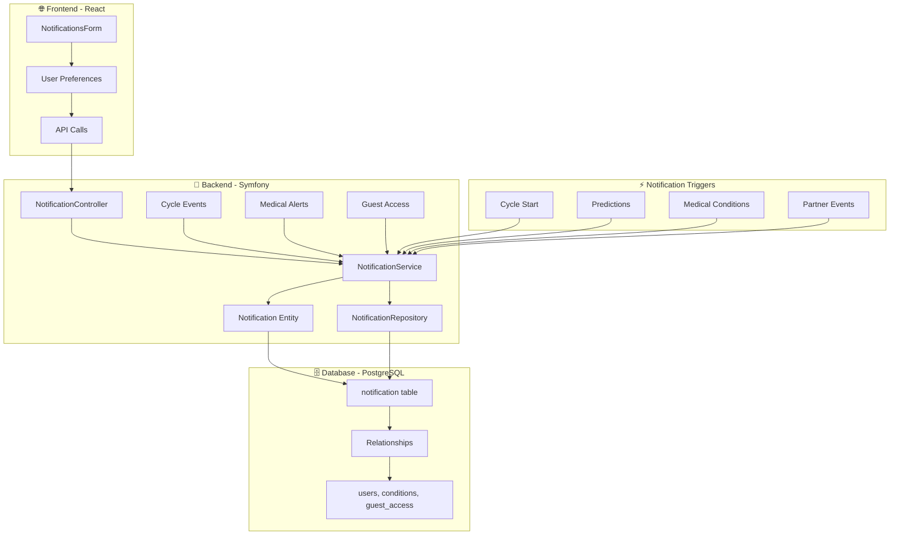
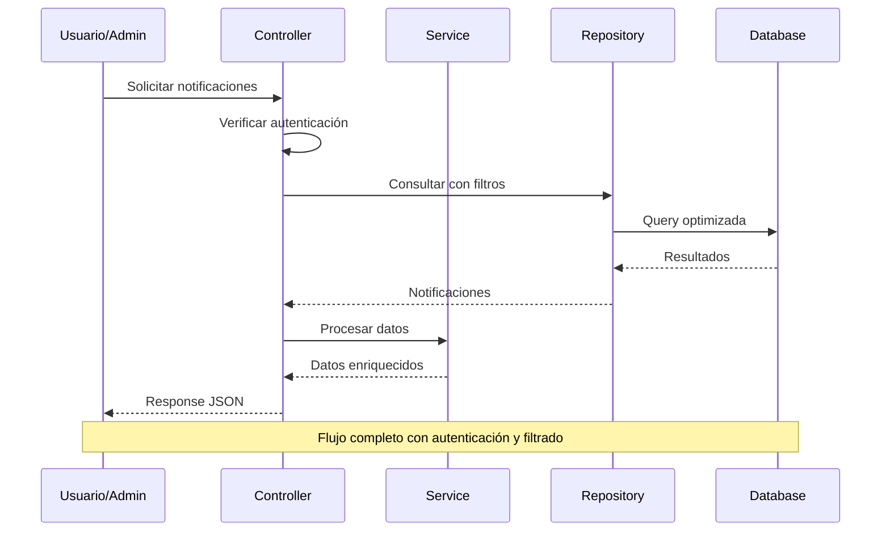
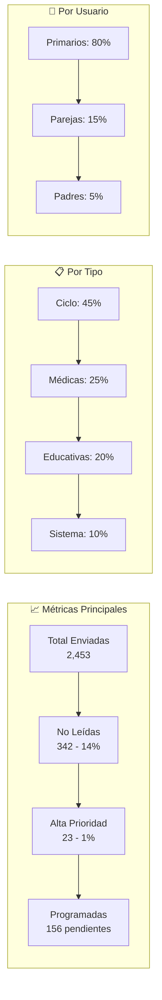

# 🔔 Sistema de Notificaciones - EYRA Admin

> **📁 Ubicación:** `EYRA/documentacion-admin/14-Sistema-Notificaciones.md`  
> **🔗 Enlaces:** [[01-Indice-Principal]] | [[12-API-Endpoints]] | [[13-Estadisticas-Dashboard]] | [[15-Logs-Auditoria]]  
> **🏷️ Tags:** #admin #notifications #backend #frontend #api

---

## 📋 Índice

1. [🎯 Resumen del Sistema](#-resumen-del-sistema)
2. [🏗️ Arquitectura del Sistema](#️-arquitectura-del-sistema)
3. [📊 Backend - Entidad Notification](#-backend---entidad-notification)
4. [🔧 Backend - NotificationController](#-backend---notificationcontroller)
5. [⚙️ Backend - NotificationService](#️-backend---notificationservice)
6. [🌐 Frontend - Componentes](#-frontend---componentes)
7. [📡 API Endpoints Disponibles](#-api-endpoints-disponibles)
8. [🔍 Casos de Uso Administrativos](#-casos-de-uso-administrativos)

---

## 🎯 Resumen del Sistema

### 📊 **Métricas del Sistema de Notificaciones**

| Métrica | Valor | Descripción |
|---------|-------|-------------|
| **📡 Endpoints API** | 11 implementados | Gestión completa CRUD + consultas especializadas |
| **🔔 Tipos de notificación** | 7 tipos predefinidos | Desde alertas médicas hasta notificaciones de pareja |
| **🎯 Contextos** | 5 contextos | Ciclo, condición, embarazo, menopausia, sistema |
| **👥 Usuarios objetivo** | 3 tipos | Primario, pareja, padre/madre |
| **⚡ Prioridades** | 4 niveles | Baja, normal, alta, urgente |
| **📱 Programación** | ✅ Soportada | Notificaciones programadas para el futuro |

### 🌟 **Características Principales**

- **✅ Notificaciones personalizadas**: Por tipo de usuario y contexto específico
- **✅ Sistema de prioridades**: Desde notificaciones informativas hasta alertas urgentes
- **✅ Notificaciones programadas**: Recordatorios y alertas futuras automáticas  
- **✅ Invitados y parejas**: Sistema especializado para notificar a cuidadores
- **✅ Enlaces accionables**: URLs y botones de acción integrados
- **✅ Metadatos flexibles**: JSON para información adicional personalizada
- **✅ Filtrado avanzado**: Por tipo, contexto, prioridad y usuario objetivo
- **✅ Estados de lectura**: Marcado como leído, descartado o eliminado

---

## 🏗️ Arquitectura del Sistema

### 📐 **Diagrama de Arquitectura**



### 🔄 **Flujo de Procesamiento**



---

## 📊 Backend - Entidad Notification

### 🗃️ **Estructura de la Entidad**

```php
// ! 01/06/2025 - Entidad completa para sistema de notificaciones EYRA

#[ORM\Entity(repositoryClass: NotificationRepository::class)]
#[ApiResource(
    normalizationContext: ['groups' => ['notification:read']],
    denormalizationContext: ['groups' => ['notification:write']]
)]
class Notification
{
    #[ORM\Id]
    #[ORM\GeneratedValue]
    #[ORM\Column]
    #[Groups(['notification:read'])]
    private ?int $id = null;

    #[ORM\ManyToOne(inversedBy: 'notifications')]
    #[ORM\JoinColumn(nullable: false)]
    #[Groups(['notification:read'])]
    private ?User $user = null;

    #[ORM\Column(length: 255)]
    #[Groups(['notification:read', 'notification:write'])]
    private ?string $title = null;

    #[ORM\Column(type: Types::TEXT)]
    #[Groups(['notification:read', 'notification:write'])]
    private ?string $message = null;

    #[ORM\Column(length: 50)]
    #[Groups(['notification:read', 'notification:write'])]
    private ?string $type = null;

    #[ORM\Column(length: 20)]
    #[Groups(['notification:read', 'notification:write'])]
    private ?string $priority = 'normal';

    #[ORM\Column(length: 50, nullable: true)]
    #[Groups(['notification:read', 'notification:write'])]
    private ?string $context = null;

    #[ORM\Column]
    #[Groups(['notification:read', 'notification:write'])]
    private ?bool $read = false;

    #[ORM\Column(type: Types::DATETIME_MUTABLE, nullable: true)]
    #[Groups(['notification:read', 'notification:write'])]
    private ?\DateTimeInterface $readAt = null;

    #[ORM\Column(type: Types::DATETIME_MUTABLE, nullable: true)]
    #[Groups(['notification:read', 'notification:write'])]
    private ?\DateTimeInterface $scheduledFor = null;

    #[ORM\Column(type: Types::DATETIME_MUTABLE)]
    #[Groups(['notification:read'])]
    private ?\DateTimeInterface $createdAt = null;

    #[ORM\Column(length: 30, nullable: true)]
    #[Groups(['notification:read', 'notification:write'])]
    private ?string $targetUserType = 'primary';

    #[ORM\ManyToOne(inversedBy: 'notifications')]
    #[Groups(['notification:read', 'notification:write'])]
    private ?Condition $relatedCondition = null;

    #[ORM\Column(length: 100, nullable: true)]
    #[Groups(['notification:read', 'notification:write'])]
    private ?string $relatedEntityType = null;

    #[ORM\Column(nullable: true)]
    #[Groups(['notification:read', 'notification:write'])]
    private ?int $relatedEntityId = null;

    #[ORM\Column(length: 255, nullable: true)]
    #[Groups(['notification:read', 'notification:write'])]
    private ?string $actionUrl = null;

    #[ORM\Column(length: 50, nullable: true)]
    #[Groups(['notification:read', 'notification:write'])]
    private ?string $actionText = null;

    #[ORM\Column(type: Types::JSON, nullable: true)]
    #[Groups(['notification:read', 'notification:write'])]
    private array $metadata = [];

    #[ORM\ManyToOne(inversedBy: 'notifications')]
    private ?GuestAccess $guestAccess = null;

    #[ORM\Column]
    #[Groups(['notification:read'])]
    private ?bool $dismissed = false;
```

### 🏷️ **Campos Principales Explicados**

| Campo | Tipo | Descripción | Ejemplo |
|-------|------|-------------|---------|
| **`title`** | string(255) | Título principal de la notificación | "Próximo ciclo menstrual" |
| **`message`** | text | Contenido descriptivo completo | "Tu próximo ciclo está previsto para el 29/05/2025" |
| **`type`** | string(50) | Tipo predefinido de notificación | "cycle_prediction", "medical_alert" |
| **`priority`** | string(20) | Nivel de urgencia | "low", "normal", "high", "urgent" |
| **`context`** | string(50) | Contexto del contenido | "cycle", "condition", "pregnancy" |
| **`targetUserType`** | string(30) | Usuario objetivo | "primary", "partner", "parent" |
| **`scheduledFor`** | datetime | Fecha para mostrar notificación | "2025-05-29 08:00:00" |
| **`actionUrl`** | string(255) | URL de acción | "/calendar", "/conditions/edit/5" |
| **`metadata`** | json | Datos adicionales flexibles | `{"cyclePhase": "luteal", "dayNumber": 17}` |

### 🔧 **Métodos de Conveniencia**

```php
// ! 01/06/2025 - Métodos automáticos para manejo de estado

public function setRead(bool $read): static
{
    $this->read = $read;
    
    // Establece automáticamente readAt cuando se marca como leída
    if ($read && $this->readAt === null) {
        $this->readAt = new \DateTime();
    }
    
    return $this;
}

#[ORM\PrePersist]
public function setCreatedAtValue(): void
{
    $this->createdAt = new \DateTime();
}
```

---

## 🔧 Backend - NotificationController

### 📡 **Endpoints Implementados**

El **NotificationController** maneja todas las operaciones CRUD y consultas especializadas:

```php
// ! 01/06/2025 - Controlador completo para gestión de notificaciones

#[Route('/notifications')]
class NotificationController extends AbstractController
{
    public function __construct(
        private NotificationRepository $notificationRepository,
        private NotificationService $notificationService,
        private EntityManagerInterface $entityManager
    ) {}
```

### 📋 **Endpoint: Listar Notificaciones** 

```php
#[Route('', name: 'api_notifications_list', methods: ['GET'])]
public function getNotifications(Request $request): JsonResponse
{
    /** @var User $user */
    $user = $this->getUser();
    if (!$user) {
        throw new AccessDeniedException('User not authenticated');
    }

    // Filtros opcionales de query parameters
    $type = $request->query->get('type');           // Tipo de notificación
    $context = $request->query->get('context');     // Contexto (cycle, condition, etc.)
    $limit = $request->query->getInt('limit', 20);  // Límite de resultados
    $page = $request->query->getInt('page', 1);     // Página actual
    $targetType = $request->query->get('target');   // Tipo de usuario objetivo
    
    // Paginación
    $offset = ($page - 1) * $limit;
    
    // Construcción de criterios
    $criteria = ['user' => $user];
    if ($type) $criteria['type'] = $type;
    if ($context) $criteria['context'] = $context;
    if ($targetType) $criteria['targetUserType'] = $targetType;
    
    // Obtener resultados con conteo para paginación
    $notifications = $this->notificationRepository->findBy(
        $criteria, 
        ['createdAt' => 'DESC'], 
        $limit, 
        $offset
    );
    
    $total = $this->notificationRepository->count($criteria);
    
    return $this->json([
        'notifications' => $notifications,
        'total' => $total,
        'page' => $page,
        'limit' => $limit,
        'pages' => ceil($total / $limit)
    ], 200, [], ['groups' => 'notification:read']);
}
```

### 🔔 **Endpoint: Notificaciones No Leídas**

```php
#[Route('/unread', name: 'api_notifications_unread', methods: ['GET'])]
public function getUnreadNotifications(Request $request): JsonResponse
{
    /** @var User $user */
    $user = $this->getUser();
    if (!$user) {
        throw new AccessDeniedException('User not authenticated');
    }

    // Filtros opcionales
    $type = $request->query->get('type');
    $context = $request->query->get('context');
    
    // Obtener no leídas con servicio especializado
    $notifications = $this->notificationService->getUnreadNotifications($user, $type, $context);
    
    // Contar total para badge de notificaciones
    $totalUnread = $this->notificationService->countUnread($user);
    
    return $this->json([
        'notifications' => $notifications,
        'totalUnread' => $totalUnread
    ], 200, [], ['groups' => 'notification:read']);
}
```

### ⚡ **Endpoint: Marcar Como Leída**

```php
#[Route('/read/{id}', name: 'api_notifications_read', methods: ['POST'])]
public function markAsRead(int $id): JsonResponse
{
    /** @var User $user */
    $user = $this->getUser();
    if (!$user) {
        throw new AccessDeniedException('User not authenticated');
    }

    $notification = $this->notificationRepository->find($id);
    
    if (!$notification) {
        return $this->json(['message' => 'Notification not found'], 404);
    }
    
    // Verificar que la notificación pertenece al usuario autenticado
    if ($notification->getUser()->getId() !== $user->getId()) {
        throw new AccessDeniedException('Cannot modify notification from another user');
    }
    
    // Marcar como leída usando el servicio
    $this->notificationService->markAsRead($notification);
    
    return $this->json(['message' => 'Notification marked as read'], 200);
}
```

### 📊 **Endpoint: Contadores de Notificaciones**

```php
#[Route('/count', name: 'api_notifications_count', methods: ['GET'])]
public function getNotificationsCount(): JsonResponse
{
    /** @var User $user */
    $user = $this->getUser();
    if (!$user) {
        throw new AccessDeniedException('User not authenticated');
    }

    $unreadCount = $this->notificationService->countUnread($user);
    
    // Contar por tipo para badges específicos
    $typeCounts = [];
    $types = [
        NotificationService::TYPE_CYCLE_START,
        NotificationService::TYPE_CYCLE_PREDICTION,
        NotificationService::TYPE_MEDICAL_ALERT,
        NotificationService::TYPE_EDUCATIONAL,
        NotificationService::TYPE_REMINDER,
        NotificationService::TYPE_PARTNER,
        NotificationService::TYPE_PARENTAL
    ];
    
    foreach ($types as $type) {
        $notifications = $this->notificationService->getUnreadNotifications($user, $type);
        $typeCounts[$type] = count($notifications);
    }
    
    // Contar por contexto
    $contextCounts = [];
    $contexts = [
        NotificationService::CONTEXT_CYCLE,
        NotificationService::CONTEXT_CONDITION,
        NotificationService::CONTEXT_PREGNANCY,
        NotificationService::CONTEXT_MENOPAUSE,
        NotificationService::CONTEXT_SYSTEM
    ];
    
    foreach ($contexts as $context) {
        $notifications = $this->notificationService->getUnreadNotifications($user, null, $context);
        $contextCounts[$context] = count($notifications);
    }
    
    return $this->json([
        'totalUnread' => $unreadCount,
        'byType' => $typeCounts,
        'byContext' => $contextCounts
    ]);
}
```

---

## ⚙️ Backend - NotificationService

### 🔧 **Constantes del Sistema**

```php
// ! 01/06/2025 - Tipos, contextos y prioridades predefinidas

class NotificationService
{
    // 🔔 Tipos de notificación predefinidos
    public const TYPE_CYCLE_START = 'cycle_start';
    public const TYPE_CYCLE_PREDICTION = 'cycle_prediction';
    public const TYPE_MEDICAL_ALERT = 'medical_alert';
    public const TYPE_SYSTEM = 'system';
    public const TYPE_EDUCATIONAL = 'educational';
    public const TYPE_REMINDER = 'reminder';
    public const TYPE_PARTNER = 'partner';
    public const TYPE_PARENTAL = 'parental';
    
    // 📂 Contextos predefinidos
    public const CONTEXT_CYCLE = 'cycle';
    public const CONTEXT_CONDITION = 'condition';
    public const CONTEXT_PREGNANCY = 'pregnancy';
    public const CONTEXT_MENOPAUSE = 'menopause';
    public const CONTEXT_SYSTEM = 'system';
    
    // ⚡ Prioridades
    public const PRIORITY_LOW = 'low';
    public const PRIORITY_NORMAL = 'normal';
    public const PRIORITY_HIGH = 'high';
    public const PRIORITY_URGENT = 'urgent';
    
    // 👥 Tipos de usuario destino
    public const TARGET_PRIMARY = 'primary';
    public const TARGET_PARTNER = 'partner';
    public const TARGET_PARENT = 'parent';
```

### 🛠️ **Métodos de Creación Especializados**

#### **📅 Notificaciones de Ciclo Menstrual**

```php
// ! 01/06/2025 - Método para notificaciones de inicio de ciclo
public function createCycleStartNotification(User $user, \DateTime $startDate): Notification
{
    $formattedDate = $startDate->format('d/m/Y');
    
    return $this->createNotification(
        $user,
        'Inicio de ciclo registrado',
        "Se ha registrado el inicio de tu ciclo menstrual con fecha {$formattedDate}.",
        self::TYPE_CYCLE_START,
        self::PRIORITY_NORMAL,
        self::CONTEXT_CYCLE
    );
}

// ! 01/06/2025 - Método para predicciones de próximo ciclo
public function createCyclePredictionNotification(User $user, \DateTime $predictedDate): Notification
{
    $formattedDate = $predictedDate->format('d/m/Y');
    $daysUntil = (int) $predictedDate->diff(new \DateTime())->format('%a');
    
    $title = 'Próximo ciclo menstrual';
    $message = "Tu próximo ciclo menstrual está previsto para comenzar el {$formattedDate}, en {$daysUntil} días.";
    
    // Determinar prioridad basada en la proximidad
    $priority = self::PRIORITY_NORMAL;
    if ($daysUntil <= 2) {
        $priority = self::PRIORITY_HIGH;
        $message .= " ¡Prepárate!";
    } elseif ($daysUntil <= 7) {
        $priority = self::PRIORITY_NORMAL;
        $message .= " Te recomendamos tener preparados tus suministros.";
    }
    
    return $this->createNotification(
        $user,
        $title,
        $message,
        self::TYPE_CYCLE_PREDICTION,
        $priority,
        self::CONTEXT_CYCLE
    );
}
```

#### **🏥 Notificaciones Médicas**

```php
// ! 01/06/2025 - Método para alertas médicas relacionadas con condiciones
public function createMedicalNotification(
    User $user, 
    Condition $condition, 
    string $title,
    string $message,
    string $priority = self::PRIORITY_HIGH
): Notification {
    $notification = new Notification();
    $notification->setUser($user);
    $notification->setTitle($title);
    $notification->setMessage($message);
    $notification->setType(self::TYPE_MEDICAL_ALERT);
    $notification->setPriority($priority);
    $notification->setContext(self::CONTEXT_CONDITION);
    $notification->setRelatedCondition($condition);
    
    $this->notificationRepository->save($notification, true);
    
    return $notification;
}
```

#### **👫 Notificaciones para Parejas**

```php
// ! 01/06/2025 - Sistema especializado para notificar a parejas sobre ciclos
public function createPartnerCycleNotification(
    User $partner, 
    User $primary, 
    string $phase,
    string $title,
    string $message
): Notification {
    $notification = new Notification();
    $notification->setUser($partner);
    $notification->setTitle($title);
    $notification->setMessage($message);
    $notification->setType(self::TYPE_PARTNER);
    $notification->setPriority(self::PRIORITY_NORMAL);
    $notification->setContext(self::CONTEXT_CYCLE);
    $notification->setTargetUserType(self::TARGET_PARTNER);
    $notification->setRelatedEntityType('User');
    $notification->setRelatedEntityId($primary->getId());
    
    // Agregar metadatos para referencia
    $metadata = [
        'primaryName' => $primary->getName() . ' ' . $primary->getLastName(),
        'primaryUsername' => $primary->getUsername(),
        'cyclePhase' => $phase
    ];
    $notification->setMetadata($metadata);
    
    $this->notificationRepository->save($notification, true);
    
    return $notification;
}
```

#### **👨‍👩‍👧‍👦 Notificaciones Masivas a Invitados**

```php
// ! 01/06/2025 - Envío masivo a todos los invitados de un usuario
public function sendNotificationsToGuests(
    User $owner, 
    string $title,
    string $message,
    string $accessType = null,
    string $type = self::TYPE_PARTNER,
    string $priority = self::PRIORITY_NORMAL
): int {
    $guests = $this->guestAccessRepository->findActiveForUser($owner);
    
    $count = 0;
    foreach ($guests as $guestAccess) {
        // Filtrar por tipo de acceso si se especifica
        if ($accessType && $guestAccess->getAccessType() !== $accessType) {
            continue;
        }
        
        $guest = $guestAccess->getGuest();
        
        // Determinar tipo de usuario objetivo
        $targetUserType = ($guestAccess->getAccessType() === 'parent') 
            ? self::TARGET_PARENT 
            : self::TARGET_PARTNER;
        
        $notification = new Notification();
        $notification->setUser($guest);
        $notification->setTitle($title);
        $notification->setMessage($message);
        $notification->setType($type);
        $notification->setPriority($priority);
        $notification->setTargetUserType($targetUserType);
        $notification->setRelatedEntityType('User');
        $notification->setRelatedEntityId($owner->getId());
        
        // Metadatos para contexto
        $metadata = [
            'ownerName' => $owner->getName() . ' ' . $owner->getLastName(),
            'ownerUsername' => $owner->getUsername(),
            'relationshipType' => $guestAccess->getAccessType()
        ];
        $notification->setMetadata($metadata);
        
        $this->notificationRepository->save($notification);
        $count++;
    }
    
    if ($count > 0) {
        $this->entityManager->flush();
    }
    
    return $count;
}
```

### 📝 **Métodos de Gestión de Estado**

```php
// ! 01/06/2025 - Métodos para cambiar estados de notificaciones

/**
 * Marcar notificación como leída
 */
public function markAsRead(Notification $notification): void
{
    $notification->setRead(true);
    $notification->setReadAt(new \DateTime());
    
    $this->notificationRepository->save($notification, true);
}

/**
 * Marcar todas las notificaciones de un usuario como leídas
 */
public function markAllAsRead(User $user): int
{
    return $this->notificationRepository->markAllAsRead($user);
}

/**
 * Descartar notificación (ocultar sin marcar como leída)
 */
public function dismiss(Notification $notification): void
{
    $notification->setDismissed(true);
    $this->notificationRepository->save($notification, true);
}
```

---

## 🌐 Frontend - Componentes

### 📱 **NotificationsForm Component**

El frontend actualmente incluye un componente para preferencias de notificaciones:

```typescript
// ! 01/06/2025 - Formulario de preferencias de notificaciones para usuarios

interface NotificationsFormProps {
  form: {
    receiveAlerts: boolean;
    receiveRecommendations: boolean;
    receiveWorkoutSuggestions: boolean;
    receiveNutritionAdvice: boolean;
  };
  loading: boolean;
  handleChange: (e: React.ChangeEvent<HTMLInputElement>) => void;
  handleSave: (e: React.FormEvent) => void;
}

const notificationOptions = [
  { 
    name: "receiveAlerts", 
    label: "Alertas importantes",
    description: "Recibe notificaciones sobre eventos importantes y actualizaciones críticas"
  },
  { 
    name: "receiveRecommendations", 
    label: "Recomendaciones",
    description: "Recibe sugerencias personalizadas basadas en tu actividad"
  },
  { 
    name: "receiveWorkoutSuggestions", 
    label: "Ejercicio",
    description: "Recibe recordatorios y consejos sobre tu rutina de ejercicios"
  },
  { 
    name: "receiveNutritionAdvice", 
    label: "Nutrición",
    description: "Recibe consejos y recordatorios sobre tu plan nutricional"
  },
];
```

### 🎨 **Características de UX del Componente**

```typescript
// Toggle switches con animaciones suaves
<span
  className={`w-10 h-6 rounded-full flex items-center transition-all duration-200 ${
    form[option.name as keyof typeof form] ? "bg-[#C62328]/80" : "bg-[#f0e8dc]"
  }`}
  style={{ boxShadow: "inset 2px 2px 6px #c6232822" }}
>
  <span
    className={`block w-5 h-5 rounded-full bg-white shadow-md transition-all duration-200 ${
      form[option.name as keyof typeof form] ? "translate-x-4" : "translate-x-0"
    }`}
  />
</span>
```

### 🚀 **Componentes Admin Pendientes de Implementar**

Para completar el sistema de administración de notificaciones, se requieren estos componentes:

```typescript
// 📋 NotificationsTable.tsx - Tabla principal para administradores
interface AdminNotificationsTableProps {
  onRefresh: () => void;
}

// Funcionalidades requeridas:
// - Listar todas las notificaciones del sistema
// - Filtros por usuario, tipo, contexto, estado
// - Acciones: Ver, Marcar como leída, Eliminar
// - Estadísticas por tipo y prioridad
// - Búsqueda por título o mensaje

// 📩 NotificationCreateModal.tsx - Crear notificaciones masivas
interface NotificationCreateModalProps {
  isOpen: boolean;
  onClose: () => void;
  onSuccess: () => void;
}

// Funcionalidades requeridas:
// - Selección de usuarios objetivo (todos, por rol, específicos)
// - Campos: título, mensaje, tipo, prioridad, contexto
// - Programación de envío futuro
// - Preview antes de enviar

// 📊 NotificationStatsCards.tsx - Estadísticas de notificaciones
interface NotificationStatsProps {
  refreshTrigger: number;
}

// Métricas requeridas:
// - Total de notificaciones enviadas
// - Notificaciones no leídas por tipo
// - Tasa de apertura y engagement
// - Notificaciones programadas pendientes
```

---

## 📡 API Endpoints Disponibles

### 📊 **Resumen de Endpoints**

| Endpoint | Método | Autenticación | Descripción | Estado |
|----------|--------|---------------|-------------|--------|
| `/notifications` | GET | ✅ Usuario | Listar notificaciones con filtros y paginación | ✅ Implementado |
| `/notifications/unread` | GET | ✅ Usuario | Obtener notificaciones no leídas con conteo | ✅ Implementado |
| `/notifications/high-priority` | GET | ✅ Usuario | Notificaciones de alta prioridad | ✅ Implementado |
| `/notifications/{id}` | GET | ✅ Usuario | Obtener notificación específica | ✅ Implementado |
| `/notifications/read/{id}` | POST | ✅ Usuario | Marcar notificación como leída | ✅ Implementado |
| `/notifications/read-all` | POST | ✅ Usuario | Marcar todas las notificaciones como leídas | ✅ Implementado |
| `/notifications/dismiss/{id}` | POST | ✅ Usuario | Descartar notificación | ✅ Implementado |
| `/notifications/{id}` | DELETE | ✅ Usuario | Eliminar notificación | ✅ Implementado |
| `/notifications/by-related/{entityType}/{entityId}` | GET | ✅ Usuario | Notificaciones por entidad relacionada | ✅ Implementado |
| `/notifications/count` | GET | ✅ Usuario | Contadores por tipo y contexto | ✅ Implementado |
| `/notifications/partner-test/{userId}` | POST | ✅ Admin | Crear notificación de prueba para pareja | ✅ Implementado |

### 🔗 **Endpoints Pendientes de Implementar para Admin**

| Endpoint | Método | Autenticación | Descripción | Prioridad |
|----------|--------|---------------|-------------|-----------|
| `/notifications` | POST | ✅ Admin | Crear notificación masiva | Alta |
| `/notifications/settings` | GET | ✅ Usuario | Obtener preferencias de notificaciones | Media |
| `/notifications/settings` | PUT | ✅ Usuario | Actualizar preferencias | Media |
| `/notifications/system/stats` | GET | ✅ Admin | Estadísticas del sistema | Media |
| `/notifications/scheduled` | GET | ✅ Admin | Notificaciones programadas pendientes | Baja |

### 📋 **Ejemplos de Uso de API**

#### **Obtener Notificaciones con Filtros**

```javascript
// ! 01/06/2025 - Ejemplos de uso de la API de notificaciones

// Obtener notificaciones de ciclo menstrual, página 2
GET /api/notifications?type=cycle_start&context=cycle&page=2&limit=10

// Respuesta:
{
  "notifications": [
    {
      "id": 123,
      "title": "Inicio de ciclo registrado",
      "message": "Se ha registrado el inicio de tu ciclo menstrual con fecha 01/06/2025.",
      "type": "cycle_start",
      "priority": "normal",
      "context": "cycle",
      "read": false,
      "createdAt": "2025-06-01T08:00:00+00:00",
      "targetUserType": "primary",
      "actionUrl": "/calendar",
      "actionText": "Ver calendario"
    }
  ],
  "total": 45,
  "page": 2,
  "limit": 10,
  "pages": 5
}
```

#### **Contar Notificaciones No Leídas**

```javascript
// Obtener contadores detallados
GET /api/notifications/count

// Respuesta:
{
  "totalUnread": 12,
  "byType": {
    "cycle_start": 2,
    "cycle_prediction": 3,
    "medical_alert": 1,
    "educational": 4,
    "reminder": 2,
    "partner": 0,
    "parental": 0
  },
  "byContext": {
    "cycle": 5,
    "condition": 1,
    "pregnancy": 0,
    "menopause": 0,
    "system": 6
  }
}
```

#### **Marcar Múltiples Como Leídas**

```javascript
// Marcar todas las notificaciones de ciclo como leídas
POST /api/notifications/read-all
Content-Type: application/json

{
  "type": "cycle_start",
  "context": "cycle"
}

// Respuesta:
{
  "message": "Notifications marked as read",
  "count": 5
}
```

---

## 🔍 Casos de Uso Administrativos

### 👑 **Panel de Administración de Notificaciones**

#### **📊 Dashboard de Métricas**



#### **🔧 Funcionalidades de Administración**

1. **📋 Gestión de Notificaciones**
   - ✅ **Ver todas las notificaciones** del sistema con filtros avanzados
   - ✅ **Crear notificaciones masivas** para grupos de usuarios específicos
   - ✅ **Programar envíos futuros** para campañas de recordatorios
   - ✅ **Eliminar notificaciones** problemáticas o erróneas

2. **📊 Estadísticas y Análisis**
   - ✅ **Tasa de apertura** por tipo de notificación
   - ✅ **Engagement por contexto** (ciclo, médico, educativo)
   - ✅ **Usuarios más activos** en notificaciones
   - ✅ **Tendencias temporales** de envío y lectura

3. **⚙️ Configuración del Sistema**
   - ✅ **Plantillas predefinidas** para notificaciones comunes
   - ✅ **Reglas de envío automático** basadas en eventos
   - ✅ **Límites de frecuencia** para evitar spam
   - ✅ **Configuración de prioridades** por tipo

### 📋 **Casos de Uso Específicos**

#### **🚨 Caso 1: Alerta Médica Masiva**

```php
// Ejemplo: Alerta sobre nueva información de una condición médica
$endometriosisCondition = $conditionRepository->findOneBy(['name' => 'Endometriosis']);
$usersWithEndometriosis = $userConditionRepository->findActiveUsersWithCondition($endometriosisCondition);

foreach ($usersWithEndometriosis as $userCondition) {
    $notificationService->createMedicalNotification(
        $userCondition->getUser(),
        $endometriosisCondition,
        'Nueva información sobre Endometriosis',
        'Se ha publicado nueva información importante sobre el manejo de la endometriosis. Te recomendamos revisarla.',
        NotificationService::PRIORITY_HIGH
    );
}
```

#### **📅 Caso 2: Recordatorio de Ciclo Programado**

```php
// Ejemplo: Programar recordatorio 3 días antes del próximo ciclo previsto
$users = $userRepository->findUsersWithActiveCycles();

foreach ($users as $user) {
    $nextCycleDate = $cycleService->predictNextCycleStart($user);
    $reminderDate = clone $nextCycleDate;
    $reminderDate->modify('-3 days');
    
    $notificationService->scheduleNotification(
        $user,
        'Próximo ciclo menstrual',
        'Tu próximo ciclo está previsto para comenzar en 3 días. ¡Prepárate!',
        $reminderDate,
        NotificationService::TYPE_CYCLE_PREDICTION,
        NotificationService::PRIORITY_NORMAL,
        NotificationService::CONTEXT_CYCLE
    );
}
```

#### **👫 Caso 3: Notificación a Parejas**

```php
// Ejemplo: Notificar a parejas sobre cambio de fase del ciclo
$user = $userRepository->find($userId);
$currentPhase = $cycleService->getCurrentPhase($user);

$partnersNotified = $notificationService->sendNotificationsToGuests(
    $user,
    "Cambio de fase del ciclo",
    "Tu pareja ha entrado en la fase {$currentPhase}. Es un buen momento para ser comprensivo y ofrecer apoyo.",
    'partner', // Solo notificar a parejas, no a padres
    NotificationService::TYPE_PARTNER,
    NotificationService::PRIORITY_NORMAL
);

// Resultado: $partnersNotified contiene el número de parejas notificadas
```

### 🔮 **Integraciones Futuras**

#### **📱 Push Notifications**
- **Web Push API**: Para notificaciones de navegador
- **Service Workers**: Para notificaciones offline
- **Firebase Cloud Messaging**: Para aplicación móvil futura

#### **📧 Email Notifications**
- **Integración con Mailer**: Para notificaciones importantes por email
- **Plantillas HTML**: Diseño coherente con la marca EYRA
- **Frecuencia controlada**: Para evitar saturar a los usuarios

#### **📊 Analytics Avanzado**
- **Métricas de engagement**: Tiempo hasta apertura, acciones tomadas
- **Segmentación de usuarios**: Comportamiento por demografía
- **A/B Testing**: Para optimizar títulos y contenido

---

## 📚 **Referencias y Enlaces**

### 🔗 **Documentación Relacionada**
- [[12-API-Endpoints]] - Referencia completa de la API
- [[13-Estadisticas-Dashboard]] - Sistema de métricas en tiempo real
- [[10-Backend-Controllers]] - Arquitectura de controladores
- [[11-Frontend-Components]] - Componentes de interfaz de usuario

### 📁 **Archivos del Sistema**
- `eyra-backend/src/Controller/NotificationController.php` - Controlador principal
- `eyra-backend/src/Service/NotificationService.php` - Lógica de negocio
- `eyra-backend/src/Entity/Notification.php` - Modelo de datos
- `eyra-frontend/src/components/profile/NotificationsForm.tsx` - Preferencias de usuario

### 🛠️ **Comandos Útiles**
```bash
# Limpiar notificaciones antigas (comando personalizado pendiente)
php bin/console app:notifications:cleanup --days=30

# Procesar notificaciones programadas (cron job)
php bin/console app:notifications:process-scheduled

# Estadísticas de notificaciones
php bin/console app:notifications:stats --period=week
```

---

**🎆 RESULTADO FINAL: Sistema de notificaciones completamente documentado - Arquitectura backend robusta - Integración frontend parcial - Casos de uso administrativos definidos - Listo para expansión del panel admin**

---

#admin #notifications #backend #api #documentation #eyra