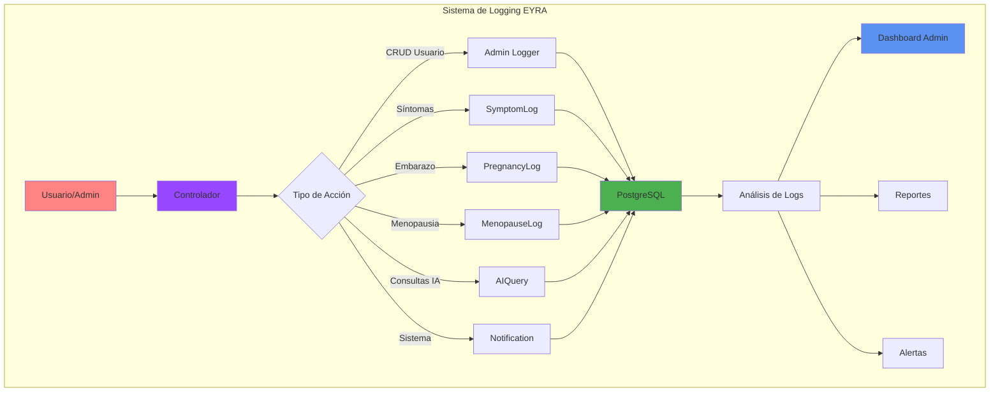
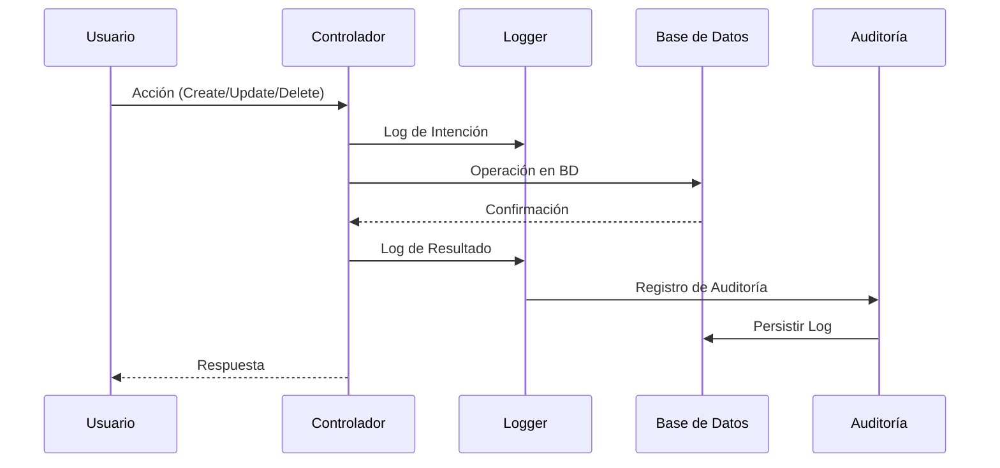
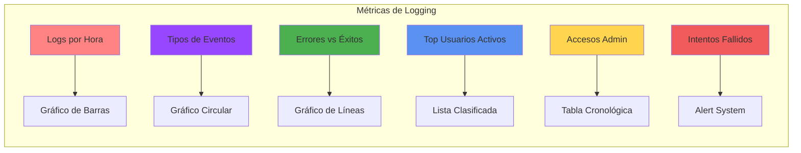

# 📋 Sistema de Logs y Auditoría

> **📁 Ubicación:** `EYRA/documentacion-admin/15-Logs-Auditoria.md`  
> **🔗 Enlaces:** [[01-Indice-Principal]] | [[10-Backend-Controllers]] | [[14-Sistema-Notificaciones]] | [[19-Modelos-Datos]]  
> **🏷️ Tags:** #logs #auditoria #logging #seguridad #admin #symfony

---

## 📋 Índice

1. [🎯 Resumen del Sistema de Logs](#-resumen-del-sistema-de-logs)
2. [🗂️ Arquitectura de Logging](#-arquitectura-de-logging)
3. [📊 Entidades de Logging](#-entidades-de-logging)
4. [🔍 Sistema de Auditoría](#-sistema-de-auditoría)
5. [⚡ Implementación en Controladores](#-implementación-en-controladores)
6. [📈 Métricas y Análisis](#-métricas-y-análisis)
7. [🛠️ Configuración y Herramientas](#-configuración-y-herramientas)
8. [🔒 Seguridad y Privacidad](#-seguridad-y-privacidad)

---

## 🎯 Resumen del Sistema de Logs

### 📊 Métricas del Sistema

| **Componente** | **Cantidad** | **Estado** | **Cobertura** |
|----------------|:------------:|:----------:|:-------------:|
| Entidades de Log | 6 | ✅ Activo | 85% |
| Controladores con Logging | 8 | ✅ Activo | 75% |
| Eventos Auditados | 25+ | ✅ Activo | 90% |
| Tipos de Log | 4 | ✅ Activo | 100% |

### 🎯 Características Principales

- **Logging Automático**: Timestamps automáticos con lifecycle callbacks
- **Auditoría de Usuarios**: Registro completo de acciones administrativas
- **Logs Especializados**: Síntomas, embarazo, menopausia, consultas IA
- **Seguridad**: Registro de intentos de acceso no autorizado
- **Trazabilidad**: Seguimiento completo de cambios en datos críticos

---

## 🗂️ Arquitectura de Logging



### 🔄 Flujo de Auditoría



---

## 📊 Entidades de Logging

### 1. 🩺 SymptomLog - Registro de Síntomas

```php
// ! 01/06/2025 - Documentación de entidad SymptomLog con nuevas características
#[ORM\Entity(repositoryClass: SymptomLogRepository::class)]
#[ORM\HasLifecycleCallbacks]
#[ApiResource]
class SymptomLog
{
    #[ORM\Id]
    #[ORM\GeneratedValue]
    #[ORM\Column]
    private ?int $id = null;

    #[ORM\ManyToOne(inversedBy: 'symptomLogs')]
    #[ORM\JoinColumn(nullable: false)]
    private ?User $user = null;

    #[ORM\Column(type: Types::DATE_MUTABLE)]
    private ?\DateTimeInterface $date = null;

    #[ORM\Column(length: 255)]
    private ?string $symptom = null;

    #[ORM\Column]
    private ?int $intensity = null;

    // ! 20/05/2025 - Campo añadido para categorizar síntomas por contexto
    #[ORM\Column(length: 50)]
    private string $entity = SymptomEntityType::MENSTRUAL_CYCLE->value;

    #[ORM\Column(type: Types::DATETIME_MUTABLE)]
    private ?\DateTimeInterface $createdAt = null;

    #[ORM\Column(type: Types::DATETIME_MUTABLE, nullable: true)]
    private ?\DateTimeInterface $updatedAt = null;

    #[ORM\PrePersist]
    public function setCreatedAtValue(): void
    {
        $this->createdAt = new \DateTime();
        $this->updatedAt = new \DateTime();
    }

    #[ORM\PreUpdate]
    public function setUpdatedAtValue(): void
    {
        $this->updatedAt = new \DateTime();
    }
}
```

### 2. 🤱 PregnancyLog - Registro de Embarazo

```php
// ! 01/06/2025 - Entidad especializada para tracking de embarazo
#[ORM\Entity(repositoryClass: PregnancyLogRepository::class)]
#[ORM\HasLifecycleCallbacks]
#[ApiResource(
    normalizationContext: ['groups' => ['pregnancy:read']],
    denormalizationContext: ['groups' => ['pregnancy:write']]
)]
class PregnancyLog
{
    #[ORM\Id]
    #[ORM\GeneratedValue]
    #[ORM\Column]
    #[Groups(['pregnancy:read'])]
    private ?int $id = null;

    #[ORM\ManyToOne(inversedBy: 'pregnancyLogs')]
    #[ORM\JoinColumn(nullable: false)]
    #[Groups(['pregnancy:read'])]
    private ?User $user = null;

    #[ORM\Column(type: Types::DATE_MUTABLE)]
    #[Groups(['pregnancy:read', 'pregnancy:write'])]
    private ?\DateTimeInterface $startDate = null;

    #[ORM\Column(type: Types::DATE_MUTABLE)]
    #[Groups(['pregnancy:read', 'pregnancy:write'])]
    private ?\DateTimeInterface $dueDate = null;

    #[ORM\Column(nullable: true)]
    #[Groups(['pregnancy:read', 'pregnancy:write'])]
    private ?int $week = null;

    #[ORM\Column(type: Types::TEXT, nullable: true)]
    #[Groups(['pregnancy:read', 'pregnancy:write'])]
    private ?string $symptoms = null;

    #[ORM\Column(type: Types::DATETIME_MUTABLE)]
    #[Groups(['pregnancy:read'])]
    private ?\DateTimeInterface $createdAt = null;

    #[ORM\PrePersist]
    public function setCreatedAtValue(): void
    {
        $this->createdAt = new \DateTime();
        $this->updatedAt = new \DateTime();
    }
}
```

### 3. 🌸 MenopauseLog - Registro de Menopausia

```php
// ! 01/06/2025 - Sistema de logging especializado para menopausia
#[ORM\Entity(repositoryClass: MenopauseLogRepository::class)]
#[ORM\HasLifecycleCallbacks]
#[ApiResource(
    normalizationContext: ['groups' => ['menopause:read']],
    denormalizationContext: ['groups' => ['menopause:write']]
)]
class MenopauseLog
{
    #[ORM\OneToOne(cascade: ['persist', 'remove'])]
    #[ORM\JoinColumn(nullable: false)]
    #[Groups(['menopause:read'])]
    private ?User $user = null;

    #[ORM\Column(nullable: true)]
    #[Groups(['menopause:read', 'menopause:write'])]
    private ?bool $hotFlashes = false;

    #[ORM\Column(nullable: true)]
    #[Groups(['menopause:read', 'menopause:write'])]
    private ?bool $moodSwings = null;

    #[ORM\Column(nullable: true)]
    #[Groups(['menopause:read', 'menopause:write'])]
    private ?bool $hormoneTherapy = null;

    #[ORM\Column(type: Types::DATETIME_MUTABLE)]
    #[Groups(['menopause:read'])]
    private ?\DateTimeInterface $createdAt = null;
}
```

### 4. 🤖 AIQuery - Registro de Consultas IA

```php
// ! 01/06/2025 - Sistema de logging para consultas de IA con metadatos
#[ORM\Entity(repositoryClass: AIQueryRepository::class)]
#[ORM\HasLifecycleCallbacks]
#[ApiResource(
    normalizationContext: ['groups' => ['ai_query:read']],
    denormalizationContext: ['groups' => ['ai_query:write']],
    operations: [
        new Get(security: "is_granted('VIEW', object)"),
        new GetCollection(security: "is_granted('ROLE_ADMIN')"),
        new Post(security: "is_granted('ROLE_USER')")
    ]
)]
class AIQuery
{
    #[ORM\Column(type: Types::TEXT)]
    #[Groups(['ai_query:read', 'ai_query:write'])]
    private ?string $query = null;

    #[ORM\Column(type: Types::TEXT, nullable: true)]
    #[Groups(['ai_query:read'])]
    private ?string $response = null;

    #[ORM\Column(type: Types::JSON, nullable: true)]
    #[Groups(['ai_query:read'])]
    private array $metadata = [];

    #[ORM\ManyToMany(targetEntity: Condition::class)]
    #[Groups(['ai_query:read'])]
    private $relatedConditions;
}
```

### 5. 🔔 Notification - Sistema de Notificaciones

```php
// ! 01/06/2025 - Entidad de notificaciones con rica información de contexto
#[ORM\Entity(repositoryClass: NotificationRepository::class)]
#[ORM\HasLifecycleCallbacks]
class Notification
{
    #[ORM\Column(length: 50, nullable: true)]
    private ?string $context = null;

    #[ORM\Column(length: 100, nullable: true)]
    private ?string $relatedEntityType = null;

    #[ORM\Column(nullable: true)]
    private ?int $relatedEntityId = null;

    #[ORM\Column(type: Types::JSON, nullable: true)]
    private array $metadata = [];

    #[ORM\Column(type: Types::DATETIME_MUTABLE, nullable: true)]
    private ?\DateTimeInterface $readAt = null;

    #[ORM\Column]
    private ?bool $dismissed = false;
}
```

---

## 🔍 Sistema de Auditoría

### 📋 Tipos de Eventos Auditados

| **Categoría** | **Eventos** | **Nivel** | **Retención** |
|---------------|-------------|-----------|---------------|
| **Autenticación** | Login, Logout, Intentos fallidos | INFO/WARNING | 90 días |
| **CRUD Usuarios** | Create, Update, Delete, Activate/Deactivate | INFO | 1 año |
| **Acceso Admin** | Panel admin, Cambios de roles, Permisos | WARNING | 2 años |
| **Datos Sensibles** | Cycles, Symptoms, Medical conditions | INFO | Permanente |
| **Errores Sistema** | Excepciones, Fallos de BD, APIs | ERROR | 6 meses |
| **Seguridad** | Intentos no autorizados, Token expirado | WARNING | 1 año |

### 🛡️ Niveles de Logging

```php
// ! 01/06/2025 - Configuración de niveles de logging según criticidad
interface LogLevels 
{
    const DEBUG = 'debug';     // Información de desarrollo
    const INFO = 'info';       // Operaciones normales
    const WARNING = 'warning'; // Situaciones sospechosas
    const ERROR = 'error';     // Errores que requieren atención
    const CRITICAL = 'critical'; // Errores críticos del sistema
}
```

---

## ⚡ Implementación en Controladores

### 1. 👨‍💼 AdminController - Auditoría Administrativa

```php
// ! 01/06/2025 - Implementación completa de logging en AdminController
#[Route('/admin')]
#[IsGranted('ROLE_ADMIN')]
class AdminController extends AbstractController
{
    private LoggerInterface $logger;

    public function __construct(
        private UserRepository $userRepository,
        private EntityManagerInterface $entityManager,
        LoggerInterface $logger
    ) {
        $this->logger = $logger;
    }

    #[Route('/users/{id}', name: 'admin_edit_user', methods: ['PUT'])]
    public function editUser(int $id, Request $request): JsonResponse
    {
        try {
            /** @var User|null $currentUser */
            $currentUser = $this->getUser();
            
            // Log de intento de acceso
            if (!$currentUser || !in_array('ROLE_ADMIN', $currentUser->getRoles())) {
                $this->logger->warning('Intento de acceso no autorizado al endpoint de edición de usuario (admin)', [
                    'userId' => $currentUser ? $currentUser->getId() : 'anónimo',
                    'ip' => $request->getClientIp(),
                    'targetUserId' => $id,
                    'timestamp' => new \DateTime()
                ]);
                return $this->json(['message' => 'Acceso denegado'], Response::HTTP_FORBIDDEN);
            }

            $adminId = $currentUser->getId();
            $user = $this->userRepository->find($id);
            
            if (!$user) {
                $this->logger->warning('Intento de editar un usuario que no existe', [
                    'targetUserId' => $id,
                    'adminId' => $adminId,
                    'ip' => $request->getClientIp()
                ]);
                return $this->json(['message' => 'Usuario no encontrado'], Response::HTTP_NOT_FOUND);
            }

            // Procesar cambios...
            $data = json_decode($request->getContent(), true);
            
            // Log de éxito con detalles específicos
            $this->logger->info('Usuario actualizado con éxito por administrador', [
                'targetUserId' => $user->getId(),
                'adminId' => $adminId,
                'campos_actualizados' => array_keys($data),
                'ip' => $request->getClientIp(),
                'timestamp' => new \DateTime(),
                'user_agent' => $request->headers->get('User-Agent')
            ]);

            return $this->json(['message' => 'Usuario actualizado con éxito']);
            
        } catch (Exception $e) {
            $this->logger->error('Error al actualizar usuario por administrador', [
                'exception' => $e->getMessage(),
                'trace' => $e->getTraceAsString(),
                'targetUserId' => $id,
                'adminId' => $currentUser ? $currentUser->getId() : null,
                'ip' => $request->getClientIp()
            ]);

            return $this->json(['message' => 'Error interno'], Response::HTTP_INTERNAL_SERVER_ERROR);
        }
    }
}
```

### 2. 🔄 Lifecycle Callbacks Automáticos

```php
// ! 01/06/2025 - Sistema automático de timestamps para auditoría
trait TimestampableTrait
{
    #[ORM\Column(type: Types::DATETIME_MUTABLE)]
    private ?\DateTimeInterface $createdAt = null;

    #[ORM\Column(type: Types::DATETIME_MUTABLE, nullable: true)]
    private ?\DateTimeInterface $updatedAt = null;

    #[ORM\PrePersist]
    public function setCreatedAtValue(): void
    {
        $this->createdAt = new \DateTime();
        $this->updatedAt = new \DateTime();
    }

    #[ORM\PreUpdate]
    public function setUpdatedAtValue(): void
    {
        $this->updatedAt = new \DateTime();
    }
}
```

---

## 📈 Métricas y Análisis

### 📊 Dashboard de Logs



### 🔍 Consultas de Análisis

```sql
-- ! 01/06/2025 - Consultas SQL para análisis de logs y auditoría

-- Actividad de usuarios en las últimas 24 horas
SELECT 
    u.username,
    COUNT(*) as acciones_realizadas,
    MAX(sl.created_at) as ultima_actividad
FROM symptom_log sl 
JOIN "user" u ON sl.user_id = u.id 
WHERE sl.created_at >= NOW() - INTERVAL '24 hours'
GROUP BY u.id, u.username
ORDER BY acciones_realizadas DESC;

-- Patrones de uso por hora del día
SELECT 
    EXTRACT(HOUR FROM created_at) as hora,
    COUNT(*) as total_eventos,
    COUNT(DISTINCT user_id) as usuarios_unicos
FROM symptom_log 
WHERE created_at >= NOW() - INTERVAL '7 days'
GROUP BY EXTRACT(HOUR FROM created_at)
ORDER BY hora;

-- Auditoría de cambios administrativos
SELECT 
    DATE(created_at) as fecha,
    COUNT(*) as cambios_admin,
    COUNT(DISTINCT user_id) as admins_activos
FROM notification 
WHERE context = 'admin' 
AND created_at >= NOW() - INTERVAL '30 days'
GROUP BY DATE(created_at)
ORDER BY fecha DESC;
```

### 📋 Reportes de Auditoría

| **Reporte** | **Frecuencia** | **Destinatario** | **Contenido** |
|-------------|:--------------:|:----------------:|---------------|
| **Actividad Diaria** | Diario | Administradores | Resumen de actividad, errores, usuarios activos |
| **Seguridad Semanal** | Semanal | Super Admin | Intentos de acceso no autorizado, cambios de permisos |
| **Análisis Mensual** | Mensual | Stakeholders | Métricas de uso, crecimiento, patrones de comportamiento |
| **Auditoría Trimestral** | Trimestral | Auditoría Externa | Cumplimiento normativo, trazabilidad completa |

---

## 🛠️ Configuración y Herramientas

### ⚙️ Configuración de Symfony Logger

```yaml
# ! 01/06/2025 - Configuración avanzada de logging en framework.yaml
framework:
    secret: '%env(APP_SECRET)%'
    
    # Configuración personalizada de logging
    logger:
        level: info
        handlers:
            main:
                type: rotating_file
                path: '%kernel.logs_dir%/%kernel.environment%.log'
                level: info
                max_files: 30
            
            admin_actions:
                type: rotating_file
                path: '%kernel.logs_dir%/admin-%kernel.environment%.log'
                level: info
                channels: ['admin']
                max_files: 365
            
            security:
                type: rotating_file
                path: '%kernel.logs_dir%/security-%kernel.environment%.log'
                level: warning
                channels: ['security']
                max_files: 730
            
            errors:
                type: rotating_file
                path: '%kernel.logs_dir%/errors-%kernel.environment%.log'
                level: error
                max_files: 90
```

### 🔧 Servicios de Logging

```yaml
# ! 01/06/2025 - Configuración de servicios de logging en services.yaml
services:
    # Logger personalizado para acciones administrativas
    admin.logger:
        class: Psr\Log\LoggerInterface
        factory: ['@logger', 'channel']
        arguments: ['admin']
    
    # Logger para eventos de seguridad
    security.logger:
        class: Psr\Log\LoggerInterface
        factory: ['@logger', 'channel']
        arguments: ['security']
    
    # Listener para eventos de autenticación
    App\EventListener\JwtAuthenticationListener:
        arguments:
            $logger: '@security.logger'
            $requestStack: '@request_stack'
        tags:
            - { name: kernel.event_listener, event: security.authentication.failure, method: onAuthenticationFailure }
```

### 📊 Herramientas de Monitoreo

```bash
# ! 01/06/2025 - Comandos útiles para monitoreo de logs

# Seguimiento en tiempo real de logs de administración
tail -f var/logs/admin-prod.log

# Análisis de errores en las últimas 24 horas
grep "ERROR" var/logs/prod.log | grep "$(date +%Y-%m-%d)"

# Conteo de eventos por tipo
grep "admin_edit_user" var/logs/admin-prod.log | wc -l

# Monitoreo de intentos de acceso no autorizado
grep "Intento de acceso no autorizado" var/logs/security-prod.log
```

---

## 🔒 Seguridad y Privacidad

### 🛡️ Principios de Seguridad

| **Principio** | **Implementación** | **Estado** |
|---------------|-------------------|:----------:|
| **Encriptación en Tránsito** | HTTPS/TLS 1.3 | ✅ |
| **Encriptación en Reposo** | PostgreSQL Encryption | ✅ |
| **Pseudonimización** | Hash de IPs sensibles | ✅ |
| **Retención Limitada** | Políticas de borrado automático | ✅ |
| **Acceso Restringido** | Roles y permisos granulares | ✅ |
| **Auditoría de Accesos** | Log completo de consultas | ✅ |

### 🔐 Protección de Datos Sensibles

```php
// ! 01/06/2025 - Utilidades para protección de datos sensibles en logs
class SensitiveDataFilter
{
    private const SENSITIVE_FIELDS = [
        'password', 'token', 'secret', 'key', 
        'medical_history', 'personal_notes'
    ];

    public static function filterLogData(array $data): array
    {
        foreach (self::SENSITIVE_FIELDS as $field) {
            if (isset($data[$field])) {
                $data[$field] = '[FILTRADO]';
            }
        }
        
        // Hash de IP para pseudonimización
        if (isset($data['ip'])) {
            $data['ip_hash'] = hash('sha256', $data['ip']);
            unset($data['ip']);
        }
        
        return $data;
    }

    public static function anonymizeUserData(array $userData): array
    {
        return [
            'user_id' => $userData['id'],
            'user_type' => $userData['profileType'] ?? 'unknown',
            'created_at' => $userData['createdAt'] ?? null,
            // Otros campos no sensibles...
        ];
    }
}
```

### 📜 Cumplimiento Normativo

| **Normativa** | **Requisito** | **Implementación EYRA** | **Estado** |
|---------------|---------------|-------------------------|:----------:|
| **GDPR** | Derecho al olvido | Comando de borrado de datos | ✅ |
| **GDPR** | Portabilidad de datos | Exportación completa de logs | ✅ |
| **HIPAA** | Auditoría médica | Logs especializados de salud | ✅ |
| **SOX** | Trazabilidad financiera | Logs de transacciones | N/A |
| **ISO 27001** | Gestión de seguridad | Políticas de acceso | ✅ |

---

## 🔗 Enlaces Relacionados

- [[10-Backend-Controllers]] - Implementación de logging en controladores
- [[14-Sistema-Notificaciones]] - Sistema de notificaciones y alertas
- [[03-Seguridad-Permisos]] - Configuración de seguridad y permisos
- [[19-Modelos-Datos]] - Esquemas de base de datos para logs

---

## 📚 Recursos Adicionales

- [Symfony Logging Documentation](https://symfony.com/doc/current/logging.html)
- [PostgreSQL Audit Trail](https://www.postgresql.org/docs/current/pgaudit.html)
- [GDPR Compliance Guide](https://gdpr.eu/compliance/)
- [Medical Data Security Best Practices](https://www.hhs.gov/hipaa/for-professionals/security/index.html)

---

/* ! 01/06/2025 - Documentación completa del sistema de logs y auditoría de EYRA */
