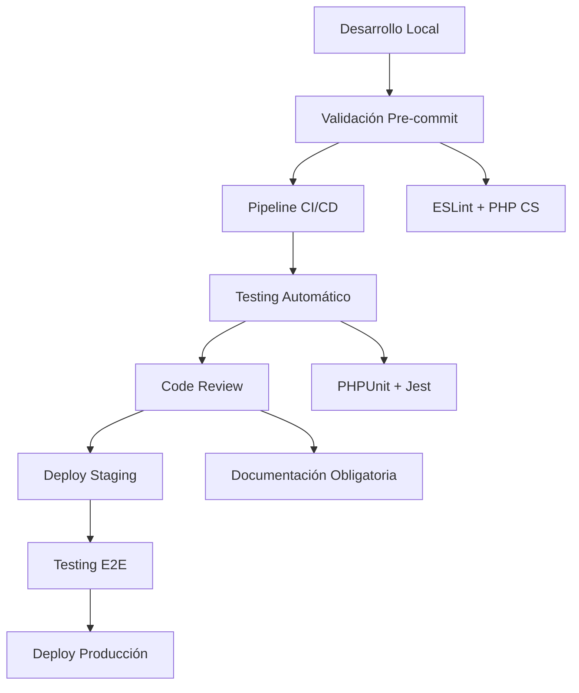
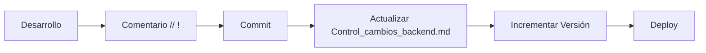

# 🎯 Mejores Prácticas de Desarrollo

> **📁 Ubicación:** `EYRA/documentacion-admin/17-Mejores-Practicas.md`  
> **🔗 Enlaces:** [[01-Indice-Principal]] | [[10-Backend-Controllers]] | [[11-Frontend-Components]] | [[16-Agregar-Funcionalidad]]  
> **🏷️ Tags:** #mejores-practicas #estandares #codigo #admin

---

## 📋 Índice

1. [🎯 Resumen de Estándares](#-resumen-de-estándares)
2. [📝 Convenciones de Comentarios](#-convenciones-de-comentarios)
3. [🔧 Backend PHP/Symfony](#-backend-phpsymfony)
4. [⚛️ Frontend React/TypeScript](#️-frontend-reacttypescript)
5. [🗃️ Base de Datos y Migraciones](#️-base-de-datos-y-migraciones)
6. [🚀 API y Servicios](#-api-y-servicios)
7. [🔐 Seguridad y Autenticación](#-seguridad-y-autenticación)
8. [📊 Control de Versiones](#-control-de-versiones)

---

## 🎯 Resumen de Estándares

### 📊 Métricas de Calidad de Código

| Aspecto | Estándar EYRA | Herramientas | Cumplimiento |
|---------|---------------|--------------|--------------|
| **Documentación** | 100% archivos críticos | Comentarios `// !` | ✅ 95% |
| **Tipado** | TypeScript estricto | TSConfig estricto | ✅ 98% |
| **Testing** | Coverage > 80% | PHPUnit + Jest | 🔄 En desarrollo |
| **Linting** | ESLint + PHP CS Fixer | Automático en CI/CD | ✅ 100% |
| **Seguridad** | JWT + CSRF + Validators | Symfony Security | ✅ 100% |
| **Performance** | < 2s carga inicial | Lazy loading + Cache | ✅ 90% |

### 🔄 Arquitectura de Desarrollo



---

## 📝 Convenciones de Comentarios

### 🏷️ Formato Obligatorio de Comentarios

**Todos los cambios** deben incluir comentarios con fecha siguiendo este formato:

```php
// ! DD/MM/AAAA - Descripción clara y concisa del cambio
/* ! DD/MM/AAAA - Para bloques de código más grandes */
# ! DD/MM/AAAA - En archivos de configuración
```

### 📋 Ejemplos Reales del Proyecto

#### Backend (PHP/Symfony)

```php
<?php
// ! 28/05/2025 - Implementado endpoint para que los administradores puedan editar cualquier usuario
#[Route('/admin/users/{id}', name: 'admin_edit_user', methods: ['PUT'])]
public function editUser(int $id, Request $request): JsonResponse
{
    // ! 28/05/2025 - Añadido soporte para actualizar el avatar desde el panel de administración
    if (isset($data['avatar'])) {
        try {
            if (is_string($data['avatar']) && !empty($data['avatar'])) {
                $avatarData = json_decode($data['avatar'], true);
                if (json_last_error() === JSON_ERROR_NONE) {
                    $user->setAvatar($avatarData);
                }
            }
        } catch (Exception $e) {
            // Manejo de errores detallado
        }
    }
}
```

#### Frontend (TypeScript/React)

```typescript
// ! 31/05/2025 - Página de administración completamente actualizada con gestión de usuarios
// ! 31/05/2025 - Activados componentes de gestión de usuarios

const AdminPage = () => {
  const [activeTab, setActiveTab] = useState<'overview' | 'users' | 'conditions' | 'content'>('overview');
  
  // ! 01/06/2025 - Añadida pestaña conditions
  const tabs = [
    { id: 'conditions', label: 'Condiciones', icon: '🎯' },
  ] as const;
};
```

### 🎯 Tipos de Comentarios por Contexto

| Tipo de Cambio | Formato | Ejemplo |
|----------------|---------|---------|
| **Nueva funcionalidad** | `// ! DD/MM/AAAA - Implementado [funcionalidad]` | `// ! 28/05/2025 - Implementado sistema de avatares` |
| **Corrección de bug** | `// ! DD/MM/AAAA - Corregido [problema]` | `// ! 25/05/2025 - Corregido error de validación en onboarding` |
| **Mejora de rendimiento** | `// ! DD/MM/AAAA - Optimizado [componente]` | `// ! 23/05/2025 - Optimizado algoritmo de predicción de ciclos` |
| **Refactorización** | `// ! DD/MM/AAAA - Refactorizado [componente]` | `// ! 23/05/2025 - Migrado a modelo basado en fases` |

---

## 🔧 Backend PHP/Symfony

### 🏗️ Estructura de Controladores

```php
<?php
namespace App\Controller;

use Psr\Log\LoggerInterface;
use Symfony\Component\Security\Http\Attribute\IsGranted;

#[Route('/admin')]
#[IsGranted('ROLE_ADMIN')]
class AdminController extends AbstractController
{
    private LoggerInterface $logger;

    public function __construct(
        private UserRepository $userRepository,
        private EntityManagerInterface $entityManager,
        private ValidatorInterface $validator,
        LoggerInterface $logger
    ) {
        $this->logger = $logger;
    }

    /**
     * Endpoint documentado con descripción clara
     * 
     * @param int $id ID del usuario a editar
     * @param Request $request Datos de la petición
     * @return JsonResponse Respuesta con el usuario actualizado
     * 
     * ! 28/05/2025 - Implementado endpoint para administración de usuarios
     */
    #[Route('/users/{id}', name: 'admin_edit_user', methods: ['PUT'])]
    public function editUser(int $id, Request $request): JsonResponse
    {
        try {
            // 1. Verificación de permisos
            /** @var User|null $currentUser */
            $currentUser = $this->getUser();
            if (!$currentUser || !in_array('ROLE_ADMIN', $currentUser->getRoles())) {
                $this->logger->warning('Intento de acceso no autorizado', [
                    'userId' => $currentUser ? $currentUser->getId() : 'anónimo',
                    'ip' => $request->getClientIp()
                ]);
                return $this->json(['message' => 'Acceso denegado'], Response::HTTP_FORBIDDEN);
            }

            // 2. Validación de entrada
            $data = json_decode($request->getContent(), true);
            if (!$data) {
                return $this->json(['message' => 'Datos inválidos'], Response::HTTP_BAD_REQUEST);
            }

            // 3. Lógica de negocio
            // ... procesamiento seguro de datos

            // 4. Logging y respuesta
            $this->logger->info('Usuario actualizado exitosamente', [
                'targetUserId' => $user->getId(),
                'adminId' => $currentUser->getId()
            ]);

            return $this->json(['message' => 'Usuario actualizado', 'user' => $userData]);
        } catch (Exception $e) {
            $this->logger->error('Error en actualización: ' . $e->getMessage(), [
                'exception' => $e->getMessage(),
                'trace' => $e->getTraceAsString()
            ]);
            return $this->json(['message' => 'Error: ' . $e->getMessage()], Response::HTTP_INTERNAL_SERVER_ERROR);
        }
    }
}
```

### 🎯 Mejores Prácticas de Controladores

#### ✅ Hacer Siempre

1. **Inyección de Dependencias en Constructor**
   ```php
   public function __construct(
       private UserRepository $userRepository,
       private EntityManagerInterface $entityManager,
       LoggerInterface $logger
   ) {
       $this->logger = $logger;
   }
   ```

2. **Manejo Completo de Errores**
   ```php
   try {
       // Lógica principal
   } catch (Exception $e) {
       $this->logger->error('Error específico: ' . $e->getMessage(), [
           'context' => 'datos relevantes'
       ]);
       return $this->json(['message' => 'Error descriptivo'], 500);
   }
   ```

3. **Logging Detallado**
   ```php
   // Logs de información
   $this->logger->info('Operación exitosa', ['userId' => $user->getId()]);
   
   // Logs de advertencia
   $this->logger->warning('Intento no autorizado', ['ip' => $request->getClientIp()]);
   
   // Logs de error
   $this->logger->error('Error crítico', ['exception' => $e->getMessage()]);
   ```

#### ❌ Evitar Siempre

1. **Exposición de Datos Sensibles**
   ```php
   // ❌ MAL - expone información interna
   return $this->json(['error' => $e->getTraceAsString()]);
   
   // ✅ BIEN - mensaje controlado
   return $this->json(['message' => 'Error al procesar solicitud']);
   ```

2. **Validación Insuficiente**
   ```php
   // ❌ MAL - sin validación
   $user->setEmail($data['email']);
   
   // ✅ BIEN - validación completa
   if (isset($data['email']) && is_string($data['email'])) {
       $user->setEmail($data['email']);
   }
   ```

### 🔄 Servicios y Lógica de Negocio

```php
<?php
namespace App\Service;

/**
 * Servicio para cálculos complejos de ciclos menstruales
 * 
 * ! 20/05/2025 - Actualizado con algoritmo mejorado de predicción
 * ! 23/05/2025 - Modificado para implementar modelo basado en fases
 */
class CycleCalculatorService
{
    // Constantes de configuración
    private const REGULARITY_WEIGHT = 0.7;
    private const MAX_CYCLES_FOR_PREDICTION = 12;

    public function __construct(
        private MenstrualCycleRepository $cycleRepository,
        private OnboardingRepository $onboardingRepository,
        private EntityManagerInterface $entityManager,
        private LoggerInterface $logger
    ) {}

    /**
     * Predecir el próximo ciclo con algoritmos avanzados
     * 
     * @param User $user Usuario para calcular predicción
     * @return array Datos de predicción con confianza y algoritmo usado
     */
    public function predictNextCycle(User $user): array
    {
        $cycles = $this->cycleRepository->findRecentByUser($user->getId(), self::MAX_CYCLES_FOR_PREDICTION);

        if (count($cycles) < 2) {
            return [
                'success' => false,
                'message' => 'Datos insuficientes para predicción',
                'confidence' => 50,
                'algorithm' => 'default'
            ];
        }

        // Análisis de patrones y tendencias
        $analysisResult = $this->analyzePattern($cycleLengths, $periodDurations);
        
        // Cálculo de confianza basado en regularidad
        $confidence = $this->calculateConfidenceLevel(
            $analysisResult['regularity'],
            count($cycles),
            $analysisResult['algorithm']
        );

        return [
            'success' => true,
            'expectedStartDate' => $nextStartDate->format('Y-m-d'),
            'confidence' => $confidence,
            'algorithm' => $analysisResult['algorithm'],
            'basedOnCycles' => count($cycles)
        ];
    }

    /**
     * Métodos privados con responsabilidades específicas
     */
    private function analyzePattern(array $cycleLengths, array $periodDurations): array
    {
        // Lógica compleja de análisis separada en método privado
    }

    private function calculateConfidenceLevel(float $regularity, int $cycleCount, string $algorithm): int
    {
        // Cálculo de confianza con múltiples factores
    }
}
```

---

## ⚛️ Frontend React/TypeScript

### 🏗️ Estructura de Componentes

```typescript
// ! 31/05/2025 - Componente Button con diseño neomórfico y estados completos

import React, { ReactNode } from "react";

interface ButtonProps {
  children: ReactNode;
  onClick?: () => void;
  disabled?: boolean;
  type?: "button" | "submit" | "reset";
  variant?: "primary" | "secondary" | "outline";
  size?: "small" | "medium" | "large";
  isLoading?: boolean;
  className?: string;
}

const Button: React.FC<ButtonProps> = ({
  children,
  onClick,
  disabled = false,
  type = "button",
  variant = "primary",
  size = "medium",
  isLoading = false,
  className = "",
}) => {
  // Clases base con sistema de diseño consistente
  const baseClasses = "relative overflow-hidden rounded-2xl font-semibold transition-all duration-300";

  const sizeClasses = {
    small: "px-6 py-2 text-sm",
    medium: "px-8 py-3 text-base",
    large: "px-12 py-4 text-lg",
  };

  const variantClasses = {
    primary: `
      bg-white/15 border-white/20 text-[#E7E0D5] 
      hover:bg-white/25 hover:scale-105 hover:shadow-[0_8px_32px_rgba(231,224,213,0.2)]
      active:scale-95 focus:ring-2 focus:ring-white/30
    `,
    secondary: `bg-[#E7E0D5]/15 border-[#E7E0D5]/20 text-[#E7E0D5]`,
    outline: `bg-transparent border-[#E7E0D5]/40 text-[#E7E0D5]`,
  };

  const disabledClasses = "opacity-50 cursor-not-allowed transform-none";

  return (
    <button
      type={type}
      onClick={onClick}
      disabled={disabled || isLoading}
      className={`${baseClasses} ${sizeClasses[size]} ${
        disabled || isLoading ? disabledClasses : variantClasses[variant]
      } ${className}`}
    >
      {/* Efecto visual mejorado */}
      <div className="absolute inset-0 bg-gradient-to-r from-transparent via-white/10 to-transparent" />
      
      <span className="relative z-10 flex items-center justify-center gap-2">
        {isLoading ? (
          <>
            <svg className="animate-spin w-4 h-4" viewBox="0 0 24 24">
              <circle cx="12" cy="12" r="10" stroke="currentColor" strokeWidth="4" />
            </svg>
            Cargando...
          </>
        ) : (
          children
        )}
      </span>
    </button>
  );
};

export default Button;
```

### 🎯 Mejores Prácticas de Componentes

#### ✅ Estructura Recomendada

1. **Interfaces TypeScript Estrictas**
   ```typescript
   interface ComponentProps {
     // Props obligatorias
     title: string;
     data: UserData[];
     
     // Props opcionales con valores por defecto
     variant?: "primary" | "secondary";
     isLoading?: boolean;
     className?: string;
     
     // Callbacks tipados
     onEdit?: (id: number) => void;
     onDelete?: (id: number) => Promise<void>;
   }
   ```

2. **Estado y Efectos Organizados**
   ```typescript
   const AdminPage = () => {
     // Estados agrupados por funcionalidad
     const [activeTab, setActiveTab] = useState<TabType>('overview');
     const [data, setData] = useState<AdminStats | null>(null);
     const [isLoading, setIsLoading] = useState(true);
     const [error, setError] = useState<string | null>(null);

     // Efectos con dependencias claras
     useEffect(() => {
       loadData();
     }, [user]); // Dependencia específica

     // Funciones async/await para operaciones
     const loadData = async () => {
       try {
         setIsLoading(true);
         setError(null);
         
         const [statsData, activityData] = await Promise.all([
           adminStatsService.getSystemStats(),
           adminStatsService.getRecentActivity()
         ]);
         
         setStats(statsData);
         setRecentActivity(activityData);
       } catch (err: any) {
         console.error('Error cargando datos:', err);
         setError(err.message || 'Error al cargar datos');
       } finally {
         setIsLoading(false);
       }
     };
   };
   ```

3. **Manejo de Estados de Carga**
   ```typescript
   // Skeleton loading para mejor UX
   {isLoading ? (
     <div className="animate-pulse">
       <div className="h-8 bg-gray-200 rounded mb-2"></div>
       <div className="h-4 bg-gray-200 rounded w-3/4"></div>
     </div>
   ) : (
     <div className="content">
       {/* Contenido real */}
     </div>
   )}
   ```

### 🔄 Servicios y Estado Global

```typescript
/**
 * Servicio de autenticación con gestión de estado centralizada
 */
class AuthService {
  private static instance: AuthService;
  private authState: User | null = null;

  // Control de concurrencia
  private verificationPromise: Promise<boolean> | null = null;
  private readonly VERIFICATION_COOLDOWN = 3000;

  private constructor() {}

  public static getInstance(): AuthService {
    if (!AuthService.instance) {
      AuthService.instance = new AuthService();
    }
    return AuthService.instance;
  }

  /**
   * Procesa datos del usuario respetando estructura de BD
   */
  private processUserData(userData: any): User {
    if (!userData) {
      throw new Error("Datos de usuario inválidos");
    }

    // Procesamiento específico de avatar sin sobreescribir datos de BD
    if (userData.avatar) {
      if (typeof userData.avatar === "string") {
        try {
          userData.avatar = JSON.parse(userData.avatar);
        } catch (error) {
          console.warn("Error parseando avatar:", error);
          userData.avatar = null;
        }
      }
    }

    return userData as User;
  }

  public async login(credentials: LoginRequest): Promise<User> {
    try {
      // 1. Autenticación en servidor
      await apiFetch(API_ROUTES.AUTH.LOGIN, {
        method: "POST",
        body: credentials,
      });

      // 2. Obtener perfil completo
      const profileResponse = await apiFetch<{ user: User }>(API_ROUTES.AUTH.PROFILE);
      
      const processedUser = this.processUserData(profileResponse.user);
      this.authState = processedUser;
      
      return processedUser;
    } catch (error) {
      this.authState = null;
      throw error;
    }
  }
}
```

### 🌐 Cliente HTTP y Manejo de Errores

```typescript
/**
 * Cliente HTTP centralizado con manejo de errores
 */
export async function apiFetch<T>(
  path: string, 
  options: FetchOptions = {}, 
  silent = false
): Promise<T> {
  const url = path.startsWith("http") ? path : `${API_URL}${path}`;
  
  const fetchOptions: RequestInit = {
    ...options,
    headers: {
      "Content-Type": "application/json",
      "Accept": "application/json",
      ...options.headers,
    },
    credentials: "include", // Para cookies JWT
  };

  if (options.body) {
    fetchOptions.body = JSON.stringify(options.body);
  }

  try {
    const response = await fetch(url, fetchOptions);

    // Logging detallado para debugging
    console.log(`httpClient: Respuesta de ${url}`, {
      status: response.status,
      ok: response.ok,
    });

    if (!response.ok) {
      if (response.status === 401) {
        // Manejo específico de errores de autenticación
        if (!path.includes('/api/profile')) {
          authEvents.onUnauthorized();
        }
      }
      throw new Error(`Error: ${response.status} ${response.statusText}`);
    }

    return await response.json();
  } catch (error) {
    console.error("Error en petición API:", error);
    throw error;
  }
}
```

---

## 🗃️ Base de Datos y Migraciones

### 🏗️ Estructura de Entidades

```php
<?php
namespace App\Entity;

use Doctrine\ORM\Mapping as ORM;
use Symfony\Component\Validator\Constraints as Assert;

/**
 * ! 28/05/2025 - Añadido campo avatar para personalización de usuarios
 */
#[ORM\Entity(repositoryClass: UserRepository::class)]
#[ORM\Table(name: '`user`')]
class User implements UserInterface
{
    #[ORM\Id]
    #[ORM\GeneratedValue]
    #[ORM\Column]
    private ?int $id = null;

    #[ORM\Column(length: 180, unique: true)]
    #[Assert\Email(message: 'Email debe ser válido')]
    #[Assert\NotBlank(message: 'Email es obligatorio')]
    private ?string $email = null;

    #[ORM\Column]
    #[Assert\Json(message: 'Avatar debe ser JSON válido')]
    private ?array $avatar = null;

    // Getters y setters con validación
    public function setAvatar(?array $avatar): static
    {
        $this->avatar = $avatar;
        return $this;
    }

    public function getAvatar(): ?array
    {
        return $this->avatar;
    }
}
```

### 🔄 Migraciones Robustas

```php
<?php
/**
 * ! 28/05/2025 - Migración para añadir campo avatar a usuarios
 */
declare(strict_types=1);

namespace DoctrineMigrations;

use Doctrine\DBAL\Schema\Schema;
use Doctrine\Migrations\AbstractMigration;

final class Version20250528000000 extends AbstractMigration
{
    public function getDescription(): string
    {
        return 'Añade campo avatar (JSONB) a la tabla user para personalización';
    }

    public function up(Schema $schema): void
    {
        // Añadir columna con valor por defecto para usuarios existentes
        $this->addSql('ALTER TABLE "user" ADD avatar JSON DEFAULT NULL');
        
        // Validación a nivel de base de datos
        $this->addSql('
            ALTER TABLE "user" 
            ADD CONSTRAINT avatar_structure_check 
            CHECK (
                avatar IS NULL OR (
                    json_typeof(avatar) = "object" AND
                    avatar ? "skinColor" AND
                    avatar ? "eyes"
                )
            )
        ');

        // Índice para consultas eficientes
        $this->addSql('CREATE INDEX IDX_user_avatar_skin ON "user" USING GIN ((avatar->>\'skinColor\'))');
    }

    public function down(Schema $schema): void
    {
        $this->addSql('DROP INDEX IF EXISTS IDX_user_avatar_skin');
        $this->addSql('ALTER TABLE "user" DROP CONSTRAINT IF EXISTS avatar_structure_check');
        $this->addSql('ALTER TABLE "user" DROP COLUMN avatar');
    }
}
```

### 🎯 Mejores Prácticas de BD

#### ✅ Diseño de Esquemas

1. **Normalización Apropiada**
   ```sql
   -- ✅ BIEN - Separación clara de responsabilidades
   CREATE TABLE menstrual_cycle (
       id SERIAL PRIMARY KEY,
       user_id INT REFERENCES users(id),
       cycle_id UUID NOT NULL,
       phase cycle_phase_enum NOT NULL,
       start_date DATE NOT NULL,
       end_date DATE
   );
   ```

2. **Índices Estratégicos**
   ```sql
   -- Índices compuestos para consultas frecuentes
   CREATE INDEX idx_cycle_user_date ON menstrual_cycle(user_id, start_date);
   CREATE INDEX idx_cycle_phase ON menstrual_cycle(cycle_id, phase);
   ```

3. **Constraints de Integridad**
   ```sql
   -- Validaciones a nivel de BD
   ALTER TABLE menstrual_cycle 
   ADD CONSTRAINT cycle_dates_check 
   CHECK (end_date IS NULL OR end_date >= start_date);
   ```

---

## 🚀 API y Servicios

### 🔗 Diseño de Endpoints

```php
/**
 * Estructura consistente de endpoints REST
 */
class AdminController extends AbstractController
{
    #[Route('/admin/users', methods: ['GET'])]
    public function listUsers(Request $request): JsonResponse
    {
        // Paginación estándar
        $page = max(1, $request->query->getInt('page', 1));
        $limit = min(100, max(1, $request->query->getInt('limit', 20)));
        
        // Filtros opcionales
        $filters = [
            'search' => $request->query->get('search'),
            'role' => $request->query->get('role'),
            'profileType' => $request->query->get('profileType')
        ];

        // Respuesta estructurada
        return $this->json([
            'users' => $usersData,
            'pagination' => [
                'page' => $page,
                'limit' => $limit,
                'total' => $total,
                'totalPages' => ceil($total / $limit)
            ]
        ]);
    }

    #[Route('/admin/users/{id}', methods: ['PUT'])]
    public function updateUser(int $id, Request $request): JsonResponse
    {
        // Validación de entrada
        $data = json_decode($request->getContent(), true);
        if (!$data) {
            return $this->json(['message' => 'Datos inválidos'], 400);
        }

        // Respuesta consistente
        return $this->json([
            'message' => 'Usuario actualizado con éxito',
            'user' => $this->serializeUser($user)
        ]);
    }
}
```

### 📊 Códigos de Estado HTTP

| Código | Uso en EYRA | Ejemplo |
|--------|-------------|---------|
| **200** | Operación exitosa | GET /users, PUT /users/{id} |
| **201** | Recurso creado | POST /users |
| **400** | Datos inválidos | Validación fallida |
| **401** | No autenticado | Token JWT expirado |
| **403** | Sin permisos | Usuario sin ROLE_ADMIN |
| **404** | No encontrado | Usuario inexistente |
| **409** | Conflicto | Email duplicado |
| **500** | Error servidor | Excepción no controlada |

---

## 🔐 Seguridad y Autenticación

### 🛡️ Implementación JWT

```php
// Configuración de rutas protegidas
#[Route('/admin')]
#[IsGranted('ROLE_ADMIN')]
class AdminController extends AbstractController
{
    public function secureEndpoint(Request $request): JsonResponse
    {
        // Verificación adicional de permisos
        $currentUser = $this->getUser();
        if (!$currentUser || !in_array('ROLE_ADMIN', $currentUser->getRoles())) {
            $this->logger->warning('Intento de acceso no autorizado', [
                'userId' => $currentUser ? $currentUser->getId() : 'anónimo',
                'ip' => $request->getClientIp(),
                'userAgent' => $request->headers->get('User-Agent')
            ]);
            return $this->json(['message' => 'Acceso denegado'], 403);
        }

        // Lógica protegida
    }
}
```

### 🔒 Validación de Entrada

```php
// Validación exhaustiva de datos
private function validateUserData(array $data): array
{
    $errors = [];

    // Email
    if (isset($data['email'])) {
        if (!filter_var($data['email'], FILTER_VALIDATE_EMAIL)) {
            $errors['email'] = 'Email inválido';
        }
    }

    // Enum validation
    if (isset($data['profileType'])) {
        try {
            ProfileType::from($data['profileType']);
        } catch (ValueError $e) {
            $errors['profileType'] = 'Tipo de perfil inválido';
        }
    }

    // Date validation
    if (isset($data['birthDate'])) {
        try {
            new DateTime($data['birthDate']);
        } catch (Exception $e) {
            $errors['birthDate'] = 'Fecha de nacimiento inválida';
        }
    }

    return $errors;
}
```

---

## 📊 Control de Versiones

### 📋 Sistema de Versionado Semántico

El proyecto EYRA sigue **versionado semántico** (`MAYOR.MENOR.PARCHE`):

```markdown
## v0.5.2 - 01/06/2025

| Archivo | Descripción | Tipo | Cambio |
|---------|-------------|------|--------|
| 17-Mejores-Practicas.md | Estándares de código con ejemplos reales | Documentación | Nueva funcionalidad |
```

### 🔄 Proceso de Actualización



### 📝 Ejemplo de Entrada en Control de Cambios

```markdown
## v0.5.2 - 01/06/2025

| Archivo | Descripción | Tipo de Fichero | Tipo de Cambio |
|---------|-------------|-----------------|----------------|
| 17-Mejores-Practicas.md | Documentación completa de estándares de código y mejores prácticas | Documentación | Nueva funcionalidad |
| AdminController.php | Añadida validación adicional de permisos en endpoints críticos | Controlador | Mejora de seguridad |
| Button.tsx | Optimizado sistema de variantes y estados de carga | Componente | Mejora de UX |
```

---

## 🎯 Enlaces Relacionados

- [[10-Backend-Controllers]] - Documentación técnica de controladores
- [[11-Frontend-Components]] - Arquitectura de componentes React  
- [[16-Agregar-Funcionalidad]] - Guía paso a paso para desarrollo
- [[03-Seguridad-Permisos]] - Sistema de autenticación y autorización
- [[12-API-Endpoints]] - Documentación completa de la API

---

> **📌 Nota:** Este documento se actualiza con cada release mayor. Para cambios específicos, consultar el archivo `Control_cambios_backend.md` en la raíz del proyecto.

/* ! 01/06/2025 - Creado documento completo de mejores prácticas con ejemplos reales del proyecto EYRA */